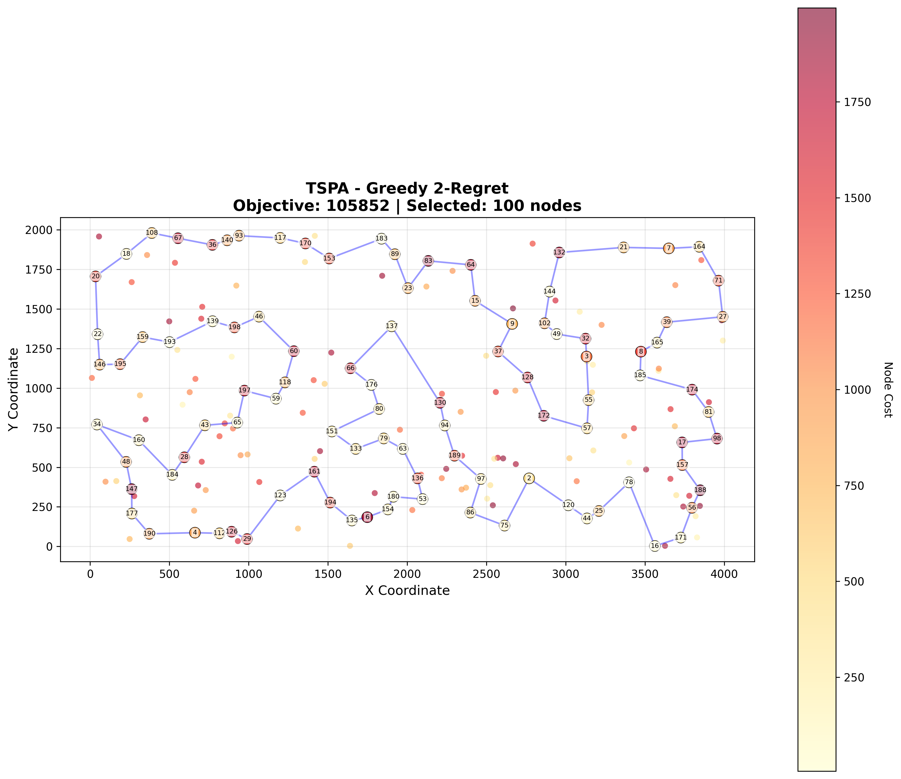
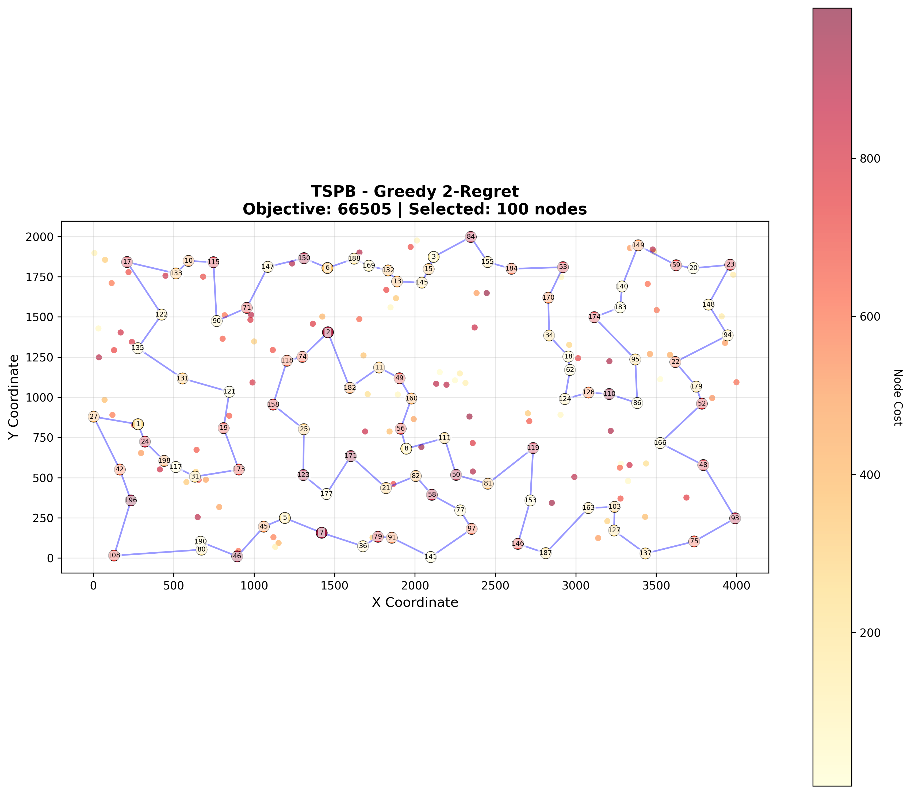
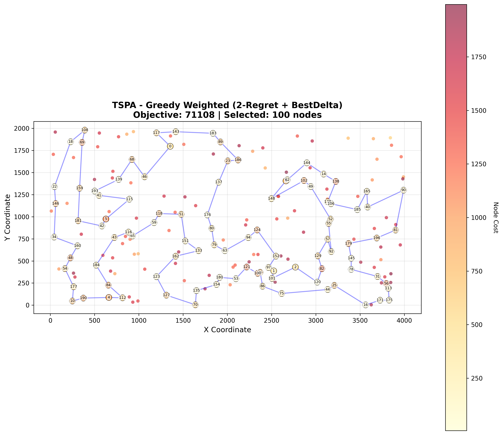
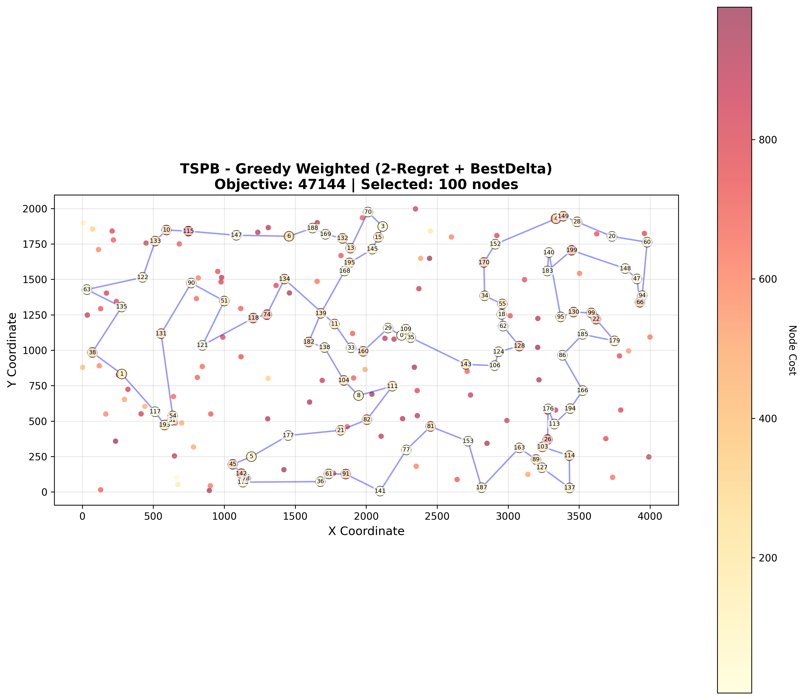

# Assignment 2 - Greedy Regret Heuristics for Selective TSP

## Authors
- Mateusz Idziejczak 155842
- Mateusz Stawicki 155900

## Problem Description

This is a variant of the Traveling Salesman Problem where:
- Select exactly 50% of nodes (rounded up if odd)
- Form a Hamiltonian cycle through selected nodes
- Minimize: total path length + sum of selected node costs
- Distances are Euclidean distances rounded to integers

## Algorithm Pseudocode

### Greedy 2-Regret
```
1. Start with given node
2. Add nearest node to form initial 2-node cycle
3. While not enough nodes selected:
   a. For each unselected node i:
      For each edge (u,v) in cycle:
         Calculate delta = dist[u][i] + dist[i][v] - dist[u][v] + cost[i]
      Find best (minimum delta) and 2nd-best insertion positions
      Calculate regret = 2nd_best_delta - best_delta
   b. Select node with maximum regret (ties broken by minimum best_delta)
   c. Insert at its best position
4. Return cycle
```

### Greedy Weighted (2-Regret + BestDelta)
```
1. Start with given node
2. Add nearest node to form initial 2-node cycle
3. While not enough nodes selected:
   a. For each unselected node i:
      For each edge (u,v) in cycle:
         Calculate delta = dist[u][i] + dist[i][v] - dist[u][v] + cost[i]
      Find best (minimum delta) and 2nd-best insertion positions
      Calculate regret = 2nd_best_delta - best_delta
      Calculate score = wRegret × regret - wBest × best_delta
   b. Select node with maximum score (default weights: wRegret=1.0, wBest=1.0)
   c. Insert at its best position
4. Return cycle
```

## Key Results

### TSPA.csv (200 nodes, select 100)

| Method | Min | Max | Avg |
|---|---:|---:|---:|
| Random | 242247 | 288959 | 265582 |
| Nearest Neighbor (end only) | 83182 | 89433 | 85108 |
| Nearest Neighbor (any position) | 71179 | 75450 | 73178 |
| Greedy Cycle | 71488 | 74410 | 72646 |
| Greedy 2-Regret | 105852 | 123428 | 115474 |
| Greedy Weighted (2-Regret + BestDelta) | 71108 | 73395 | 72129 |

### TSPB.csv (200 nodes, select 100)

| Method | Min | Max | Avg |
|---|---:|---:|---:|
| Random | 188533 | 235611 | 212974 |
| Nearest Neighbor (end only) | 52319 | 59030 | 54390 |
| Nearest Neighbor (any position) | 44417 | 53438 | 45870 |
| Greedy Cycle | 49001 | 57324 | 51400 |
| Greedy 2-Regret | 66505 | 77072 | 72454 |
| Greedy Weighted (2-Regret + BestDelta) | 47144 | 55700 | 50950 |






The solutions were checked using Solution checker.xlsx

## Github
> https://github.com/Luncenok/EvolutionaryComputingLab1

## Conclusions

The experimental results reveal critical insights about regret-based greedy heuristics:

**Greedy 2-Regret performs poorly**, producing solutions significantly worse than simpler methods (avg 115k for TSPA vs 72k for Greedy Cycle; 72k for TSPB vs 51k for Greedy Cycle). This counterintuitive result demonstrates that **maximizing regret alone is insufficient** - prioritizing only "picky" nodes without considering insertion cost leads to poor early decisions that constrain later choices.

**Greedy Weighted (2-Regret + BestDelta) achieves excellent performance**, ranking among the best methods tested:
- TSPA: 72.1k average (competitive with Greedy Cycle at 72.6k)
- TSPB: 51k average (between Nearest Neighbor any-position at 45.8k and Greedy Cycle at 51.4k)
- Lower variance than pure 2-Regret (narrower min-max ranges)

The **weighted criterion successfully balances two competing objectives**:
- High regret → prioritize nodes with few good placement options
- Low insertion cost → avoid expensive additions to the current cycle

**Key insight**: The weights (default 1.0, 1.0) allow the algorithm to consider both urgency (regret) and efficiency (cost), avoiding the myopic behavior of pure regret maximization. The weighted approach effectively combines the "look-ahead" benefit of regret with immediate cost optimization.

**Comparison to baseline methods**:
- Outperforms Nearest Neighbor (end-only) by ~15-6%
- Competitive with or slightly better than Greedy Cycle
- Slightly behind Nearest Neighbor (any-position) on TSPB, but more consistent

The weighted regret heuristic demonstrates that **sophisticated selection criteria require balancing multiple factors** rather than optimizing a single metric, making it a robust choice for practical selective TSP instances.
