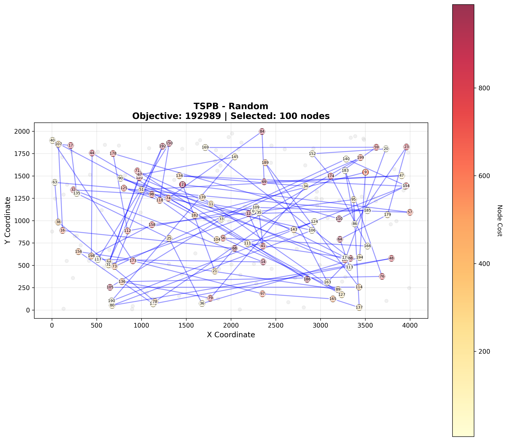
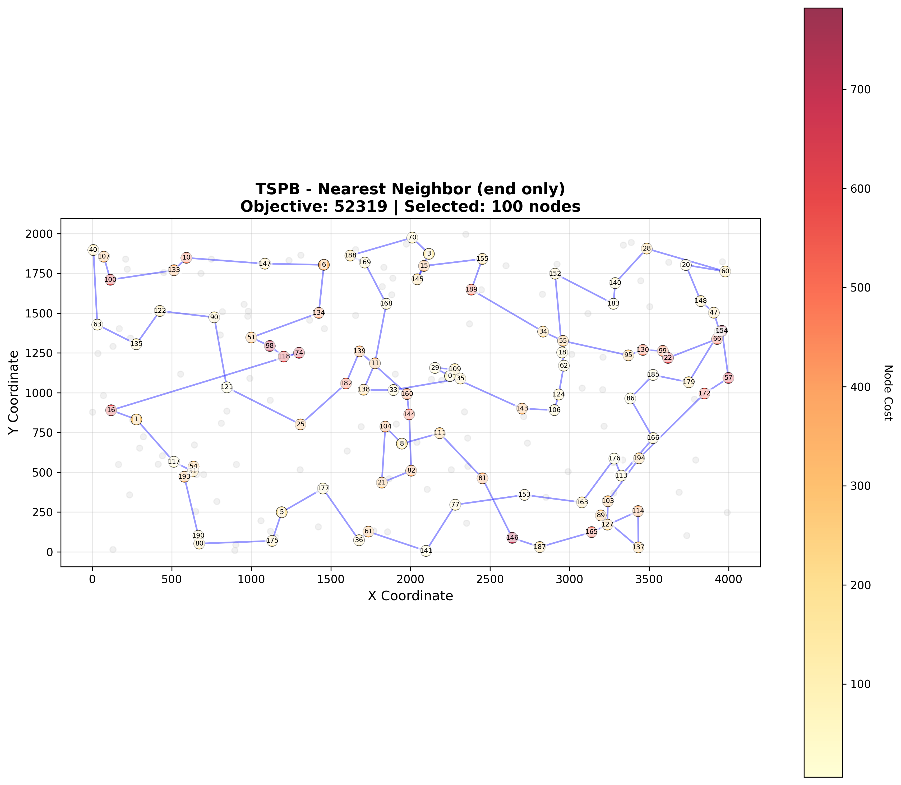
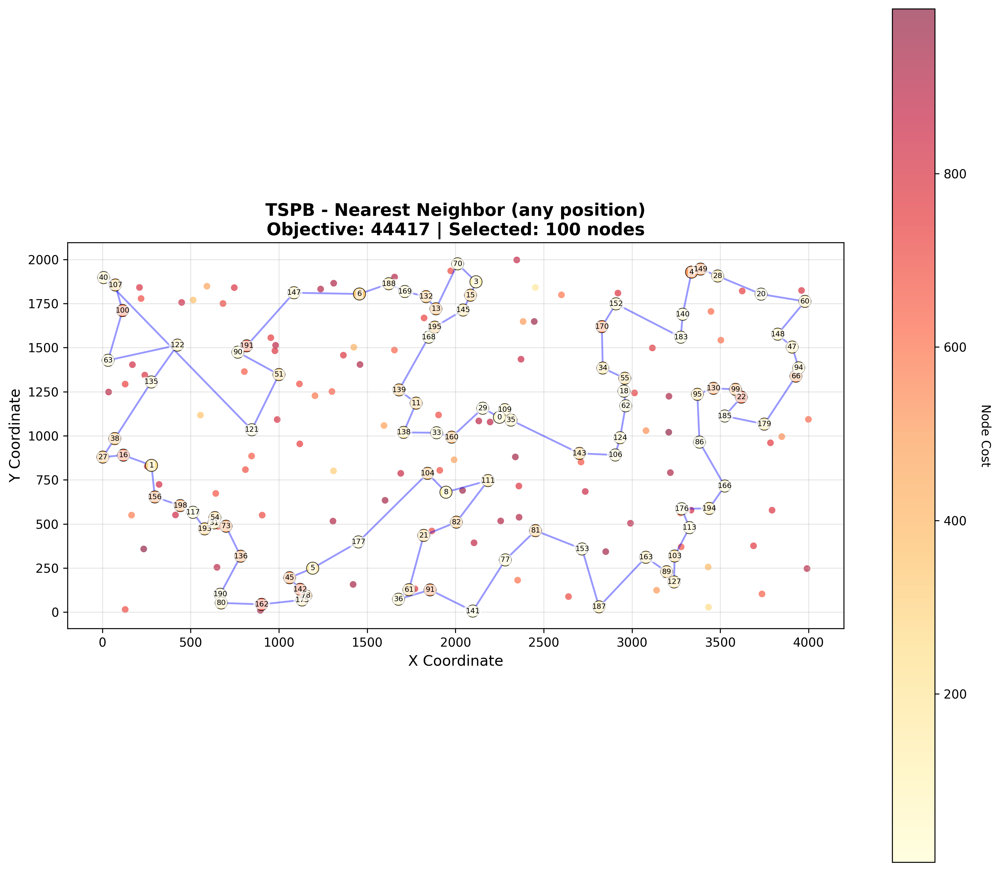
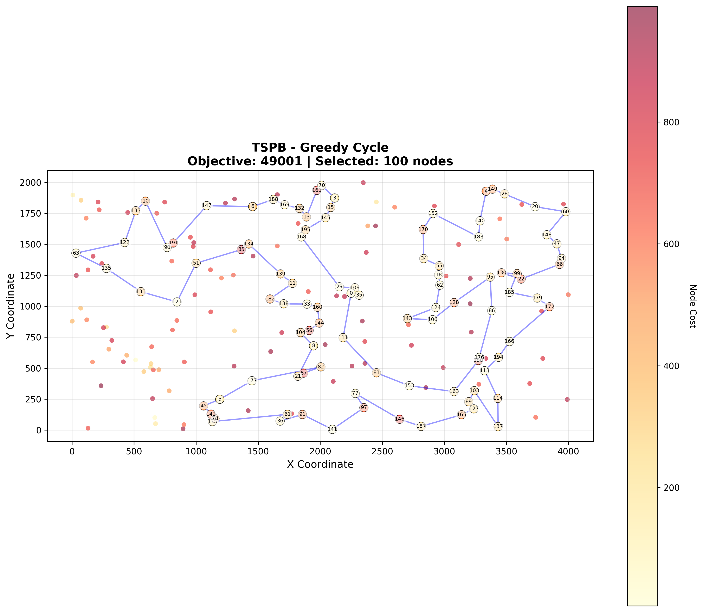

# Assignment 1 - Greedy Heuristics for Selective TSP

## Authors
- Mateusz Idziejczak 155842
- Mateusz Stawicki 155900

## Problem Description

This is a variant of the Traveling Salesman Problem where:
- Select exactly 50% of nodes (rounded up if odd)
- Form a Hamiltonian cycle through selected nodes
- Minimize: total path length + sum of selected node costs
- Distances are Euclidean distances rounded to integers

## Algorithm Pseudocode

### Random Solution
```
1. Create list of all node indices
2. Shuffle the list
3. Select first 50% nodes
4. Return as cycle
```

### Nearest Neighbor (End Only)
```
1. Start with given node
2. While not enough nodes selected:
   a. For each unselected node i:
      Calculate: distance[last_node][i] + cost[i]
   b. Select node i with minimum value
   c. Add to end of path
3. Return cycle
```

### Nearest Neighbor (Any Position)
```
1. Start with given node
2. While not enough nodes selected:
   a. For each unselected node i:
      For each position p in current path:
         If p = 0 (insert at start):
            delta = cost[i] + distance[i][path[0]]
         Else if p = path.size (insert at end):
            delta = cost[i] + distance[path[end]][i]
         Else (insert in middle):
            delta = cost[i] + distance[path[p-1]][i] + distance[i][path[p]] 
                    - distance[path[p-1]][path[p]]
   b. Insert node with minimum delta at best position
3. Return cycle (path treated as path during construction, cycle for evaluation)
```

### Greedy Cycle
```
1. Start with given node
2. Add nearest node (considering distance + cost)
3. While not enough nodes selected:
   a. For each unselected node i:
      For each edge (u,v) in cycle:
         Calculate delta = dist[u][i] + dist[i][v] - dist[u][v] + cost[i]
   b. Insert node with minimum delta at best edge
4. Return cycle
```

## Key Results

### TSPA.csv (200 nodes, select 100)

| Method | Min | Max | Avg |
|---|---:|---:|---:|
| Random | 242247 | 288959 | 265582 |
| Nearest Neighbor (end only) | 83182 | 89433 | 85108 |
| Nearest Neighbor (any position) | 71179 | 75450 | 73178 |
| Greedy Cycle | 71488 | 74410 | 72646 |

### TSPB.csv (200 nodes, select 100)

| Method | Min | Max | Avg |
|---|---:|---:|---:|
| Random | 188533 | 235611 | 212974 |
| Nearest Neighbor (end only) | 52319 | 59030 | 54390 |
| Nearest Neighbor (any position) | 44417 | 53438 | 45870 |
| Greedy Cycle | 49001 | 57324 | 51400 |










The solutions were checked using Solution checker.xlsx

## Github
> https://github.com/Luncenok/EvolutionaryComputingLab1

## Conclusions

The experimental results demonstrate significant performance differences among the implemented greedy heuristics:

**Random baseline** produces highly variable solutions with poor quality, serving as a lower bound for comparison (avg ~264k for TSPA, ~213k for TSPB).

**Nearest Neighbor (end only)** achieves substantial improvement over random (~68% reduction for TSPA, ~74% for TSPB) but remains limited by its constraint of only appending nodes to the path end.

**Nearest Neighbor (any position)** and **Greedy Cycle** deliver the best performance, with average objectives of ~72.6k (TSPA) and ~51.4k (TSPB). These methods show:
- Lower variance (narrower min-max ranges)
- Consistent quality across multiple runs
- ~73% improvement over random solutions

The cycle-based insertion strategies (Greedy Cycle, Nearest Neighbor with flexible positioning) significantly outperform path-only construction by considering the global impact of node placement. However, their similar performance suggests diminishing returns from additional complexity once intelligent insertion is implemented.

All greedy heuristics successfully construct valid solutions in polynomial time, making them practical for real-world selective TSP instances.
