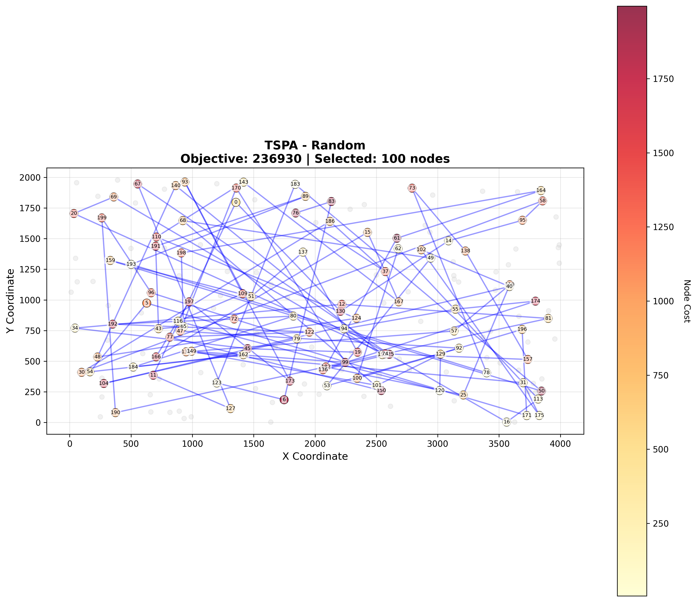
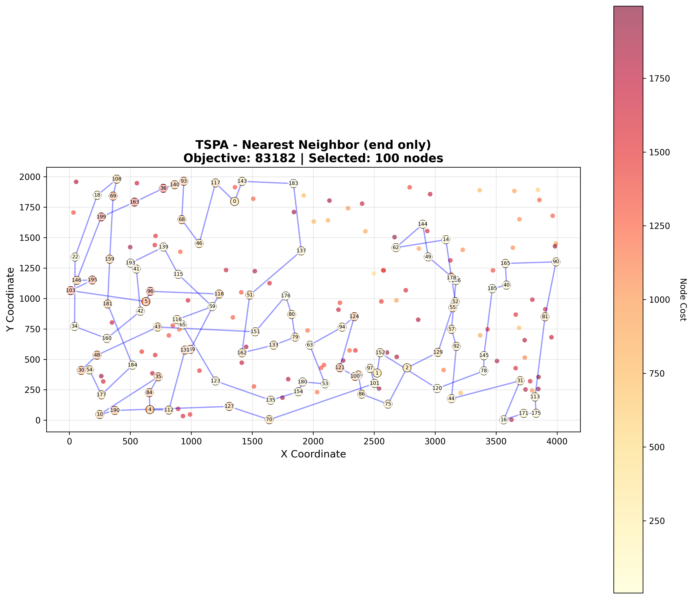
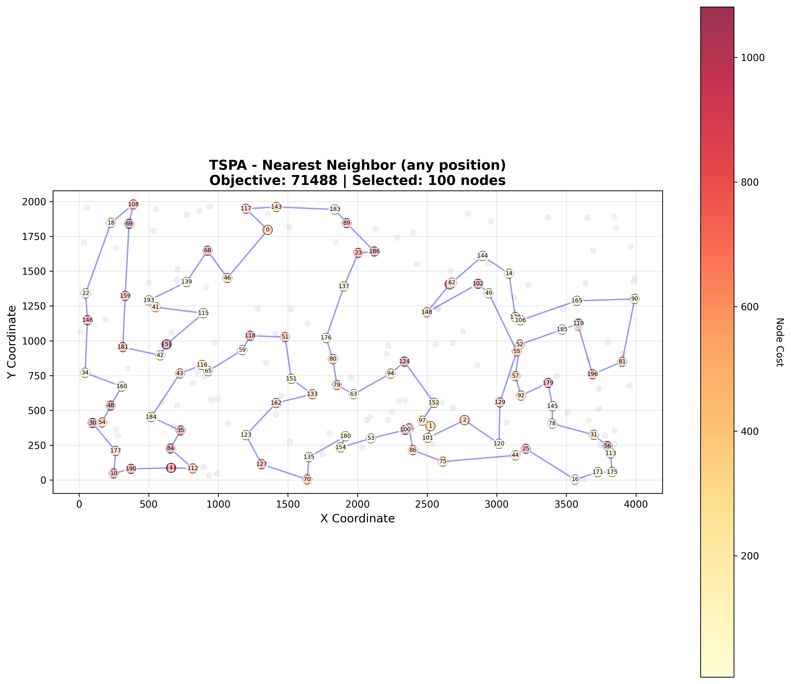
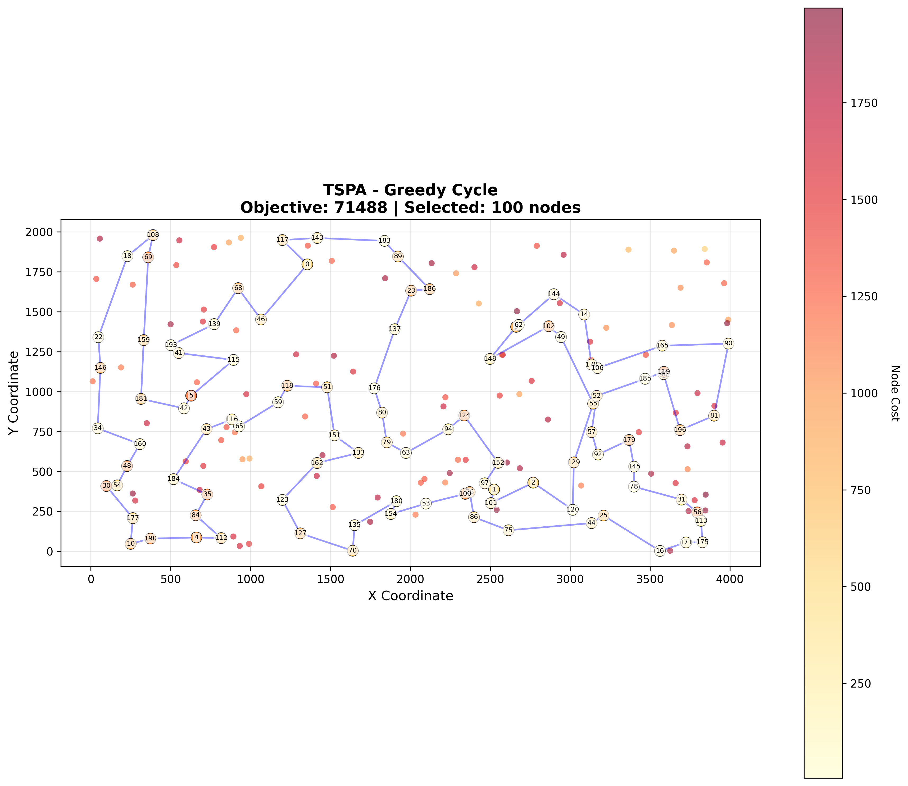

# Assignment 1 - Greedy Heuristics for Selective TSP

## Authors
- Mateusz Idziejczak 155842
- Mateusz Stawicki 155900

## Github
> https://github.com/Luncenok/EvolutionaryComputingLab1

## Problem Description

This is a variant of the Traveling Salesman Problem where:
- Select exactly 50% of nodes (rounded up if odd)
- Form a Hamiltonian cycle through selected nodes
- Minimize: total path length + sum of selected node costs
- Distances are Euclidean distances rounded to integers

## Implemented Algorithms

1. **Random Solution**: Randomly select 50% of nodes and create a random cycle
2. **Nearest Neighbor (end only)**: Greedily add nodes at the end of path, considering both distance and node cost
3. **Nearest Neighbor (any position)**: Greedily add nodes at any position in the path
4. **Greedy Cycle**: Start with 2 nodes, then iteratively insert nodes at the position that minimizes increase in objective

Each method generates 200 solutions (starting from each node). 

## Compilation and Execution

```bash
# Compile
g++ -std=c++17 -O2 main.cpp -o main

# Run
./main
```

## Visualization

Generate 2D visualizations of all best solutions:

```bash
# Install dependencies
python3 -m venv venv
source venv/bin/activate
pip install -r requirements.txt

# Generate visualizations
python3 visualize.py
```

This creates 8 PNG files (4 methods × 2 instances) showing:
- Selected nodes as colored circles (color = cost intensity)
- Unselected nodes as light gray dots
- Hamiltonian cycle path as blue lines
- Node indices as labels

## Input Format

TSPA.csv and TSPB.csv files with semicolon-separated values:
```
x;y;cost
1355;1796;496
2524;387;414
...
```

## Output

The program processes both TSPA.csv and TSPB.csv and outputs:
- Min, Max, and Average objective values for each method
- Best solution (list of node indices starting from 0) for each method

Results are also saved to `results.txt`.

## Key Results

### TSPA.csv (200 nodes, select 100)
- **Random**: Min=233411, Avg=264732
- **NN (end only)**: Min=83182, Avg=85108
- **NN (any position)**: Min=71488, Avg=72646 ✓ Best
- **Greedy Cycle**: Min=71488, Avg=72646 ✓ Best

### TSPB.csv (200 nodes, select 100)
- **Random**: Min=190580, Avg=213103
- **NN (end only)**: Min=52319, Avg=54390
- **NN (any position)**: Min=49001, Avg=51400 ✓ Best
- **Greedy Cycle**: Min=49001, Avg=51400 ✓ Best

The solutions were checked using Solution checker.xlsx

## Code Structure

- `calculateObjective()`: Computes total path length + sum of node costs
- `randomSolution()`: Generates random solution
- `nearestNeighborEnd()`: Greedy insertion at end only
- `nearestNeighborAny()`: Greedy insertion at any position
- `greedyCycle()`: Greedy cycle construction
- `processInstance()`: Runs all algorithms on one instance
- `main()`: Processes both TSPA and TSPB instances

## Algorithm Pseudocode

### Random Solution
```
1. Create list of all node indices
2. Shuffle the list
3. Select first 50% nodes
4. Return as cycle
```


### Nearest Neighbor (End Only)
```
1. Start with given node
2. While not enough nodes selected:
   a. Find unselected node that minimizes: distance[last_node][i] + cost[i]
   b. Add to end of path
3. Return cycle
```


### Nearest Neighbor (Any Position)
```
1. Start with given node
2. While not enough nodes selected:
   a. For each unselected node i:
      For each position p in current path:
         Calculate delta of inserting i at position p
   b. Insert node with minimum delta at best position
3. Return cycle
```


### Greedy Cycle
```
1. Start with given node
2. Add nearest node (considering distance + cost)
3. While not enough nodes selected:
   a. For each unselected node i:
      For each edge (u,v) in cycle:
         Calculate delta = dist[u][i] + dist[i][v] - dist[u][v] + cost[i]
   b. Insert node with minimum delta at best edge
4. Return cycle
```


## Notes

- Fixed seed (12345) used for reproducibility of random solutions
