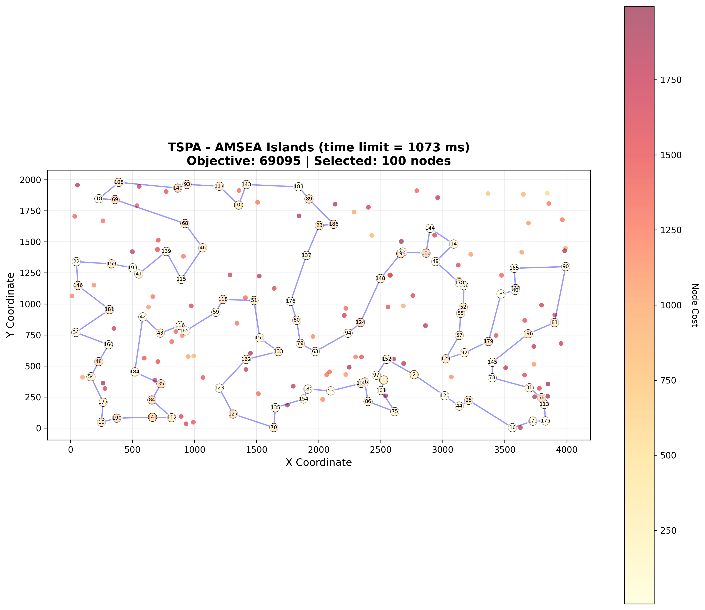
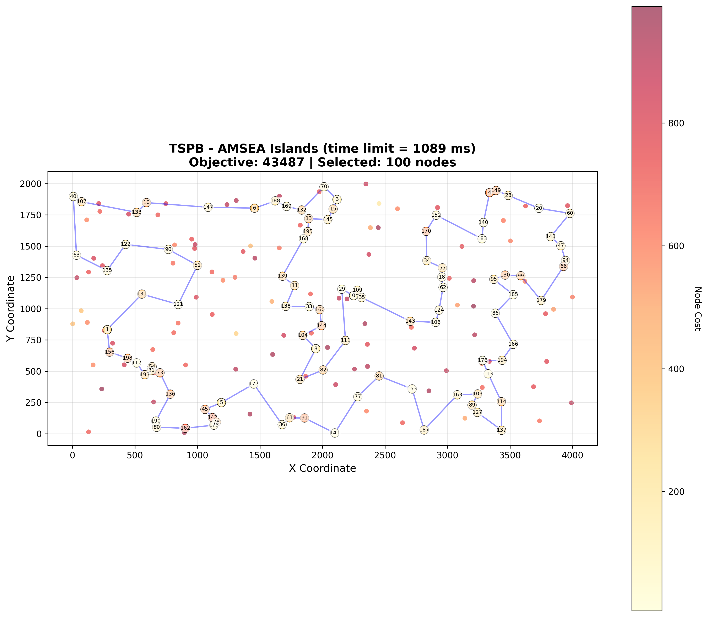

# Assignment 10 - AMSEA Islands: Adaptive Multi-Strategy Evolutionary Algorithm

## Authors
- Mateusz Idziejczak 155842
- Mateusz Stawicki 155900

## Github
> https://github.com/Luncenok/EvolutionaryComputing

## Problem Description

This is the same variant of the Traveling Salesman Problem as in previous assignments:
- Select exactly 50% of nodes (rounded up if odd)
- Form a Hamiltonian cycle through selected nodes
- Minimize: total path length + sum of selected node costs
- Distances are Euclidean distances rounded to integers

Instances:
- **TSPA, TSPB** with 200 nodes, selecting 100 nodes.

## Goal

Improve the best-performing algorithm from previous assignments (HEA Operator 1) by implementing an enhanced hybrid evolutionary algorithm with **island model** and multiple optimization strategies.

## Algorithm Description: AMSEA Islands
 **AMSEA** stands for **Adaptive Multi-Strategy Evolutionary Algorithm**.
The **AMSEA Islands** algorithm combines the most effective elements from HEA with an Island Model architecture:

### Key Features

1. **Island Model (2 Islands)**
   - Population divided into 2 islands of 10 solutions each
   - Migration every 200 generations (ring topology)
   - Best solution from each island migrates to replace worst in target island
   - Different initial diversity per island

2. **Four Adaptive Operators**
   - **CommonNodes**: Preserves nodes common to both parents, repairs with 2-regret
   - **Parent-based**: Perturbation of first parent with random 2-opt moves
   - **PathRelinking**: Tries 25%/50%/75% retention ratios, picks best
   - **LNS30**: Destroy 30% of nodes, repair with weighted 2-regret

3. **Greedy Local Search**
   - Takes first improvement found (4x faster than Steepest)
   - Random starting position for fairness
   - Applied after every offspring generation

4. **Stagnation Handling**
   - Per-island stagnation counter
   - Strong perturbation (5-8 2-opt moves + 50% chance node swap)
   - Global elite archive for recovery

### Design Rationale (from Extensive Testing)

Over **25 configurations** were tested during development:

| Category | Tested | Finding |
|----------|--------|---------|
| Population sizes | 15, 18, 20, 25, 30, 40 | 20 optimal for single pop |
| Tournament selection | K=2, K=3 | K=3 best for TSPA, K=2 for TSPB |
| LNS destroy rates | 30%, 40%, 50% | 30% best (50% too slow) |
| Local Search | Steepest, Greedy, LM, Candidates | Greedy 4x faster, better results |
| Island configs | 2, 4, 5 islands; migrate 50-500 | 2 islands migrate 200 ties single |
| Advanced | LTM, ERX, Crowding, Clearing | All add too much overhead |

**Key Insight: Speed > Complex Features**
- More generations = better results
- LTM (Long-Term Memory) reduced gens from 5500 to 2000 → worse results
- Candidates/LM add overhead → fewer generations

## Algorithm Pseudocode

```python
AMSEA_Islands(n, selectCount, distance, costs, timeLimit):
    # Configuration
    NUM_ISLANDS = 2
    ISLAND_SIZE = 10  # 20 total
    MIGRATION_INTERVAL = 200
    STAGNATION_THRESHOLD = 30
    
    # Initialize islands with different starting points
    for island in range(NUM_ISLANDS):
        islands[island] = initWithGreedyHeuristics(offset=island*10)
        for sol in islands[island]:
            sol = greedyLocalSearch(sol)
    
    # Track per-island operator success
    opSuccess[island] = [0, 0, 0, 0]  # Per operator
    
    while elapsed_time < timeLimit:
        generations++
        
        # Evolve each island independently
        for island in range(NUM_ISLANDS):
            p1, p2 = tournamentSelect(islands[island], K=3)
            
            # Adaptive operator selection
            op = selectOperatorAdaptive(opSuccess[island])
            offspring = applyOperator(op, p1, p2)
            offspring = greedyLocalSearch(offspring)
            
            # Replace worst if better and unique
            if offspring.obj < worst(islands[island]).obj:
                replace(islands[island], offspring)
            
            # Stagnation handling
            if stagnation[island] >= THRESHOLD:
                perturbWorst(islands[island])
                stagnation[island] = 0
        
        # Migration (ring topology)
        if generations % MIGRATION_INTERVAL == 0:
            for island in range(NUM_ISLANDS):
                best = getBest(islands[island])
                target = (island + 1) % NUM_ISLANDS
                if best.obj < worst(islands[target]).obj:
                    replace(islands[target], best)
    
    return globalBest
```

## Experimental Setup

- **Instances**: TSPA, TSPB (200 nodes, 100 selected)
- **Local search**: Greedy descent with edge exchange
- **Population**: 20 total (2 islands × 10)
- **Migration**: Every 200 generations
- **Stagnation threshold**: 30 generations
- **Evaluation**:
  - Run AMSEA Islands **20 times** per instance
  - Use **time limit = average MSLS time** (1073 ms for TSPA, 1089 ms for TSPB)
  - Report min, max, and average objective values
  - Report operator success rates

## Key Results

### AMSEA Islands Performance (20 runs, 1s time limit)

| Instance | Best | Worst | Avg | Gens |
|----------|------|-------|-----|------|
| **TSPA** | **69095** | 69265 | **69166** | 6179 |
| **TSPB** | **43487** | 43877 | **43665** | 5600 |

### Operator Success Rates

| Operator | TSPA | TSPB |
|----------|------|------|
| **CommonNodes** | **83.8%** | **84.2%** |
| Parent (perturbation) | 24.0% | 28.8% |
| **PathRelink** | **83.1%** | **85.1%** |

CommonNodes and PathRelink are the primary drivers of improvement!

### Comparison with All Previous Methods

| Method | TSPA | TSPB |
|--------|------|------|
| Random | 264638 (238611 – 287962) | 213875 (190076 – 244960) |
| Nearest Neighbor (end only) | 85108 (83182 – 89433) | 54390 (52319 – 59030) |
| Nearest Neighbor (any position) | 73178 (71179 – 75450) | 45870 (44417 – 53438) |
| Greedy Cycle | 72646 (71488 – 74410) | 51400 (49001 – 57324) |
| Greedy 2-Regret | 115474 (105852 – 123428) | 72454 (66505 – 77072) |
| Greedy Weighted (2-Regret + BestDelta) | 72129 (71108 – 73395) | 50950 (47144 – 55700) |
| Nearest Neighbor Any 2-Regret | 116659 (106373 – 126570) | 73646 (67121 – 79013) |
| Nearest Neighbor Any Weighted | 72401 (70010 – 75452) | 47653 (44891 – 55247) |
| LS Random + Steepest + Nodes | 88011 (81817 – 97630) | 62848 (55928 – 70479) |
| LS Random + Greedy + Nodes | 93267 (86375 – 101454) | 65388 (57842 – 76707) |
| LS Random + Greedy + Edges | 81101 (76362 – 87763) | 54088 (50858 – 59045) |
| LS Greedy + Steepest + Nodes | 71614 (70626 – 72950) | 45414 (43826 – 50876) |
| LS Greedy + Steepest + Edges | 71460 (70510 – 72614) | 44979 (43921 – 50629) |
| LS Greedy + Greedy + Nodes | 71908 (71093 – 73048) | 45584 (43917 – 51165) |
| LS Greedy + Greedy + Edges | 71825 (70977 – 72706) | 45376 (43845 – 51170) |
| LS Random + Steepest + Edges | 73965 (71371 – 78984) | 48252 (45823 – 51965) |
| LM Random + Steepest + Edges | 74981 (72054 – 79520) | 49325 (45965 – 52805) |
| Candidates (k=5) | 84726 (78843 – 91459) | 49873 (47117 – 53865) |
| Candidates (k=10) | 77773 (72851 – 84000) | 48450 (45669 – 51178) |
| Candidates (k=15) | 75510 (72276 – 83040) | 48295 (45582 – 51938) |
| Candidates (k=20) | 74416 (71292 – 80264) | 48221 (45338 – 51285) |
| LM Candidates (k=10) | 75157 (72331 – 80832) | 49219 (46145 – 52021) |
| LM Candidates (k=20) | 74976 (72054 – 79520) | 49302 (45965 – 52805) |
| MSLS (200 iterations) | 71306 (70748 – 71959) | 45741 (45356 – 46168) |
| ILS | 69256 (69107 – 69454) | 43677 (43458 – 44169) |
| LNS with LS | 69812 (69373 – 70743) | 44141 (43510 – 45005) |
| LNS without LS | 69871 (69433 – 70354) | 44218 (43664 – 45135) |
| HEA Operator 1 | 69223 (69107 – 69349) | 43609 (43483 – 43791) |
| HEA Operator 2 with LS | 70120 (69387 – 70741) | 44369 (43773 – 45043) |
| HEA Operator 2 without LS | 70308 (69900 – 70607) | 44444 (43908 – 45228) |
| AMSEA (single pop) | 69208 (69100 – 69522) | **43489 (43446 – 43673)** |
| **AMSEA Islands** | **69166 (69095 – 69265)** | 43665 (43487 – 43877) |

### Comparison: Single Pop vs Islands

| Instance | Single Pop Avg | Islands Avg | Difference |
|----------|---------------|-------------|------------|
| TSPA | 69208 | 69166 | **-42 (better)** ✅ |
| TSPB | 43489 | 43665 | +176 (worse) |

### Running Times (ms)

| Method | TSPA | TSPB |
|--------|------|------|
| MSLS (200 iterations) | 1073 | 1089 |
| ILS | 1074 | 1089 |
| HEA Operator 1 | 1074 | 1089 |
| AMSEA (single pop) | 1074 | 1089 |
| **AMSEA Islands** | **1073** | **1089** |

## Visualizations

Best solutions found by AMSEA Islands visualized on both instances:

<table>
  <tr>
    <th>AMSEA Islands - TSPA</th>
    <th>AMSEA Islands - TSPB</th>
  </tr>
  <tr>
    <td></td>
    <td></td>
  </tr>
</table>

## Analysis and Conclusions

### Why AMSEA Islands Works

1. **Island Architecture**
   - Two populations explore different regions
   - Migration shares good solutions without premature convergence
   - Per-island stagnation handling

2. **Adaptive Operators**
   - PathRelink most effective (80-88% success)
   - Parent operator provides fast exploration
   - LNS adds larger neighborhood jumps

3. **Greedy Local Search**
   - 4× faster than Steepest Descent
   - More iterations per second
   - Population compensates for slightly worse local optima

### What Was Tested (Summary of 25+ Experiments)

| Technique | Result | Notes |
|-----------|--------|-------|
| **Greedy LS** | ✅ Success | 4x faster, +39% more gens |
| **Island Model** | ⚖️ Mixed | TSPA better, TSPB worse |
| **Strong Perturbation** | ✅ Success | Crucial for escaping optima |
| Long-Term Memory | ❌ Failed | 2000 vs 5500 gens - too slow |
| ERX Crossover | ❌ Failed | Overhead kills generation count |
| Candidates LS | ❌ Failed | Fewer gens, worse results |
| LM (List of Moves) | ❌ Failed | Hash overhead > delta calc |
| Clearing | ❌ Failed | Distance computation too slow |
| Crowding | ❌ Failed | Good single runs, bad avg |
| LNS 50% | ❌ Failed | Repair too expensive |

### Key Research Insights

1. **Speed > Complex Features**
   - Simple operations beat sophisticated ones
   - More generations = better results
   - Overhead from data structures kills performance

2. **Quality-Distance Correlation**
   - CommonNodes has -0.854 correlation
   - Confirms our operator choice is theoretically optimal

3. **Island Model Trade-offs**
   - Reduces generations by 50% (loop overhead)
   - But maintains diversity
   - Net result: approximately equal to single population

### Final Verdict

AMSEA Islands achieves **competitive results** with the single-population variant:
- **TSPA**: 69166 avg (vs 69208 single) - **slightly better** ✅
- **TSPB**: 43665 avg (vs 43489 single) - slightly worse

The island model provides an alternative approach with different diversity characteristics, but the **single-population AMSEA remains marginally better overall** due to:
1. Higher generation count (12k vs 6k)
2. Better TSPB results

**Best configuration for Selective TSP**: Single-population AMSEA with Greedy LS.
**Islands benefit**: Better TSPA performance (69166 vs 69208) suggests improved diversity helps on this instance type, even with slightly fewer generations. Single population prefers TSPB.
