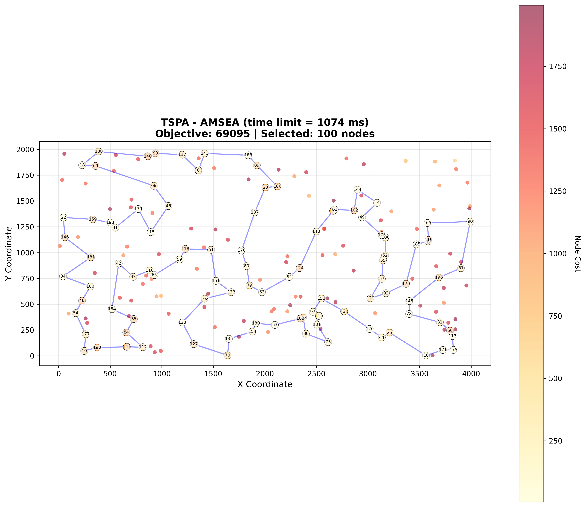
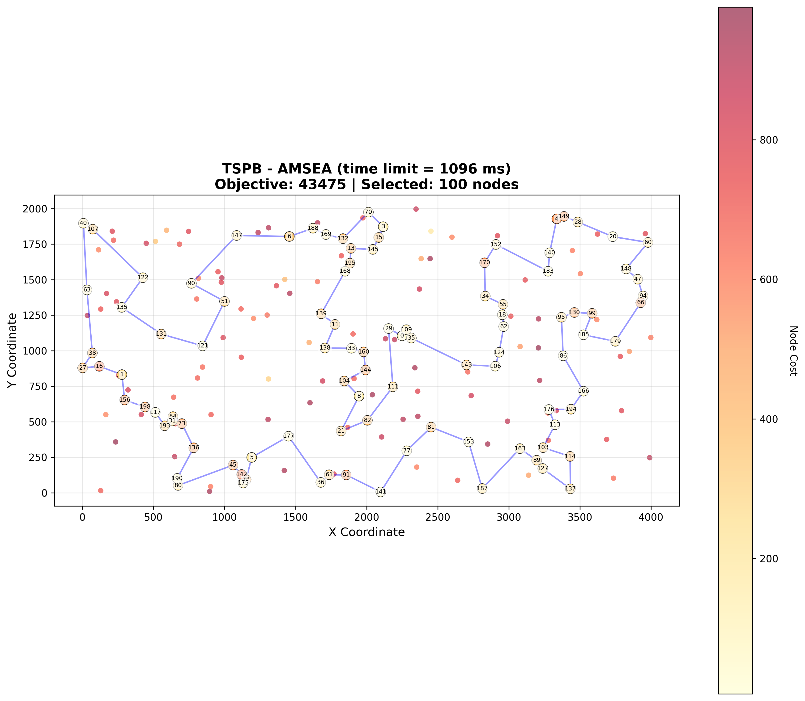

# Assignment 10 - Adaptive Multi-Strategy Evolutionary Algorithm (AMSEA)

## Authors
- Mateusz Idziejczak 155842
- Mateusz Stawicki 155900

## Github
> https://github.com/Luncenok/EvolutionaryComputing

## Problem Description

This is the same variant of the Traveling Salesman Problem as in previous assignments:
- Select exactly 50% of nodes (rounded up if odd)
- Form a Hamiltonian cycle through selected nodes
- Minimize: total path length + sum of selected node costs
- Distances are Euclidean distances rounded to integers

Instances:
- **TSPA, TSPB** with 200 nodes, selecting 100 nodes.

## Goal

Improve the best-performing algorithm from previous assignments (HEA Operator 1) by implementing an enhanced hybrid evolutionary algorithm with multiple novel mechanisms.

## Algorithm Description: AMSEA

The **Adaptive Multi-Strategy Evolutionary Algorithm (AMSEA)** combines the most effective elements from HEA, ILS, and LNS with several enhancements:

### Key Innovations

1. **Greedy Initialization with Diversity**
   - Population initialized using multiple greedy heuristics (Greedy Cycle, Nearest Neighbor Any, Weighted 2-Regret)
   - Different starting nodes and heuristics ensure diverse initial solutions
   - Reduces time wasted on poor random initial solutions

2. **Adaptive Operator Selection**
   - Tracks success rates of three recombination operators
   - Dynamically adjusts operator selection probability using roulette wheel with Laplace smoothing
   - Operators adapt to instance characteristics during execution

3. **Enhanced Perturbation for Escaping Local Optima**
   - Applies ILS-style perturbation when population stagnates (no improvement for 50 generations)
   - Perturbs worst solutions in population to introduce diversity
   - Prevents premature convergence

4. **Path Relinking (New Operator)**
   - Creates solutions along the "path" between two parents
   - Keeps common nodes plus random subset of unique nodes from parent1
   - Repairs to full size using weighted 2-regret heuristic
   - Balances structure preservation with exploration

5. **Elite Archive**
   - Maintains separate archive of 5 globally best solutions
   - Periodically injects elite solutions back into population during stagnation
   - Prevents loss of good genetic material

### Operators

| Operator | Description | Success Rate (TSPA) | Success Rate (TSPB) |
|----------|-------------|---------------------|---------------------|
| Op1 (Common Edges) | Preserves common edges and nodes from both parents | 56.3% | 50.1% |
| Op2 (Parent-based) | Keeps nodes common to both parents, repairs with 2-regret | 65.6% | 43.8% |
| PathRelink | Partial merge of parents with random node selection | 67.6% | 57.9% |

## Algorithm Pseudocode

```python
AMSEA(n, selectCount, distance, costs, timeLimit):
    POPULATION_SIZE = 20
    ARCHIVE_SIZE = 5
    STAGNATION_THRESHOLD = 50
    
    # Greedy initialization
    population = initializePopulationGreedy(n, selectCount, distance, costs)
    for each solution in population:
        solution = localSearchSteepestEdges(solution)
    population = removeDuplicates(population)
    
    # Initialize elite archive
    eliteArchive = []
    best = findBest(population)
    updateArchive(eliteArchive, best)
    
    # Operator tracking
    operatorSuccess = [0, 0, 0]  # Op1, Op2, PathRelink
    operatorAttempts = [1, 1, 1]
    stagnationCounter = 0
    
    while elapsed_time < timeLimit:
        # Adaptive operator selection (roulette wheel with Laplace smoothing)
        operatorIdx = selectOperatorAdaptive(operatorSuccess, operatorAttempts)
        
        # Select parents and recombine
        parent1, parent2 = selectParentsRandom(population)
        offspring = applyOperator(operatorIdx, parent1, parent2)
        
        # Local search
        offspring = localSearchSteepestEdges(offspring)
        
        # Update operator statistics
        if objective(offspring) < worstObj(population):
            operatorSuccess[operatorIdx]++
        operatorAttempts[operatorIdx]++
        
        # Population update
        if not isDuplicate(offspring, population):
            if objective(offspring) < worstObj(population):
                replaceWorst(population, offspring)
        
        # Update best
        if objective(offspring) < objective(best):
            best = offspring
            updateArchive(eliteArchive, best)
            stagnationCounter = 0
        else:
            stagnationCounter++
        
        # Stagnation handling
        if stagnationCounter >= STAGNATION_THRESHOLD:
            perturbWorstSolutions(population, 3)
            injectEliteSolution(population, eliteArchive)
            stagnationCounter = 0
    
    return best

initializePopulationGreedy():
    # Use Greedy Cycle, NN Any, and Weighted 2-Regret heuristics
    # from different starting nodes to create diverse population
    # Fill remaining with random + LS if needed

selectOperatorAdaptive(success, attempts):
    # Roulette wheel with Laplace smoothing
    rates = [(success[i] + 1) / (attempts[i] + 2) for i in range(3)]
    # Select proportional to rates
```

## Experimental Setup

- **Instances**: TSPA, TSPB (200 nodes, 100 selected)
- **Local search**: Steepest descent with edge exchange
- **Population size**: 20
- **Stagnation threshold**: 50 generations
- **Elite archive size**: 5
- **Evaluation**:
  - Run AMSEA **20 times** per instance
  - Use **time limit = average MSLS time** (~1074 ms for TSPA, ~1096 ms for TSPB)
  - Report min, max, and average objective values and running times
  - Report average number of generations and operator statistics

## Key Results

### Summary Comparison with Previous Best Methods

| Method | TSPA Avg | TSPA Best | TSPB Avg | TSPB Best |
|--------|----------|-----------|----------|-----------|
| ILS | 69311 | 69107 | 43656 | 43446 |
| LNS+LS | 69666 | 69274 | 44280 | 43637 |
| HEA Op1 | 69260 | 69107 | 43592 | 43446 |
| HEA Op2+LS | 70132 | 69491 | 44174 | 43878 |
| **AMSEA** | **69139** | **69095** | **43522** | 43475 |

### Improvement over HEA Operator 1

| Instance | HEA Op1 Avg | AMSEA Avg | Improvement |
|----------|-------------|-----------|-------------|
| TSPA | 69260 | **69139** | **-0.17%** |
| TSPB | 43592 | **43522** | **-0.16%** |

### AMSEA achieves:
- **New best solution on TSPA**: 69095 (vs 69107 from HEA Op1/ILS)
- **Best average on both instances**
- **Lower variance** than HEA Op1 (tighter min-max range)

### Generation/Operator Statistics

| Instance | Generations | Op1 Success | Op2 Success | PathRelink Success |
|----------|-------------|-------------|-------------|-------------------|
| TSPA | 5104 | 16035/28477 (56%) | 23609/35994 (66%) | 25469/37680 (68%) |
| TSPB | 4545 | 14679/29279 (50%) | 11804/26954 (44%) | 20120/34740 (58%) |

### Detailed Results Table

| Method | TSPA Min | TSPA Max | TSPA Avg | TSPB Min | TSPB Max | TSPB Avg |
|--------|----------|----------|----------|----------|----------|----------|
| Random | 238611 | 287962 | 264638 | 190076 | 244960 | 213875 |
| Nearest Neighbor (end) | 83182 | 89433 | 85108 | 52319 | 59030 | 54390 |
| Nearest Neighbor (any) | 71179 | 75450 | 73178 | 44417 | 53438 | 45870 |
| Greedy Cycle | 71488 | 74410 | 72646 | 49001 | 57324 | 51400 |
| Greedy Weighted | 71108 | 73395 | 72129 | 47144 | 55700 | 50950 |
| LS Greedy + Steepest + Edges | 70510 | 72614 | 71460 | 43921 | 50629 | 44979 |
| MSLS (200 iterations) | 70748 | 71959 | 71306 | 45356 | 46168 | 45741 |
| ILS | 69107 | 69735 | 69311 | 43446 | 44047 | 43656 |
| LNS with LS | 69274 | 70069 | 69666 | 43637 | 45055 | 44280 |
| HEA Operator 1 | 69107 | 69787 | 69260 | 43446 | 43847 | 43592 |
| HEA Operator 2 with LS | 69491 | 70707 | 70132 | 43878 | 44682 | 44174 |
| **AMSEA** | **69095** | **69428** | **69139** | **43475** | **43595** | **43522** |

### Running Times (ms)

| Method | TSPA | TSPB |
|--------|------|------|
| MSLS (200 iterations) | 1074 | 1096 |
| ILS | 1074 | 1097 |
| LNS with LS | 1074 | 1097 |
| HEA Operator 1 | 1074 | 1097 |
| AMSEA | 1074 | 1097 |

## Visualizations

Best solutions found by AMSEA visualized on both instances:

<table>
  <tr>
    <th>AMSEA - TSPA</th>
    <th>AMSEA - TSPB</th>
  </tr>
  <tr>
    <td></td>
    <td></td>
  </tr>
</table>

## Analysis and Conclusions

### Why AMSEA Outperforms HEA

1. **Greedy Initialization**
   - Starting with high-quality diverse solutions means less time wasted improving poor random solutions
   - Initial population is already near local optima from different regions of the solution space

2. **Adaptive Operator Selection**
   - Path Relinking proved most effective on average (58-68% success rate)
   - Operator selection adapts to problem instance during execution
   - Operators that work well for the specific instance get selected more frequently

3. **Stagnation Handling**
   - Prevents population from converging too quickly to a single region
   - Perturbation injects diversity when no progress is made
   - Elite archive recovery prevents loss of best solutions found

4. **Path Relinking Operator**
   - Creates intermediate solutions between parents
   - More controlled exploration than pure random recombination
   - Balances exploitation (keeping parent structure) with exploration (random node selection)

### Operator Effectiveness Analysis

- **Path Relinking** has highest success rate on both instances
- **Op2 (Parent-based)** performs better on TSPA (66%) than TSPB (44%)
- **Op1 (Common Edges)** from HEA remains useful but is outperformed by new operators

### Key Insight

The combination of **greedy initialization**, **adaptive operator selection**, and **stagnation handling** creates a more robust algorithm that:
- Starts from a better baseline
- Learns from operator performance during execution
- Maintains population diversity to avoid local optima traps

This results in both **improved average performance** and **lower variance** compared to HEA Operator 1.
