# Assignment 3 - Local Search for Selective TSP

## Authors
- Mateusz Idziejczak 155842
- Mateusz Stawicki 155900

## Github
> https://github.com/Luncenok/EvolutionaryComputing

## Problem Description

This is a variant of the Traveling Salesman Problem where:
- Select exactly 50% of nodes (rounded up if odd)
- Form a Hamiltonian cycle through selected nodes
- Minimize: total path length + sum of selected node costs
- Distances are Euclidean distances rounded to integers

## Algorithm Pseudocode

### Delta Calculation

Delta represents the change in objective function after applying a move: `delta = newCost - oldCost`  
If `delta < 0`, the move improves the solution.

#### 1. Intra-Route: Node Exchange (Swap)
Swap two nodes at positions `pos1` and `pos2` in the tour.

```
Given: [..., prev1, node1, next1, ..., prev2, node2, next2, ...]
After: [..., prev1, node2, next1, ..., prev2, node1, next2, ...]

oldCost = dist(prev1, node1) + dist(node1, next1) 
        + dist(prev2, node2) + dist(node2, next2)
        
newCost = dist(prev1, node2) + dist(node2, next1) 
        + dist(prev2, node1) + dist(node1, next2)
        
delta = newCost - oldCost
```

Special case: Adjacent nodes only change 2 edges instead of 4.

#### 2. Intra-Route: Edge Exchange (Reverse Segment)
Reverse the segment between positions `pos1` and `pos2`.

```
Given: [..., pos1, A, B, C, ..., Z, pos2, next, ...]
After: [..., pos1, Z, ..., C, B, A, pos2, next, ...]

Remove edges: pos1→A and pos2→next
Add edges:    pos1→pos2 and A→next

oldCost = dist(pos1, A) + dist(pos2, next)
newCost = dist(pos1, pos2) + dist(A, next)
delta = newCost - oldCost
```

Note: Only 2 edges change regardless of segment length (2-opt property).

#### 3. Inter-Route: Node Exchange
Replace a selected node with an unselected node.

```
Given: [..., prev, oldNode, next, ...] with cost[oldNode]
After: [..., prev, newNode, next, ...] with cost[newNode]

oldCost = dist(prev, oldNode) + dist(oldNode, next) + cost[oldNode]
newCost = dist(prev, newNode) + dist(newNode, next) + cost[newNode]
delta = newCost - oldCost
```

### Local Search - Steepest Descent (Nodes Exchange)
```
1. Start with initial solution
2. Mark all nodes in solution as selected
3. While improvement found:
   a. bestDelta = 0
   b. For each pair of positions (i, j) in solution (intra-route):
      Calculate delta for swapping nodes at positions i and j
      If delta < bestDelta: remember this move
   c. For each position pos in solution and each non-selected node (inter-route):
      Calculate delta for exchanging solution[pos] with non-selected node
      If delta < bestDelta: remember this move
   d. If bestDelta < 0:
      Apply best move
   e. Else:
      Stop (no improvement found)
4. Return solution
```

### Local Search - Steepest Descent (Edges Exchange)
```
Similar to Nodes Exchange, but for intra-route moves:
- Instead of swapping two nodes, reverse the segment between positions i and j
- This corresponds to removing two edges and adding two new edges (2-opt move)
```

### Local Search - Greedy (Nodes Exchange)
```
1. Start with initial solution
2. Mark all nodes in solution as selected
3. While improvement found:
   a. Calculate total number of moves:
      numInter = |solution| × (n - |solution|)  # inter-route moves
      numIntra = |solution| × (|solution| - 1) / 2  # intra-route moves
      totalMoves = numInter + numIntra
   b. Create random permutation of move indices [0, 1, ..., totalMoves-1]
   c. For each move index in random order:
      - If index < numInter: this is an inter-route move
        Decode index to (position, non-selected node)
        Calculate delta for node exchange
      - Else: this is an intra-route move
        Decode index to (pos1, pos2)
        Calculate delta for node swap
      - If delta < 0:
        Apply move and break (found improvement)
4. Return solution
```

### Local Search - Greedy (Edges Exchange)
```
Similar to Greedy Nodes, but intra-route moves use segment reversal instead of node swaps.
```

### Randomization Strategy

The greedy local search browses the neighborhood in random order using random sampling without replacement. The total number of moves is approximately 15,000, calculated as:
- **Inter-route moves**: 100 selected × 100 unselected = 10,000 moves
- **Intra-route moves**: C(100, 2) = 100 × 99 / 2 = 4,950 moves
- **Total**: 14,950 moves

Each move is assigned a unique index from 0 to 14,949. We randomly select indices using uniform distribution and track tried moves with a boolean vector. When an index is selected, it is decoded to determine the move type: if index < 10,000 it is an inter-route move, otherwise it is an intra-route move. For inter-route moves, the index is further decoded to identify which position and which unselected node to exchange. For intra-route moves, the index identifies which two positions define the segment to reverse (edges) or swap (nodes)

## Key Results

### Objective Function Values

| Method | TSPA | TSPB |
|---|---|---|
| Random | 264638 (238611 - 287962) | 213875 (190076 - 244960) |
| Nearest Neighbor (end only) | 85108 (83182 - 89433) | 54390 (52319 - 59030) |
| Nearest Neighbor (any position) | 73178 (71179 - 75450) | 45870 (44417 - 53438) |
| Greedy Cycle | 72646 (71488 - 74410) | 51400 (49001 - 57324) |
| Greedy 2-Regret | 115474 (105852 - 123428) | 72454 (66505 - 77072) |
| Greedy Weighted (2-Regret + BestDelta) | 72129 (71108 - 73395) | 50950 (47144 - 55700) |
| Nearest Neighbor Any 2-Regret | 116659 (106373 - 126570) | 73646 (67121 - 79013) |
| Nearest Neighbor Any Weighted | 72401 (70010 - 75452) | 47653 (44891 - 55247) |
| **LS: Random + Steepest + Nodes** | **87965 (81347 - 100053)** | **63288 (54775 - 78289)** |
| **LS: Random + Steepest + Edges** | **73828 (71559 - 78727)** | **48281 (45843 - 51140)** |
| **LS: Random + Greedy + Nodes** | **86336 (80068 - 94432)** | **60888 (53634 - 67187)** |
| **LS: Random + Greedy + Edges** | **74182 (71423 - 76992)** | **48675 (46143 - 52199)** |
| **LS: Greedy + Steepest + Nodes** | **71614 (70626 - 72950)** | **45414 (43826 - 50876)** |
| **LS: Greedy + Steepest + Edges** | **71460 (70510 - 72614)** | **44979 (43921 - 50629)** |
| **LS: Greedy + Greedy + Nodes** | **71658 (70687 - 73046)** | **45513 (43826 - 51140)** |
| **LS: Greedy + Greedy + Edges** | **71517 (70571 - 72780)** | **45033 (43790 - 50632)** |

### Running Times (ms)

| Method | TSPA | TSPB |
|---|---|---|
| Random | 0.005 (0.004 - 0.015) | 0.005 (0.004 - 0.007) |
| Nearest Neighbor (end only) | 0.019 (0.014 - 0.056) | 0.019 (0.015 - 0.022) |
| Nearest Neighbor (any position) | 0.736 (0.706 - 1.050) | 0.742 (0.717 - 1.049) |
| Greedy Cycle | 0.698 (0.670 - 1.110) | 0.718 (0.682 - 1.275) |
| Greedy 2-Regret | 0.979 (0.936 - 1.344) | 0.987 (0.944 - 1.302) |
| Greedy Weighted (2-Regret + BestDelta) | 1.012 (0.949 - 1.971) | 0.998 (0.959 - 1.429) |
| Nearest Neighbor Any 2-Regret | 0.942 (0.863 - 1.675) | 0.917 (0.874 - 1.224) |
| Nearest Neighbor Any Weighted | 0.904 (0.873 - 1.209) | 0.920 (0.889 - 1.269) |
| **LS: Random + Steepest + Nodes** | **5.677 (4.226 - 8.143)** | **5.708 (4.447 - 7.293)** |
| **LS: Random + Steepest + Edges** | **3.339 (2.855 - 3.793)** | **3.442 (3.010 - 3.986)** |
| **LS: Random + Greedy + Nodes** | **23.694 (12.277 - 85.151)** | **22.225 (12.500 - 45.449)** |
| **LS: Random + Greedy + Edges** | **16.215 (10.323 - 28.643)** | **16.047 (9.396 - 26.851)** |
| **LS: Greedy + Steepest + Nodes** | **1.158 (0.991 - 1.442)** | **0.942 (0.790 - 1.791)** |
| **LS: Greedy + Steepest + Edges** | **1.123 (0.990 - 1.356)** | **1.025 (0.809 - 3.370)** |
| **LS: Greedy + Greedy + Nodes** | **8.040 (4.389 - 13.077)** | **7.791 (3.984 - 17.071)** |
| **LS: Greedy + Greedy + Edges** | **8.218 (4.515 - 13.029)** | **8.835 (5.014 - 17.285)** |

## Visualizations

<table>
  <tr>
    <td></td>
    <td>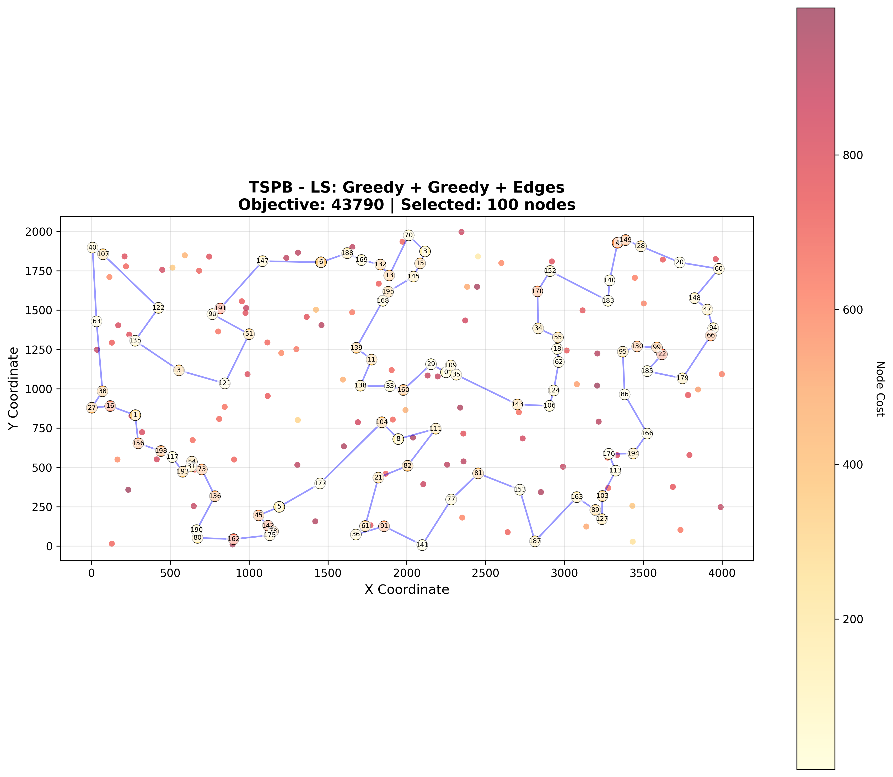</td>
  </tr>
  <tr>
    <td></td>
    <td>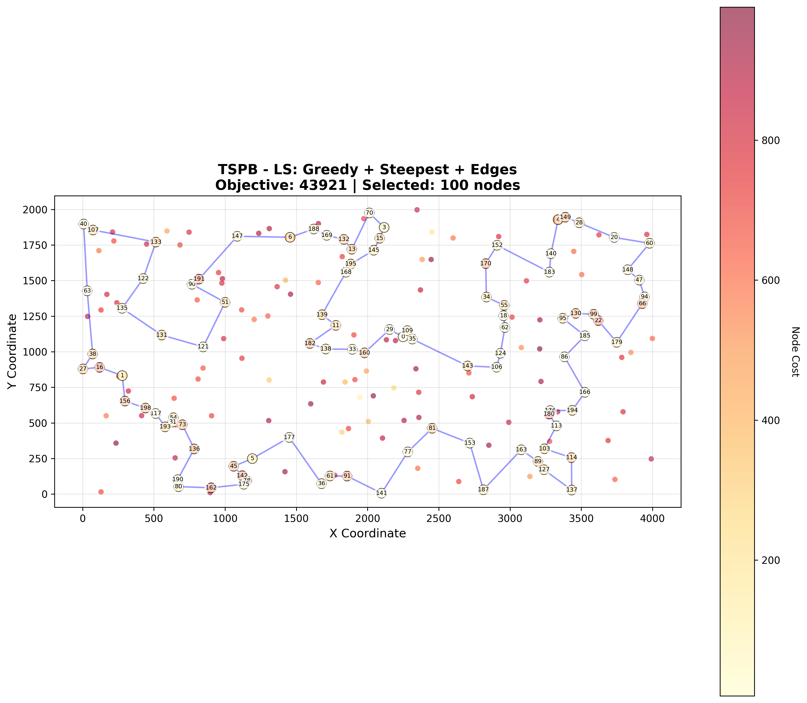</td>
  </tr>
  <tr>
    <td></td>
    <td></td>
  </tr>
  <tr>
    <td>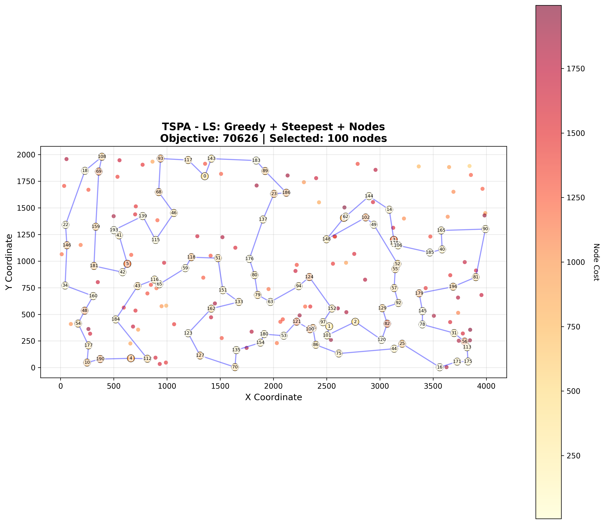</td>
    <td>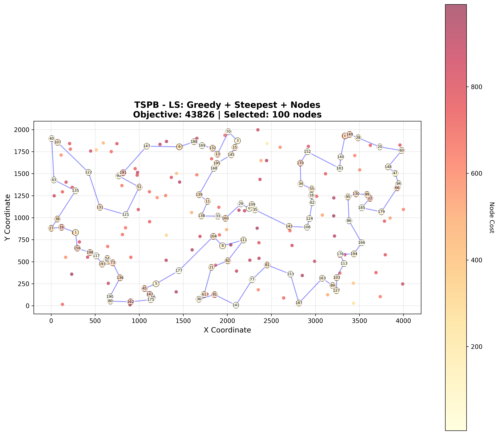</td>
  </tr>
  <tr>
    <td>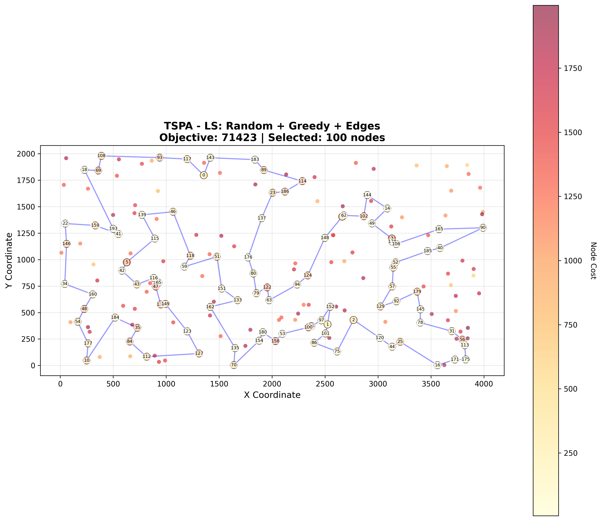</td>
    <td>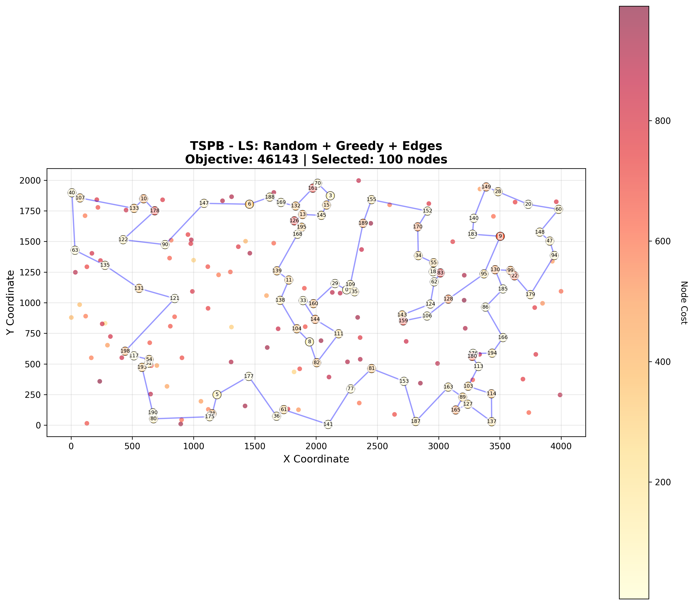</td>
  </tr>
  <tr>
    <td>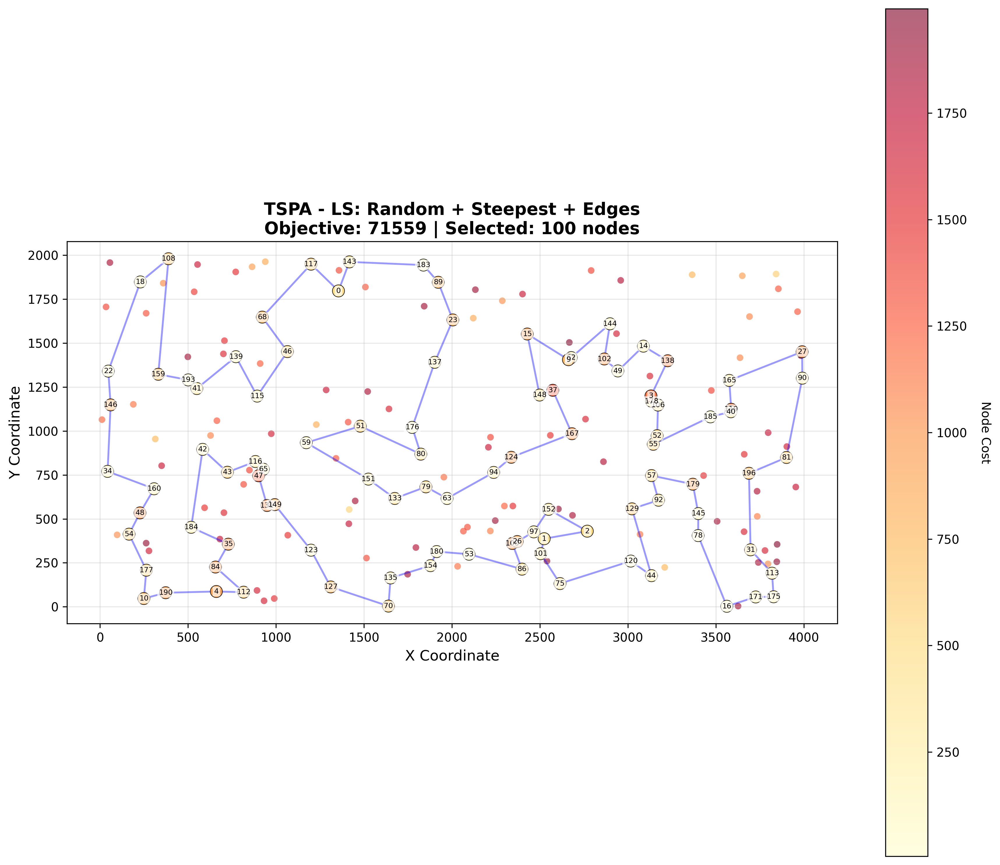</td>
    <td>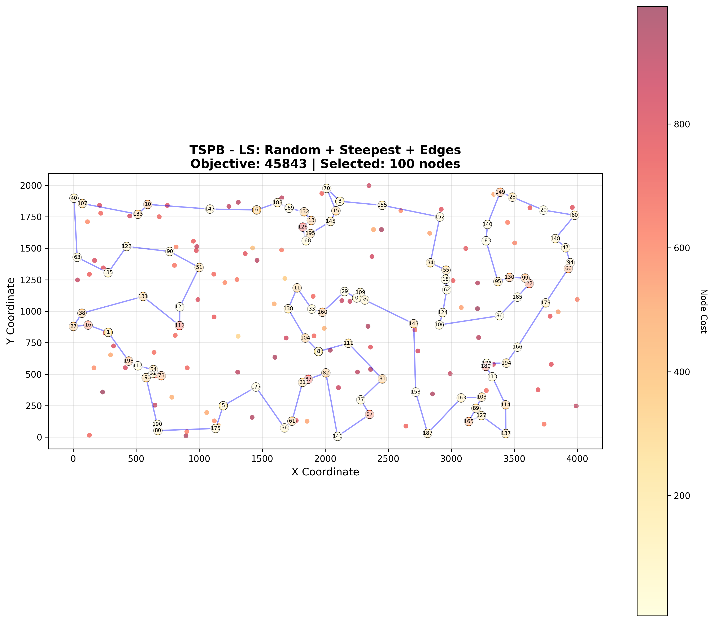</td>
  </tr>
  <tr>
    <td>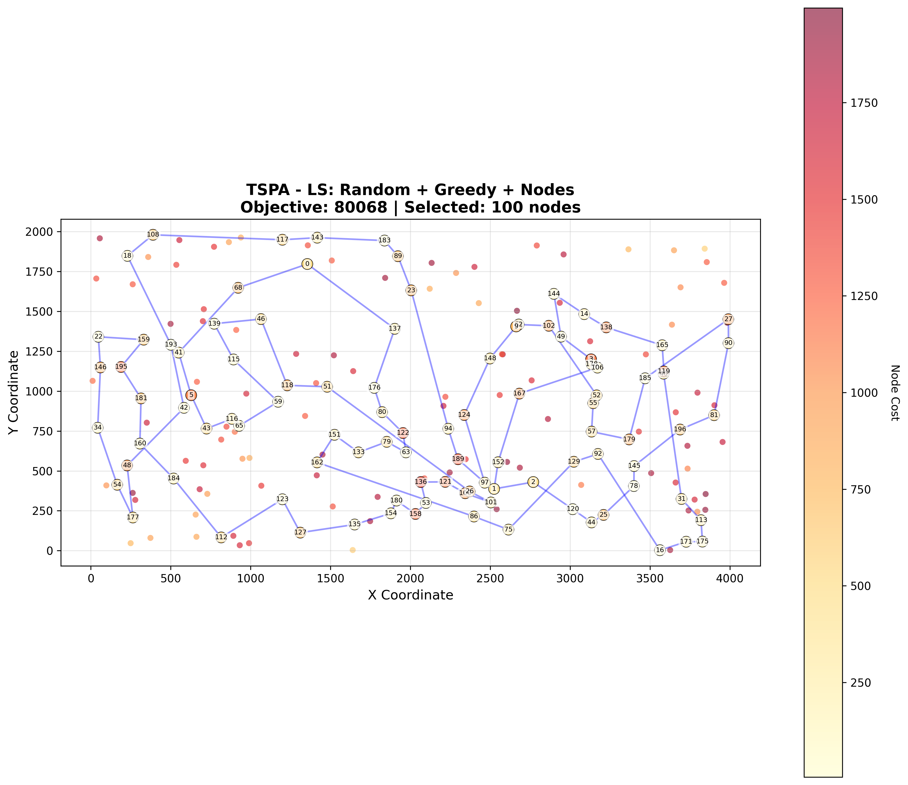</td>
    <td>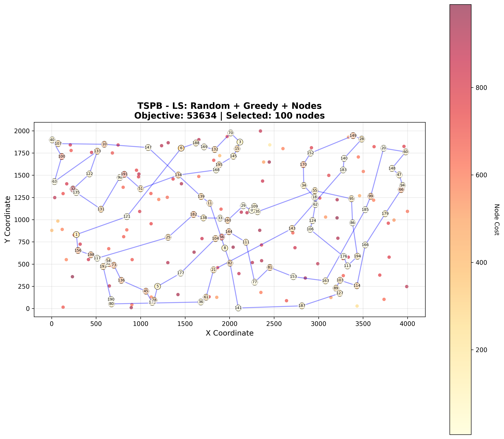</td>
  </tr>
  <tr>
    <td>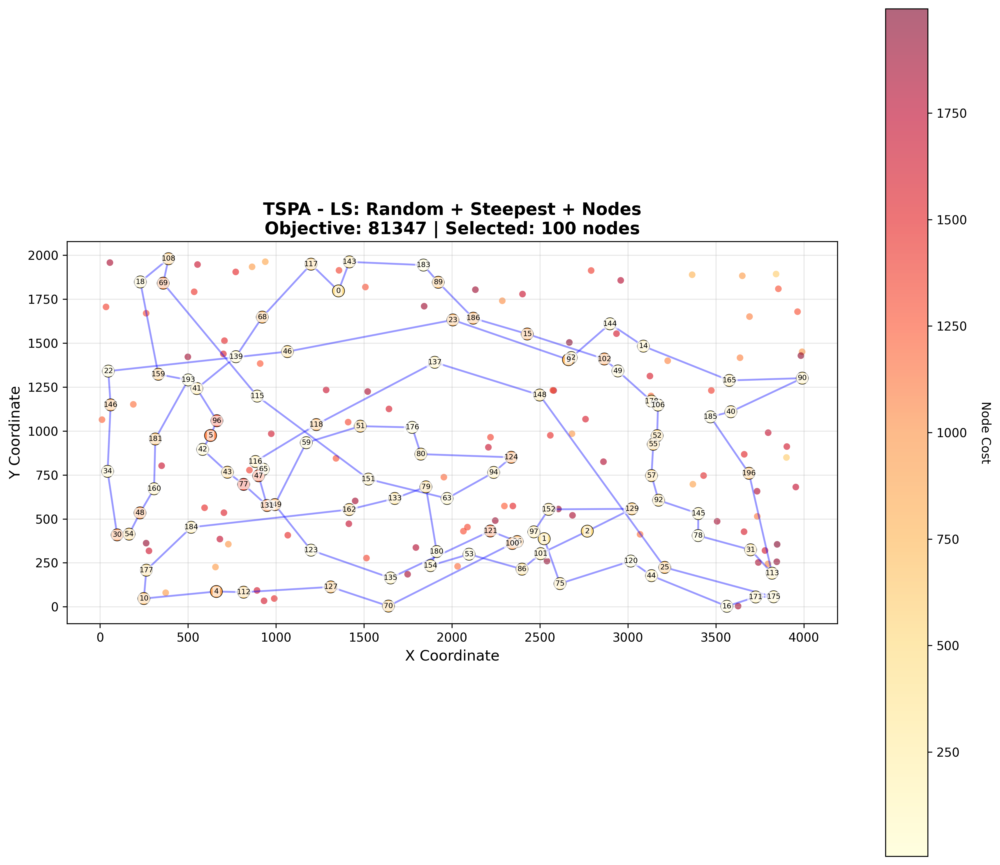</td>
    <td>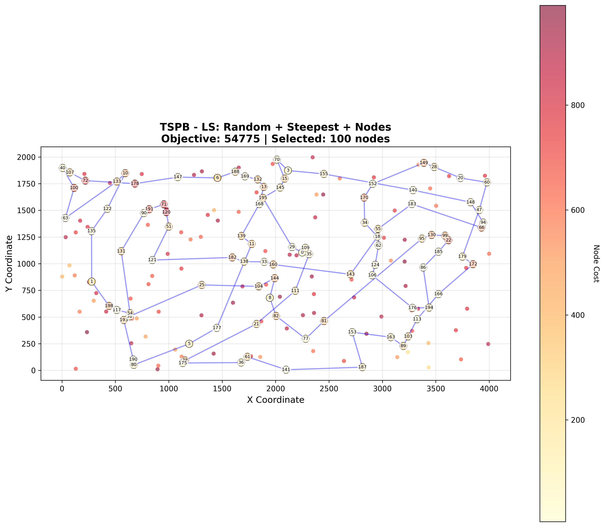</td>
  </tr>
</table>


## Conclusions

### Impact of Local Search

Local search dramatically improves solution quality from random solution. More importantly, local search starting from the **best construction heuristics** improves results:
- **TSPA**: Greedy Weighted avg 72,129 → LS Greedy+Steepest+Edges avg 71,460 **(0.9% improvement)**
- **TSPB**: NN Any avg 45,870 → LS Greedy+Steepest+Edges avg 44,979 **(1.9% improvement)**

### Steepest vs Greedy Local Search

**Steepest descent** consistently outperforms greedy local search in solution quality:

| Starting | Move Type | TSPA Steepest | TSPA Greedy | TSPB Steepest | TSPB Greedy |
|---|---|---:|---:|---:|---:|
| Random | Nodes | 87,965 | 86,336 | 63,288 | 60,888 |
| Random | Edges | 73,828 | 74,182 | 48,281 | 48,675 |
| Greedy | Nodes | 71,614 | 71,658 | 45,414 | 45,513 |
| Greedy | Edges | **71,460** | 71,517 | **44,979** | 45,033 |

**Time-quality tradeoff** (with improved randomization):
- **Steepest**: ~1-6 ms average (explores entire neighborhood, picks best move)
- **Greedy with random start**: ~16-24 ms average (random sampling, stops at first improvement)
- **Greedy with greedy start**: ~8-10 ms average (fewer iterations needed from good start)

**Key insight**: Steepest makes larger improvements per iteration (best move), requiring fewer iterations overall. Even though it evaluates all moves each iteration, the faster convergence makes it more efficient than greedy's "first improvement" strategy.

### Nodes Exchange vs Edges Exchange

**Edges exchange (2-opt)** consistently outperforms nodes exchange:

**TSPA** (Greedy start + Steepest):
- Nodes: 71,614 average
- Edges: **71,460 average** (0.2% better)

**TSPB** (Greedy start + Steepest):
- Nodes: 45,414 average
- Edges: **44,979 average** (1.0% better)

This makes sense because:
1. **Edges exchange (segment reversal)** changes the order of multiple nodes, creating larger structural changes
2. **Nodes exchange (swap)** only affects two positions and their immediate neighbors
3. Edge exchange explores a fundamentally different neighborhood structure

Both methods have the same computational complexity O(n²), but edges exchange is slightly faster in practice (1.17 ms vs 1.21 ms) due to simpler delta calculations.

### Starting Solution Quality

**Good starting solutions are crucial** for local search performance:

**TSPA** (Steepest + Edges):
- Random start: 73,828 average (range: 71,559-78,727)
- Greedy start: **71,460 average** (range: 70,510-72,614)
- Improvement: 3.2% better, 42% smaller range

**TSPB** (Steepest + Edges):
- Random start: 48,281 average (range: 45,843-51,140)
- Greedy start: **44,979 average** (range: 43,921-50,629)
- Improvement: 6.8% better, slightly smaller variance

Key insights:
1. Local search from greedy solutions reaches better local optima
2. Starting quality significantly impacts final quality
3. Even poor random solutions improve dramatically (random avg 264,638 → 73,828 after LS on TSPA)
4. The best greedy heuristic (Greedy Weighted) provides excellent starting points
