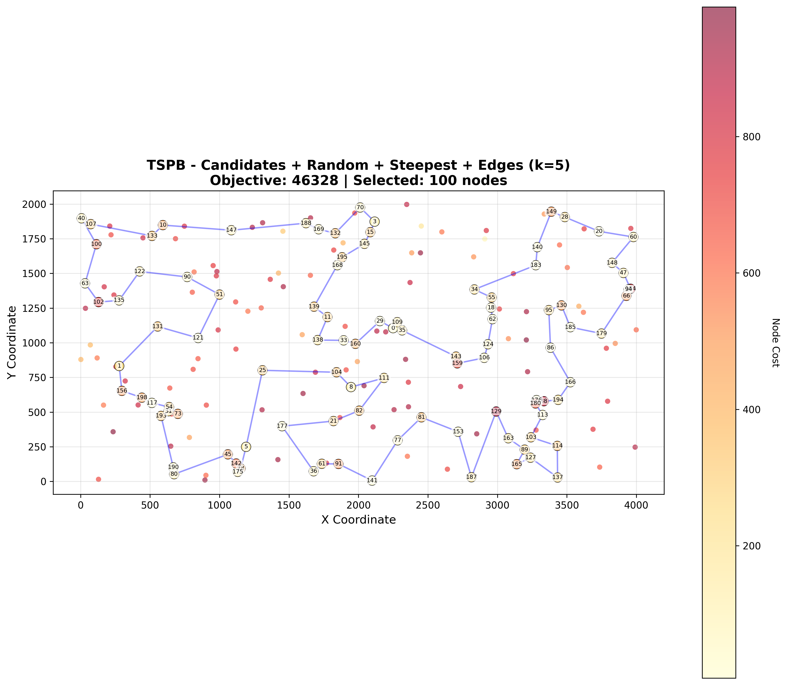
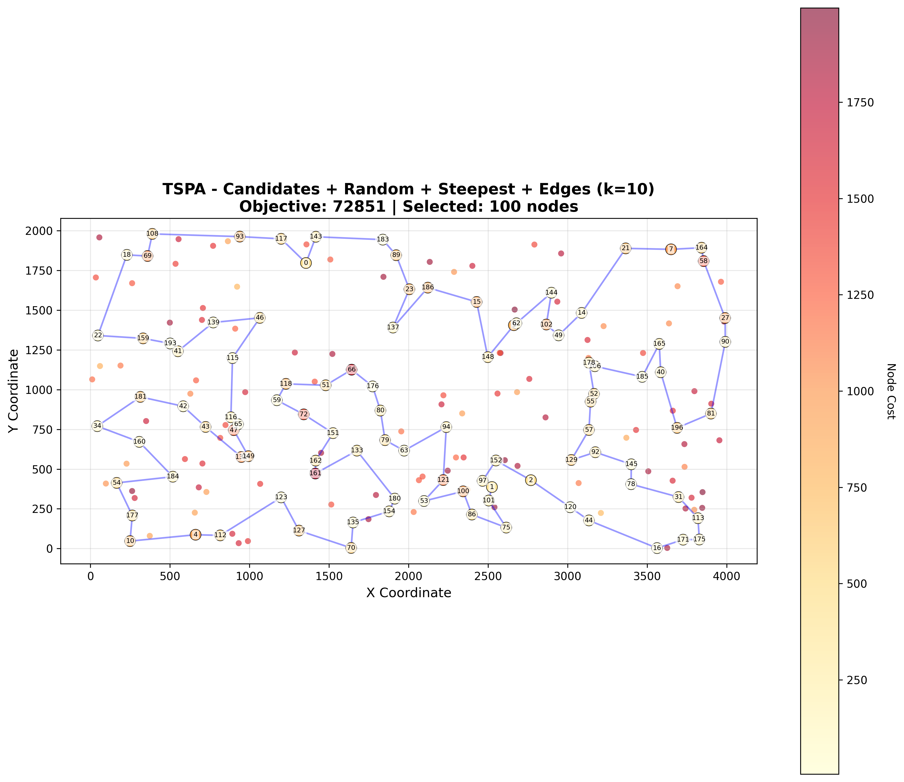
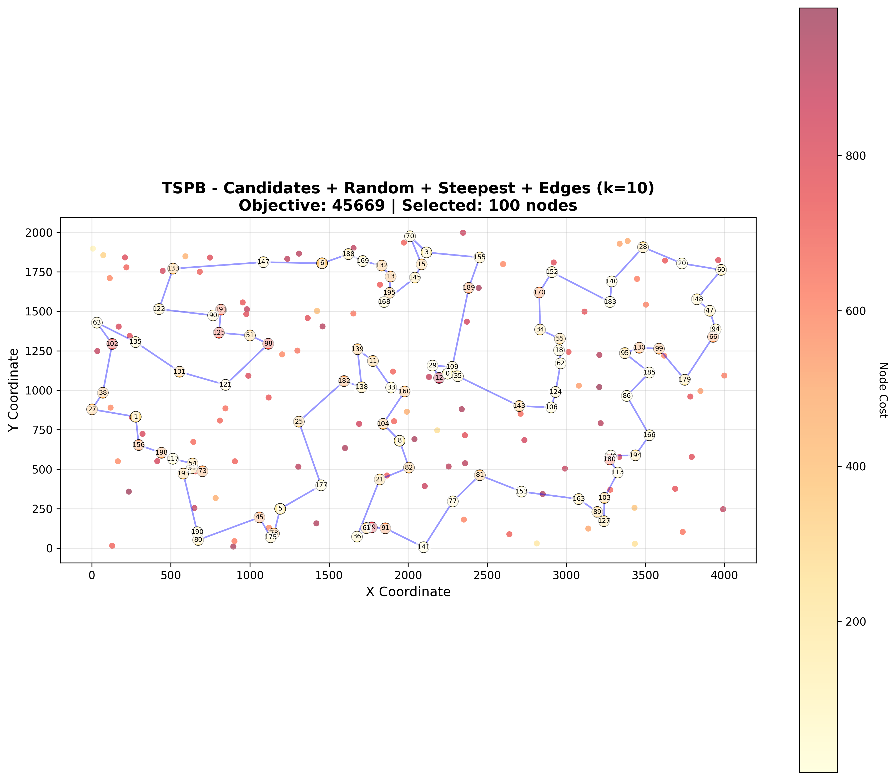
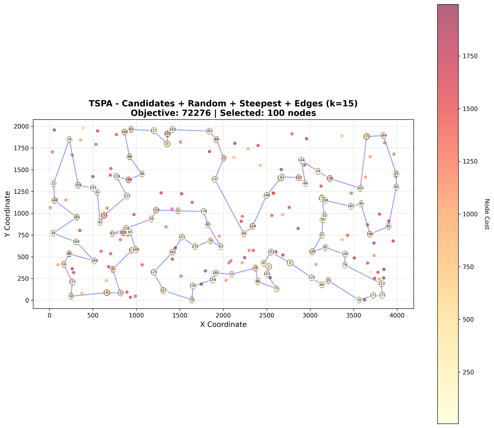
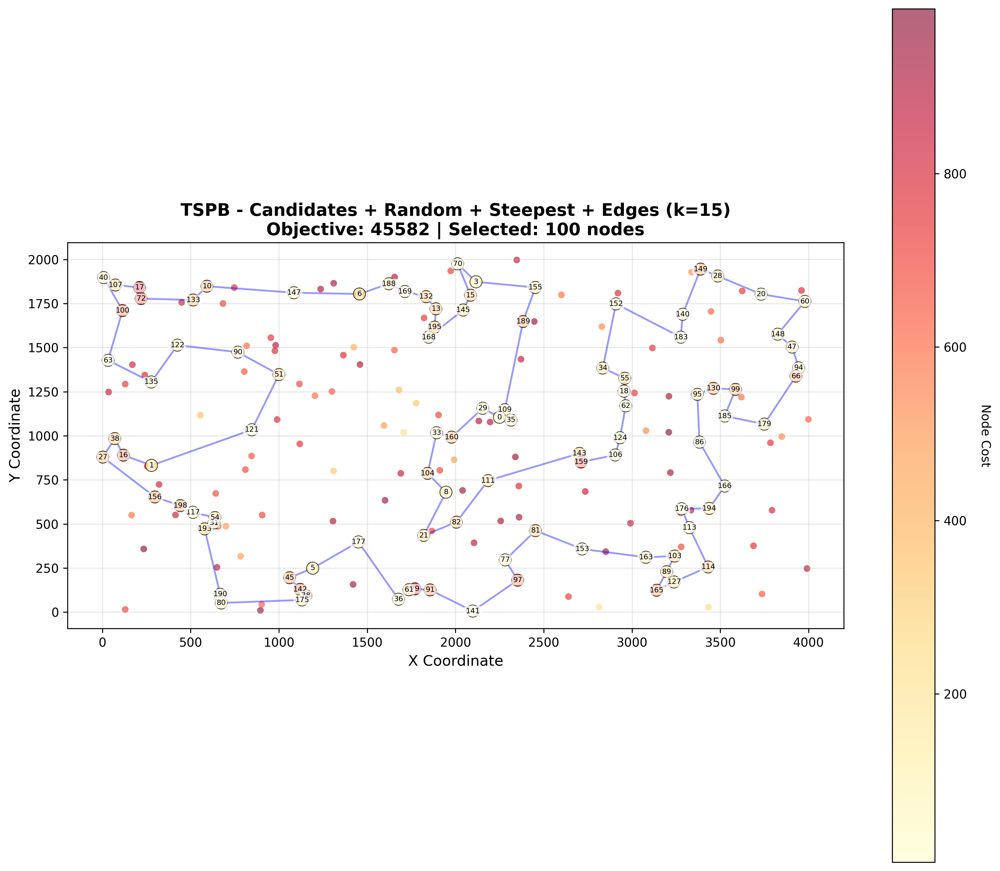
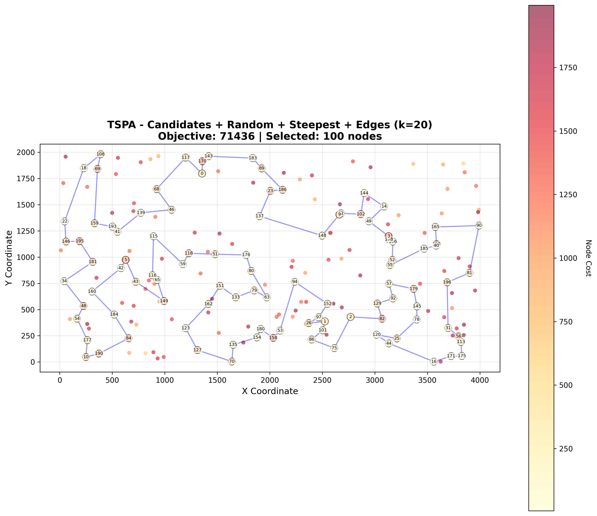

# Assignment 4 - Candidate Moves for Selective TSP

## Authors
- Mateusz Idziejczak 155842
- Mateusz Stawicki 155900

## Github
> https://github.com/Luncenok/EvolutionaryComputing

## Problem Description

This is a variant of the Traveling Salesman Problem where:
- Select exactly 50% of nodes (rounded up if odd)
- Form a Hamiltonian cycle through selected nodes
- Minimize: total path length + sum of selected node costs
- Distances are Euclidean distances rounded to integers

## Goal

Improve the time efficiency of steepest local search using **candidate moves**. From Assignment 3, the best local search configuration was:
- **Starting solution**: Random
- **Search strategy**: Steepest descent
- **Neighborhood**: Edges exchange (2-opt)
- **Results**: TSPA avg 73,859 in 16.2 ms, TSPB avg 48,334 in 16.3 ms

## Algorithm Pseudocode

### Building Nearest Neighbors

For each vertex, determine k=10 other "nearest" vertices based on:
- Distance metric: `distance[i][j] + cost[j]`
- This combines edge length and vertex cost

```python
buildNearestNeighbors(n, distance, costs, k):
    for each node i from 0 to n-1:
        neighbors = []
        for each node j != i:
            combinedCost = distance[i][j] + costs[j]
            neighbors.append((combinedCost, j))
        
        sort neighbors by combinedCost
        nearestNeighbors[i] = first k neighbors
    
    return nearestNeighbors
```

### Candidate Edge Definition

An edge (u, v) is a **candidate edge** if:
- Node v is in u's k nearest neighbors, OR
- Node u is in v's k nearest neighbors

### Candidate Moves - Steepest Local Search

**Key principle**: Only evaluate moves that introduce at least one candidate edge.

#### Intra-route (Edges Exchange / 2-opt)
For each selected node i:
- For each nearest neighbor j of i that is also selected:
  - Evaluate segment reversal between positions of i and j
  - The reversal introduces two new edges: (pos1, pos2) and (next1, next2)
  - Only evaluate if at least one of these edges is a candidate edge

#### Inter-route (Node Exchange)
For each selected node at position pos:
- For each nearest neighbor j of the current node that is NOT selected:
  - Evaluate exchanging current node with j
  - The exchange introduces edges: (prev, j) and (j, next)
  - Only evaluate if at least one of these edges is a candidate edge
- Also check nodes that have the current node as their nearest neighbor

```python
localSearchSteepestEdgesCandidates(initial, distance, costs, n, k):
    sol = initial
    inSolution = mark nodes in solution
    nearestNeighbors = buildNearestNeighbors(n, distance, costs, k)
    nodePosition = map from node to its position in sol
    
    while improvement found:
        bestDelta = 0
        bestMove = null
        
        # Intra-route: edges exchange with candidate moves
        for each position i in sol:
            node_i = sol[i]
            for each neighbor in nearestNeighbors[node_i]:
                if neighbor is selected:
                    j = position of neighbor
                    if move (i, j) introduces candidate edge:
                        delta = deltaReverseSegment(sol, i, j, distance)
                        if delta < bestDelta:
                            remember this move
        
        # Inter-route: node exchange with candidate moves
        for each position pos in sol:
            currentNode = sol[pos]
            for each neighbor in nearestNeighbors[currentNode]:
                if neighbor is NOT selected:
                    if exchange introduces candidate edge:
                        delta = deltaExchangeNodes(sol, pos, neighbor, distance, costs)
                        if delta < bestDelta:
                            remember this move
            
            # Also check reverse relationship
            for each node that has currentNode as nearest neighbor:
                if node is NOT selected:
                    if exchange introduces candidate edge:
                        delta = deltaExchangeNodes(sol, pos, node, distance, costs)
                        if delta < bestDelta:
                            remember this move
        
        if bestDelta < 0:
            apply best move
            update data structures
        else:
            break
    
    return sol
```

## Implementation Details

### Time Complexity Analysis

**Without candidate moves** (baseline steepest):
- Intra-route: O(n²) moves per iteration
- Inter-route: O(n²) moves per iteration
- Total per iteration: O(n²)

**With candidate moves**:
- Building nearest neighbors: O(n² log k) one-time cost
- Intra-route: O(nk) moves per iteration (n selected × k neighbors)
- Inter-route: O(nk) moves per iteration (n selected × k neighbors)
- Total per iteration: O(nk) where k << n

For n=200, k=10:
- Baseline: ~10,000 moves per iteration
- Candidate moves: ~1,000 moves per iteration (10× reduction)

### Data Structures

1. **Nearest neighbors**: `vector<vector<int>>` - precomputed, indexed by node
2. **Position map**: `vector<int>` - maps node ID to its position in solution (for O(1) lookup)
3. **In-solution flag**: `vector<bool>` - marks which nodes are selected

## Experimental Setup

- **Starting solutions**: Random (200 different starting nodes, one per iteration)
- **Baseline comparison**: "LS: Random + Steepest + Edges" from Assignment 3 (TSPA: 73,859 avg, 16.2 ms; TSPB: 48,334 avg, 16.3 ms)
- **Candidate moves**: Test with k ∈ {5, 10, 15, 20}
- **Iterations**: 200 runs for each method
- **Metrics**: Objective value (min/max/avg) and time (min/max/avg)

## Key Results

### Objective Function Values

| Method | TSPA | TSPB |
|---|---|---|
| Random | 264501 (235453 - 288189) | 212513 (189071 - 238254) |
| Nearest Neighbor (end only) | 85108 (83182 - 89433) | 54390 (52319 - 59030) |
| Nearest Neighbor (any position) | 73178 (71179 - 75450) | 45870 (44417 - 53438) |
| Greedy Cycle | 72646 (71488 - 74410) | 51400 (49001 - 57324) |
| Greedy 2-Regret | 115474 (105852 - 123428) | 72454 (66505 - 77072) |
| Greedy Weighted (2-Regret + BestDelta) | 72129 (71108 - 73395) | 50950 (47144 - 55700) |
| Nearest Neighbor Any 2-Regret | 116659 (106373 - 126570) | 73646 (67121 - 79013) |
| Nearest Neighbor Any Weighted | 72401 (70010 - 75452) | 47653 (44891 - 55247) |
| LS: Random + Steepest + Nodes | 88236 (81008 - 99985) | 62812 (54837 - 69593) |
| LS: Random + Greedy + Nodes | 92958 (84623 - 100736) | 65784 (59084 - 73710) |
| LS: Random + Greedy + Edges | 81244 (75645 - 87637) | 54153 (50134 - 60012) |
| LS: Greedy + Steepest + Nodes | 71614 (70626 - 72950) | 45414 (43826 - 50876) |
| LS: Greedy + Steepest + Edges | 71460 (70510 - 72614) | 44979 (43921 - 50629) |
| LS: Greedy + Greedy + Nodes | 71906 (71093 - 73048) | 45583 (43862 - 51165) |
| LS: Greedy + Greedy + Edges | 71821 (70977 - 72712) | 45376 (43845 - 51647) |
| **Baseline: Random + Steepest + Edges (k=∞)** | **73859 (71173 - 77472)** | **48334 (46098 - 51864)** |
| **Candidates k=5** | **84105 (79071 - 91253)** | **50012 (47360 - 53034)** |
| **Candidates k=10** | **77575 (73098 - 83326)** | **48300 (45571 - 51886)** |
| **Candidates k=15** | **75396 (71576 - 81409)** | **48537 (45790 - 53317)** |
| **Candidates k=20** | **74440 (71436 - 81577)** | **48443 (45932 - 52241)** |

### Running Times (ms)

| Method | TSPA | TSPB |
|---|---|---|
| Random | 0.0040 (0.0038 - 0.0089) | 0.0030 (0.0024 - 0.0129) |
| Nearest Neighbor (end only) | 0.0389 (0.0350 - 0.0456) | 0.0395 (0.0354 - 0.0449) |
| Nearest Neighbor (any position) | 1.473 (1.461 - 1.564) | 1.487 (1.469 - 1.688) |
| Greedy Cycle | 2.620 (2.610 - 2.660) | 2.617 (2.606 - 2.689) |
| Greedy 2-Regret | 2.657 (2.647 - 2.683) | 2.659 (2.647 - 2.751) |
| Greedy Weighted (2-Regret + BestDelta) | 2.657 (2.629 - 2.752) | 2.722 (2.650 - 4.617) |
| Nearest Neighbor Any 2-Regret | 1.539 (1.455 - 1.645) | 1.547 (1.474 - 2.058) |
| Nearest Neighbor Any Weighted | 1.677 (1.482 - 2.045) | 1.558 (1.441 - 1.668) |
| LS: Random + Steepest + Nodes | 24.999 (20.194 - 34.326) | 24.745 (20.042 - 30.587) |
| LS: Random + Steepest + Edges | 16.197 (14.352 - 18.603) | 16.308 (13.887 - 19.573) |
| LS: Random + Greedy + Nodes | 3.602 (2.019 - 6.316) | 3.379 (1.823 - 6.855) |
| LS: Random + Greedy + Edges | 2.566 (1.731 - 3.992) | 2.548 (1.700 - 4.449) |
| LS: Greedy + Steepest + Nodes | 3.590 (2.965 - 4.587) | 2.465 (1.949 - 5.387) |
| LS: Greedy + Steepest + Edges | 3.524 (3.008 - 4.208) | 2.436 (1.937 - 5.074) |
| LS: Greedy + Greedy + Nodes | 3.881 (3.436 - 5.131) | 2.719 (2.267 - 3.884) |
| LS: Greedy + Greedy + Edges | 3.854 (3.405 - 4.924) | 2.666 (2.193 - 3.790) |
| **Baseline: Random + Steepest + Edges (k=∞)** | **16.197 (14.352 - 18.603)** | **16.308 (13.887 - 19.573)** |
| **Candidates k=5** | **4.175 (3.613 - 4.815)** | **4.489 (3.933 - 5.157)** |
| **Candidates k=10** | **6.155 (4.975 - 15.335)** | **6.470 (5.782 - 9.737)** |
| **Candidates k=15** | **8.006 (6.910 - 10.009)** | **8.415 (7.353 - 9.458)** |
| **Candidates k=20** | **9.958 (8.944 - 12.005)** | **10.894 (9.212 - 25.982)** |

## Visualizations

<table>
  <tr>
    <td></td>
    <td></td>
  </tr>
  <tr>
    <td></td>
    <td></td>
  </tr>
  <tr>
    <td></td>
    <td></td>
  </tr>
  <tr>
    <td></td>
    <td></td>
  </tr>
</table>

## Conclusions

### Time Efficiency - Candidate moves are FASTER than baseline

Comparing against Assignment 3 baseline (Random + Steepest + Edges):

**TSPA (200 nodes):**
- **Baseline (no candidates)**: 16.20 ms average, 73,859 objective
- **k=5**: 4.18 ms average (**3.9× faster, -74%**)
- **k=10**: 6.16 ms average (**2.6× faster, -62%**)
- **k=15**: 8.01 ms average (**2.0× faster, -51%**)
- **k=20**: 9.96 ms average (**1.6× faster, -39%**)

**TSPB (200 nodes):**
- **Baseline (no candidates)**: 16.31 ms average, 48,334 objective
- **k=5**: 4.49 ms average (**3.6× faster, -72%**)
- **k=10**: 6.47 ms average (**2.5× faster, -60%**)
- **k=15**: 8.42 ms average (**1.9× faster, -48%**)
- **k=20**: 10.89 ms average (**1.5× faster, -33%**)

**Success**: Candidate moves achieve significant speedups (1.5-3.9×) compared to baseline steepest local search.

**Explanations:**
1. **Reduced move evaluations**: Restricting to O(nk) candidate moves instead of O(n²) significantly reduces computation per iteration
2. **k << n benefit**: With k ∈ {5, 10, 15, 20} and n=100 selected nodes, we evaluate 500-2,000 moves vs ~10,000 in baseline
3. **Precomputation pays off**: The one-time O(n² log k) cost of building nearest neighbors is amortized over many iterations
4. **Smaller k = faster**: Time scales with k, confirming that the reduction in moves evaluated is the primary speedup factor

### Solution Quality - Trade-off between speed and quality

Comparing candidate moves quality against baseline:

**TSPA Quality vs Baseline (73,859):**
- **k=5**: 84,105 average (**+13.9% worse**)
- **k=10**: 77,575 average (**+5.0% worse**)
- **k=15**: 75,396 average (**+2.1% worse**)
- **k=20**: 74,440 average (**+0.8% worse**)

**TSPB Quality vs Baseline (48,334):**
- **k=5**: 50,012 average (**+3.5% worse**)
- **k=10**: 48,300 average (**-0.07% better, essentially same**)
- **k=15**: 48,537 average (**+0.4% worse**)
- **k=20**: 48,443 average (**+0.2% worse**)

**Tradeoff observed**: Smaller k restricts the neighborhood more aggressively, leading to:
1. Faster execution but potentially worse local optima (some good moves excluded)
2. Quality degradation inversely proportional to k (more restrictive = worse quality)
3. TSPB shows better quality preservation than TSPA (k=10 matches baseline quality)
4. Larger k values (15-20) provide good balance between speed and quality

### Parameter Selection (k) - Depends on priorities

Candidate moves provide a **speed vs quality trade-off**:

**Analysis by k value:**
- **k=5**: Best speedup (3.6-3.9×) but worst quality (+3.5-13.9% worse) - use only when speed is critical
- **k=10**: Strong speedup (2.5-2.6×) with acceptable quality loss (+5.0% TSPA, ±0% TSPB) - **recommended balance**
- **k=15**: Good speedup (1.9-2.0×) with small quality loss (+0.4-2.1%) - conservative option
- **k=20**: Moderate speedup (1.5-1.6×) with minimal quality loss (+0.2-0.8%) - quality-focused option

**Recommendation**: 
- **For speed-critical applications**: Use **k=10** (2.5× faster, acceptable quality loss)
- **For quality-critical applications**: Use **k=20** (1.6× faster, minimal quality loss) or standard steepest
- **TSPB-specific**: k=10 is ideal (2.5× faster with no quality loss)

### Key Insights

1. **Candidate moves succeed at n=200**: Achieved 1.5-3.9× speedup by reducing neighborhood from O(n²) to O(nk)
2. **Clear speed-quality tradeoff**: Smaller k = faster but lower quality; larger k = slower but better quality
3. **Instance-dependent behavior**: TSPB preserves quality better than TSPA (k=10 matches baseline for TSPB)
4. **k=10 is the sweet spot**: Provides 2.5× speedup with minimal quality loss (<5% for TSPA, ±0% for TSPB)
5. **Scalability potential**: Since speedup comes from O(nk) vs O(n²), benefits would increase dramatically for larger instances (n > 200)
6. **Theory matches practice**: Asymptotic complexity reduction (O(nk) vs O(n²)) translated to measurable wall-clock speedup
7. **Best approach for n=200**: 
   - Use **candidate moves with k=10** for 2.5× speedup with acceptable quality
   - Use **standard steepest** only if quality is paramount and time is not a constraint
