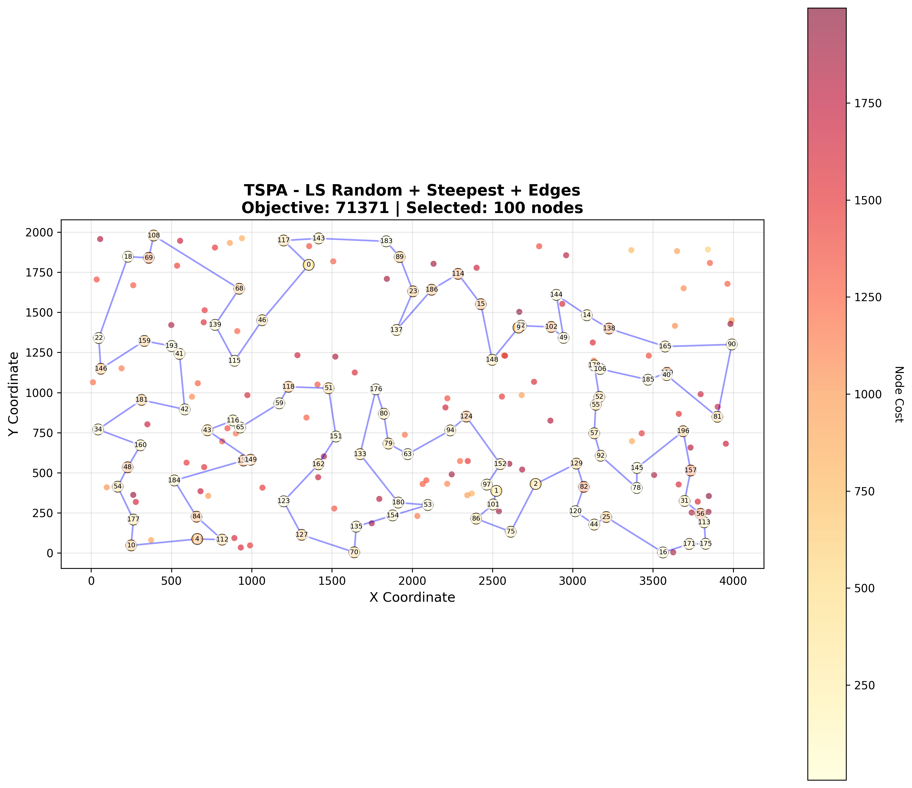
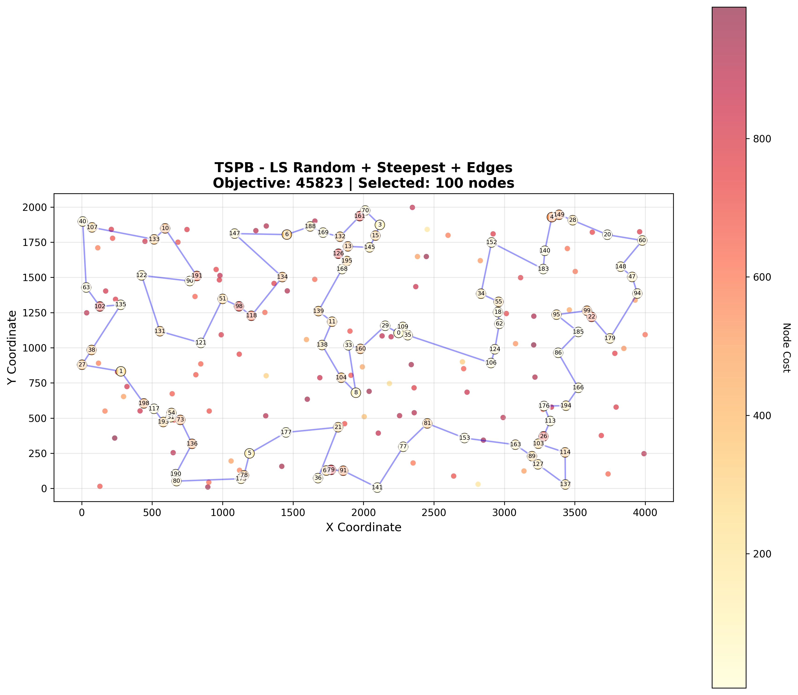
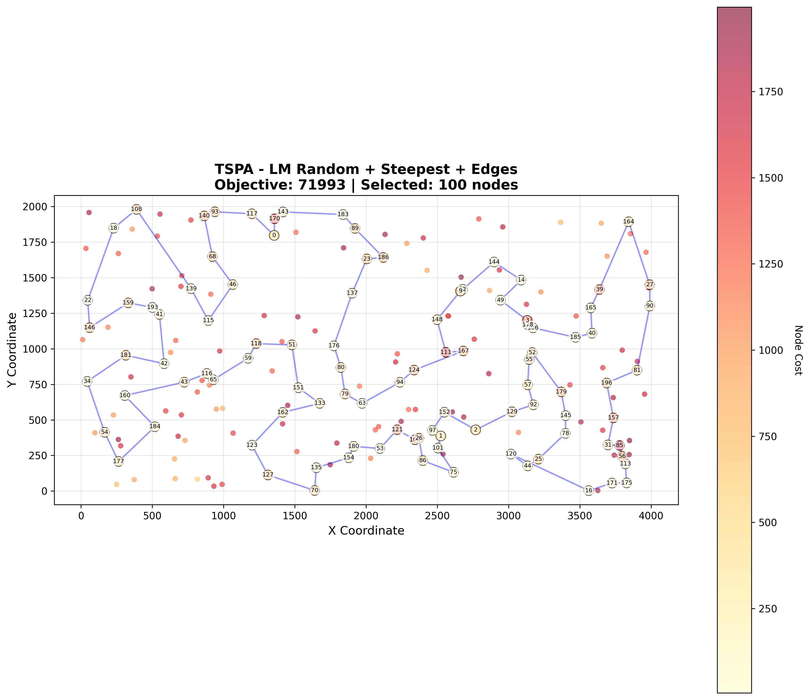
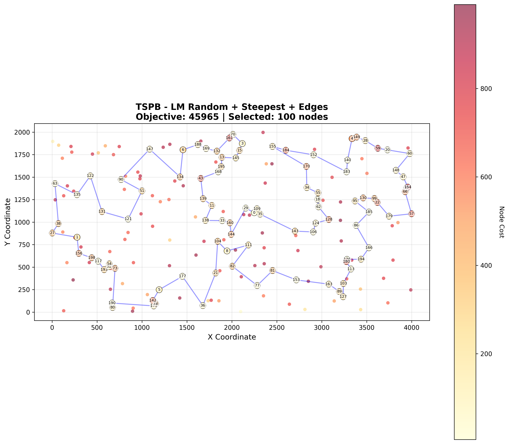
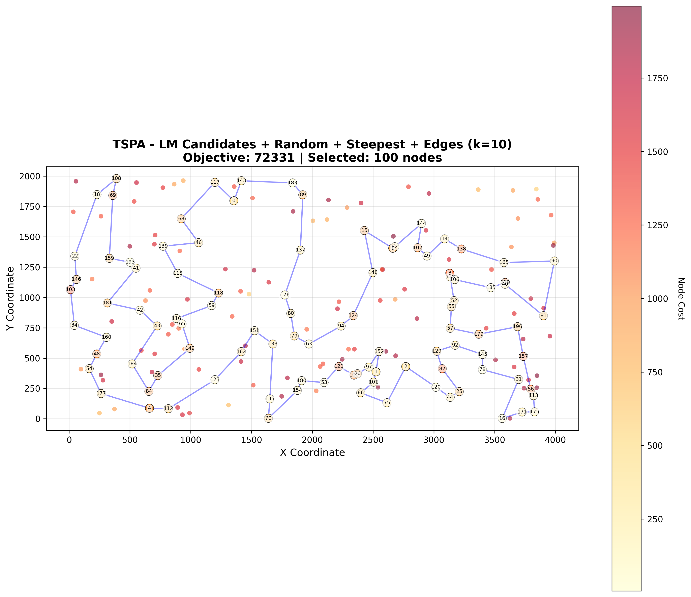
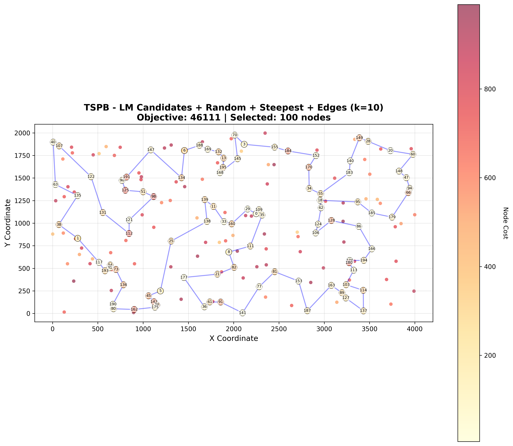
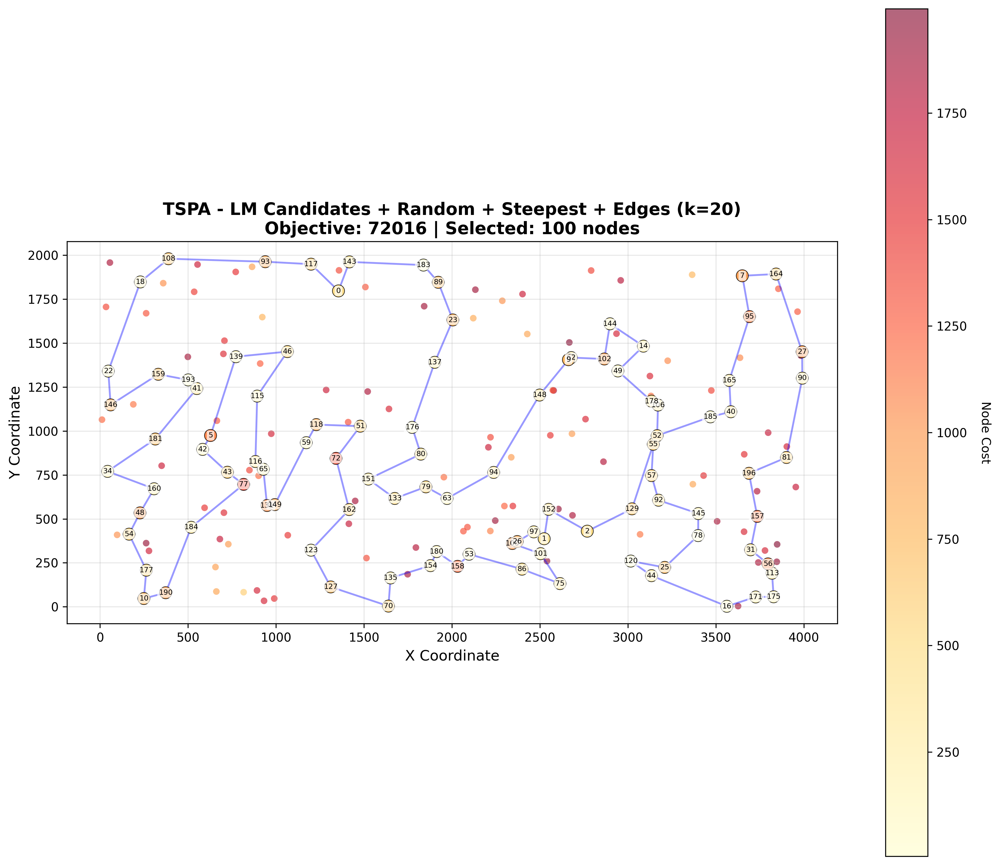
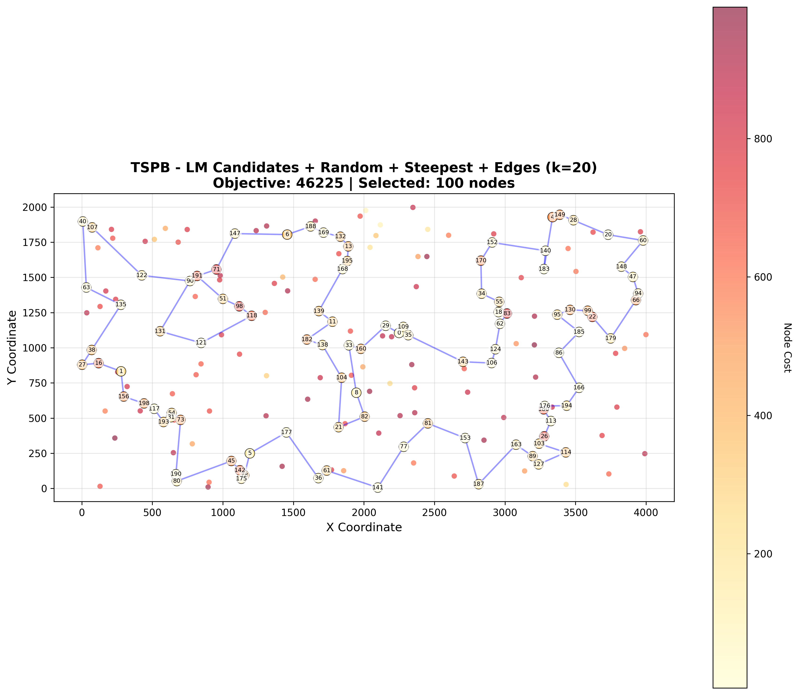

# Assignment 5 - Local Search with Move List (LM) for Selective TSP

## Authors
- Mateusz Idziejczak 155842
- Mateusz Stawicki 155900

## Github
> https://github.com/Luncenok/EvolutionaryComputing

## Problem Description

This is the same variant of the Traveling Salesman Problem as in previous assignments:
- Select exactly 50% of nodes (rounded up if odd)
- Form a Hamiltonian cycle through selected nodes
- Minimize: total path length + sum of selected node costs
- Distances are Euclidean distances rounded to integers

Instances:
- **TSPA, TSPB** with 200 nodes, selecting 100 nodes.

## Goal

Improve the **time efficiency** of steepest local search by reusing move evaluations (deltas) from previous iterations using a **list of improving moves (LM)**, for the neighborhood that turned out best in Assignment 3:
- Starting solution: **Random**
- Search strategy: **Steepest descent**
- Neighborhood: **Edges exchange (2-opt) + inter-route node exchanges**

Additionally, we compare this LM-based method with:
- Baseline steepest local search without LM
- Steepest local search with **candidate moves** (from Assignment 4) for different values of *k*.

Each method is run **200 times** per instance.

## Algorithm Pseudocode

### Delta Calculation (Reminder)

We use the same delta definitions as in Assignment 3.

Delta is the change in objective function after applying a move:

`delta = newCost - oldCost`

If `delta < 0`, the move improves the solution.

#### 1. Intra-Route: Edge Exchange (2-opt)

Reverse the segment between positions `pos1` and `pos2`.

```text
Given: [..., pos1, A, B, C, ..., Z, pos2, next, ...]
After: [..., pos1, pos2, Z, ..., C, B, A, next, ...]

Remove edges: pos1→A and pos2→next
Add edges:    pos1→pos2 and A→next

oldCost = dist(pos1, A) + dist(pos2, next)
newCost = dist(pos1, pos2) + dist(A, next)
delta   = newCost - oldCost
```

Only 2 edges change regardless of segment length (2-opt property).

#### 2. Inter-Route: Node Exchange

Replace a selected node with an unselected node.

```text
Given: [..., prev, oldNode, next, ...] with cost[oldNode]
After: [..., prev, newNode, next, ...] with cost[newNode]

oldCost = dist(prev, oldNode) + dist(oldNode, next) + cost[oldNode]
newCost = dist(prev, newNode) + dist(newNode, next) + cost[newNode]
delta   = newCost - oldCost
```

### Data Structures for LM

We maintain a **list of improving moves** (LM) that stores all currently known moves with `delta < 0`.

LM is stored as a vector sorted by `delta` (most negative first). Ties are broken by `type` and then by node index.

We also maintain:
- `sol`: current tour (list of selected nodes)
- `inSolution[node]`: whether node is in the current solution
- `nodePos[node]`: position of node in `sol`

### Edge Existence and Orientation

To interpret stored moves in the **current** solution, we must check whether the stored edges still exist and in which direction.

```text
edgeExistsUndirected(sol, nodePos, a, b):
    # Check if edge a→b or b→a exists in the current tour
    # Returns: (exists, a_to_b)
    # a_to_b = true  if edge is a→b
    #         = false if edge is b→a
```

This allows us to distinguish three situations required in the assignment:

1. **Removed edges no longer exist in current solution**  
   At least one of the stored edges is not present anymore.  
   → The move is **invalid** and should be removed from LM.

2. **Edges still exist but have different relative direction**  
   The two stored edges exist, but their directions do not match the relative orientation stored with the move.  
   → The move is **kept** in LM, but **not applied now** (it may become applicable later).

3. **Edges exist in the same relative direction (or both reversed)**  
   Both edges exist and their orientations match (up to global reversal).  
   → The move is **applicable** and can be performed.

### Handling Inverted Edges

The assignment requires that we also consider moves with **inverted edges**.

For each pair of edges `(u,v)` and `(x,y)` in the current solution we generate two 2-opt variants:

1. **Parallel orientation**: assumes edges `u→v` and `x→y`
2. **Inverted orientation**: assumes edges `u→v` and `y→x`

In pseudocode:

```text
for each edge (u,v):
  for each edge (x,y) not adjacent to (u,v):
      # Variant A: parallel
      deltaA = Δ2opt(u,v,x,y)
      if deltaA < 0:
          LM.append(move(type=2opt, a1=u,b1=v, a2=x,b2=y, delta=deltaA))

      # Variant B: inverted
      deltaB = Δ2opt(u,v,y,x)
      if deltaB < 0:
          LM.append(move(type=2opt, a1=u,b1=v, a2=y,b2=x, delta=deltaB))
```

This is applied during:
- **Initialization**: when we evaluate the full neighborhood for the initial solution
- **Updates**: when we regenerate moves around modified edges after applying a move

### Generating Moves for a Set of Positions

We reuse the same helper in two contexts: full initialization and local updates around affected positions.

```text
generateMovesForNodes(nodesToScan, sol, inSolution, distance, costs, useSymmetryCheck):
    for each index i in nodesToScan:
        u = sol[i]
        v = sol[(i+1) mod |sol|]   # edge u–v

        # 1) Intra-route 2-opt moves
        for each index j in [0 .. |sol|-1]:
            if edges (i,i+1) and (j,j+1) are adjacent: continue

            x = sol[j]
            y = sol[(j+1) mod |sol|]

            # Variant A: edges u→v and x→y
            deltaA = Δ2opt(u,v,x,y)
            if deltaA < 0:
                LM.append(2-opt move with edges (u,v) and (x,y))

            # Variant B: edges u→v and y→x (inverted second edge)
            deltaB = Δ2opt(u,v,y,x)
            if deltaB < 0:
                LM.append(2-opt move with edges (u,v) and (y,x))

        # 2) Inter-route node exchanges
        prev = sol[(i-1 + |sol|) mod |sol|]
        curr = sol[i]
        next = sol[(i+1) mod |sol|]

        for each node not in solution:
            oldCost = dist(prev,curr) + dist(curr,next) + cost[curr]
            newCost = dist(prev,node) + dist(node,next) + cost[node]
            delta   = newCost - oldCost

            if delta < 0:
                LM.append(exchange move replacing curr with node)
```

### Local Search - Steepest Descent with Move List (LM)

The LM-based local search stores all currently known improving moves and tries to re-use them between iterations.

```text
localSearchSteepestEdgesLM(initial, distance, costs, n):
    sol = initial
    mark inSolution for nodes in sol
    build nodePos for sol

    LM = []

    # --- PHASE 1: Initialization (full neighborhood) ---
    nodesToScan = [0, 1, ..., |sol|-1]
    generateMovesForNodes(nodesToScan, sol, inSolution, distance, costs)  
    sort LM by delta (best first)

    improved = true
    while improved:
        improved = false

        # 1. Cleanup: remove non-improving moves
        remove from LM all moves with delta >= 0

        appliedMove = None

        # 2. Browse LM from best to worst
        for m in LM (in sorted order):

            # Exchange: if newNode entered solution in the meantime → invalidate
            if m.type == exchange and inSolution[m.newNode]:
                mark m as invalid (delta = 0) and continue

            # Check if both stored edges still exist and get their direction
            (exists1, dir1) = edgeExistsUndirected(sol, nodePos, m.a1, m.b1)
            (exists2, dir2) = edgeExistsUndirected(sol, nodePos, m.a2, m.b2)

            # Case 1: at least one edge disappeared → remove move from LM
            if not exists1 or not exists2:
                mark m as invalid (delta = 0)
                continue

            # Case 2: edges exist but with different relative direction →
            #         keep move in LM, but do not apply now
            if dir1 != dir2:
                continue

            # Case 3: edges exist and directions match → apply move
            appliedMove = m
            applyMove(sol, inSolution, nodePos, appliedMove)
            improved = true
            break   # steepest: LM is sorted, so first applicable is best

        if not improved:
            break   # no applicable improving move left

        # 3. Rebuild node positions after applying the move
        rebuild nodePos for sol

        # 4. Determine touched positions (neighbors of modified edges/nodes)
        touched = indices around affected edges or exchanged node

        # 5. Generate new moves only for touched positions
        newMoves = generateMovesForNodes(touched, sol, inSolution, distance, costs)  
        sort newMoves by delta

        # 6. Clean LM again and merge
        remove from LM all moves with delta >= 0
        LM = merge(LM, newMoves)   # maintain sorted order

    return sol
```

**Key differences from baseline steepest local search:**
- Baseline steepest recomputes the **entire O(n²)** neighborhood every iteration.
- LM-based steepest:
  - Caches improving moves and keeps them sorted.
  - Reuses moves until they become invalid or inapplicable.
  - Recomputes moves **only around touched positions** after each applied move.

In principle, this should reduce the number of delta evaluations, especially for large instances.

## Experimental Setup

- Instances: **TSPA**, **TSPB** (200 nodes, 100 selected)
- Starting solutions: **Random**
- Objective: path length + sum of node costs
- Each method run **200 times** per instance

Methods compared:

- Construction heuristics:
  - Random
  - Nearest Neighbor (end only)
  - Nearest Neighbor (any position)
  - Greedy Cycle
  - Greedy 2-Regret
  - Greedy Weighted (2-Regret + BestDelta)
  - Nearest Neighbor Any 2-Regret
  - Nearest Neighbor Any Weighted (2-Regret + BestDelta)

- Local search variants (as in Assignments 3–4):
  - LS: Random + Steepest + Nodes
  - LS: Random + Greedy + Nodes
  - LS: Random + Greedy + Edges
  - LS: Greedy + Steepest + Nodes
  - LS: Greedy + Steepest + Edges
  - LS: Greedy + Greedy + Nodes
  - LS: Greedy + Greedy + Edges

- **Baseline for this assignment**:
  - **LS: Random + Steepest + Edges** (no LM, no candidates)

- **New LM-based method**:
  - **LM: Random + Steepest + Edges** (list of improving moves)

- **Candidate-move variants** (from Assignment 4, without LM):
  - Candidates + Random + Steepest + Edges (k = 5, 10, 15, 20)

## Key Results

### Objective Function Values

Values are reported as **average (min – max)** over 200 runs.

| Method | TSPA | TSPB |
|---|---|---|
| Random | 264638 (238611 – 287962) | 213875 (190076 – 244960) |
| Nearest Neighbor (end only) | 85108 (83182 – 89433) | 54390 (52319 – 59030) |
| Nearest Neighbor (any position) | 73178 (71179 – 75450) | 45870 (44417 – 53438) |
| Greedy Cycle | 72646 (71488 – 74410) | 51400 (49001 – 57324) |
| Greedy 2-Regret | 115474 (105852 – 123428) | 72454 (66505 – 77072) |
| Greedy Weighted (2-Regret + BestDelta) | 72129 (71108 – 73395) | 50950 (47144 – 55700) |
| Nearest Neighbor Any 2-Regret | 116659 (106373 – 126570) | 73646 (67121 – 79013) |
| Nearest Neighbor Any Weighted | 72401 (70010 – 75452) | 47653 (44891 – 55247) |
| LS: Random + Steepest + Nodes | 87965 (81347 – 100053) | 63288 (54775 – 78289) |
| LS: Random + Greedy + Nodes | 93311 (86145 – 102732) | 65529 (58261 – 72047) |
| LS: Random + Greedy + Edges | 81258 (76668 – 87339) | 54184 (50177 – 59362) |
| LS: Greedy + Steepest + Nodes | 71614 (70626 – 72950) | 45414 (43826 – 50876) |
| LS: Greedy + Steepest + Edges | 71460 (70510 – 72614) | 44979 (43921 – 50629) |
| LS: Greedy + Greedy + Nodes | 71902 (71093 – 73050) | 45575 (43862 – 51292) |
| LS: Greedy + Greedy + Edges | 71825 (70977 – 72706) | 45376 (43845 – 51170) |
| **Baseline: LS Random + Steepest + Edges** | **73965 (71371 – 78984)** | **48252 (45823 – 51965)** |
| **LM: Random + Steepest + Edges** | **74981 (72054 – 79520)** | **49325 (45965 – 52805)** |
| Candidates k = 5 | 84726 (78843 – 91459) | 49873 (47117 – 53865) |
| Candidates k = 10 | 77773 (72851 – 84000) | 48450 (45669 – 51178) |
| Candidates k = 15 | 75510 (72276 – 83040) | 48295 (45582 – 51938) |
| Candidates k = 20 | 74416 (71292 – 80264) | 48221 (45338 – 51285) |
| **LM Candidates k = 10** | **75157 (72331 – 80832)** | **49219 (46145 – 52021)** |
| **LM Candidates k = 20** | **74967 (72016 – 79576)** | **49339 (46225 – 53133)** |

## Visualizations

<table>
  <tr>
    <td></td>
    <td></td>
  </tr>
  <tr>
    <td></td>
    <td></td>
  </tr>
  <tr>
    <td></td>
    <td></td>
  </tr>
  <tr>
    <td></td>
    <td></td>
  </tr>
</table>

### Running Times (ms)

Values are reported as **average (min – max)** over 200 runs.

| Method | TSPA | TSPB |
|---|---|---|
| Random | 0.0055 (0.0046 – 0.0128) | 0.0056 (0.0048 – 0.0092) |
| Nearest Neighbor (end only) | 0.0243 (0.0167 – 0.1550) | 0.0240 (0.0189 – 0.0727) |
| Nearest Neighbor (any position) | 0.9611 (0.8181 – 2.1996) | 0.9092 (0.8455 – 1.3422) |
| Greedy Cycle | 0.9999 (0.8004 – 3.9058) | 0.8573 (0.8053 – 1.3212) |
| Greedy 2-Regret | 1.2444 (1.1254 – 2.3961) | 1.1903 (1.1308 – 1.4248) |
| Greedy Weighted (2-Regret + BestDelta) | 1.3750 (1.1234 – 3.6067) | 1.1789 (1.1293 – 1.5618) |
| Nearest Neighbor Any 2-Regret | 1.1493 (1.0278 – 2.0443) | 1.0937 (1.0343 – 1.5842) |
| Nearest Neighbor Any Weighted | 1.2644 (1.0408 – 7.5557) | 1.1075 (1.0468 – 1.4215) |
| LS: Random + Steepest + Nodes | 7.371 (5.605 – 9.845) | 7.254 (5.552 – 9.856) |
| LS: Random + Greedy + Nodes | 4.868 (3.017 – 8.791) | 4.750 (2.926 – 8.026) |
| LS: Random + Greedy + Edges | 4.050 (2.615 – 6.162) | 4.066 (2.799 – 7.494) |
| LS: Greedy + Steepest + Nodes | 1.445 (1.214 – 1.986) | 1.480 (0.983 – 41.090) |
| LS: Greedy + Steepest + Edges | 1.428 (1.219 – 2.010) | 1.136 (0.971 – 1.828) |
| LS: Greedy + Greedy + Nodes | 3.507 (2.576 – 5.475) | 3.217 (2.324 – 5.396) |
| LS: Greedy + Greedy + Edges | 3.470 (3.089 – 7.937) | 4.898 (2.539 – 12.965) |
| **Baseline: LS Random + Steepest + Edges** | **10.093 (3.904 – 72.899)** | **8.190 (4.143 – 90.349)** |
| **LM: Random + Steepest + Edges** | **9.938 (4.956 – 55.990)** | **7.817 (4.440 – 67.691)** |
| Candidates k = 5 | 18.159 (10.763 – 119.758) | 18.952 (12.852 – 149.660) |
| Candidates k = 10 | 22.729 (12.574 – 133.600) | 21.884 (15.667 – 100.190) |
| Candidates k = 15 | 25.340 (15.757 – 146.118) | 25.165 (16.542 – 119.796) |
| Candidates k = 20 | 28.855 (16.692 – 151.581) | 28.061 (16.087 – 187.760) |
| **LM Candidates k = 10** | **10.186 (5.626 – 66.923)** | **10.042 (5.453 – 111.196)** |
| **LM Candidates k = 20** | **15.434 (8.760 – 111.936)** | **15.084 (9.247 – 122.659)** |

## Conclusions

### Impact of the Move List (LM)

The goal was to speed up steepest local search by reusing improving moves from previous iterations.

- Baseline (no LM): **LS Random + Steepest + Edges**
  - TSPA: 73,965 average, 10.1 ms
  - TSPB: 48,252 average, 8.2 ms
- LM-based method: **LM Random + Steepest + Edges**
  - TSPA: 74,981 average, 9.9 ms
  - TSPB: 49,325 average, 7.8 ms

LM gives slightly worse objective values and very similar running times to the baseline. The overhead of maintaining and validating the move list is not compensated by savings from reusing deltas on these 100-node tours.

### LM + Candidates vs Candidates Only

We also compared LM combined with candidate moves (k = 10, 20) against the pure candidate-based steepest search:

- **Candidates only (k = 10, 20)**:
  - TSPA: 77,773 / 74,416 average
  - TSPB: 48,450 / 48,221 average
  - Time: 22.7 / 28.9 ms (TSPA), 21.9 / 28.1 ms (TSPB)

- **LM Candidates (k = 10, 20)**:
  - TSPA: 75,157 / 74,967 average
  - TSPB: 49,219 / 49,339 average
  - Time: 10.2 / 15.4 ms (TSPA), 10.0 / 15.1 ms (TSPB)

LM+Candidates roughly halves the running time of pure candidate search for the same k, at the cost of slightly worse quality on TSPB and slightly better quality on TSPA. However, both variants are still slower and worse than the simple baseline steepest search without candidates.

### Overall Conclusions

- For these Selective TSP instances (TSPA, TSPB, 100 selected nodes), **full steepest local search without LM or candidates** remains the best option.
- The LM mechanism works correctly (handles disappeared / reversed edges and inverted 2-opt moves), but its bookkeeping overhead dominates on small instances.
- Candidate moves and LM+Candidates reduce the number of evaluated moves, but their additional data structures make them slower than the baseline in this setting.
