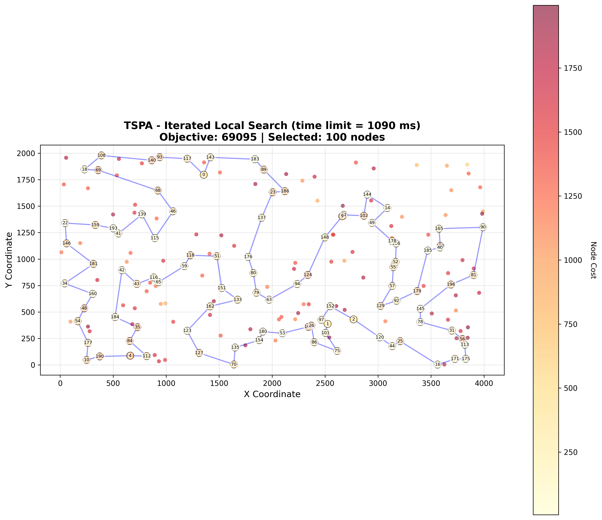
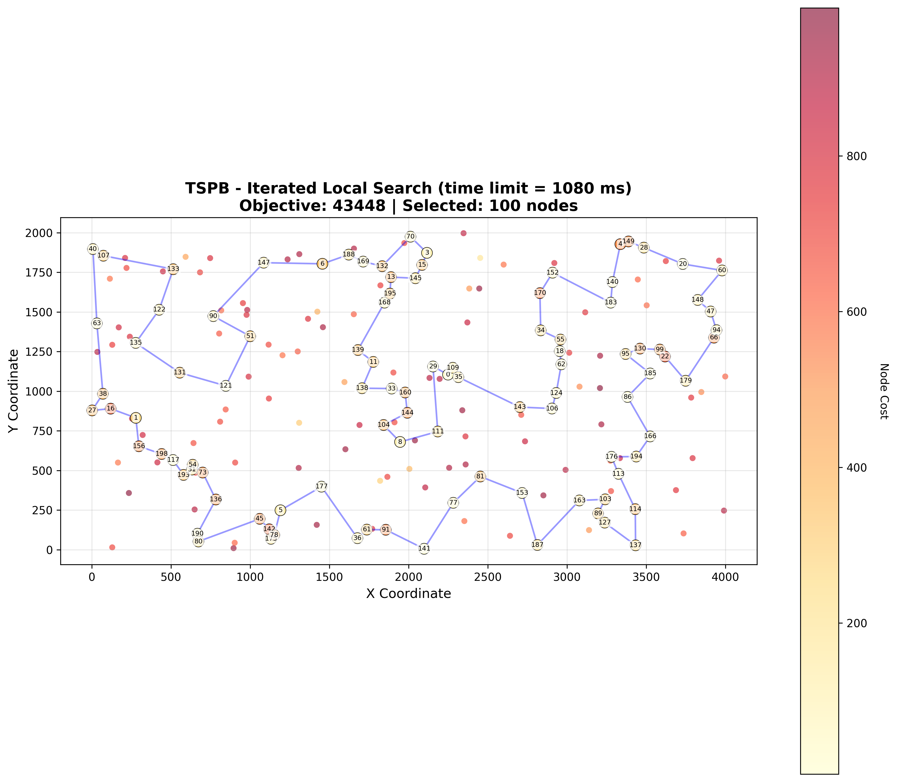

# Assignment 6 - Multiple Start and Iterated Local Search for Selective TSP

## Authors
- Mateusz Idziejczak 155842
- Mateusz Stawicki 155900

## Github
> https://github.com/Luncenok/EvolutionaryComputing

## Problem Description

This is the same variant of the Traveling Salsman Problem as in previous assignments:
- Select exactly 50% of nodes (rounded up if odd)
- Form a Hamiltonian cycle through selected nodes
- Minimize: total path length + sum of selected node costs
- Distances are Euclidean distances rounded to integers

Instances:
- **TSPA, TSPB** with 200 nodes, selecting 100 nodes.

## Goal

Implement and compare two iterative local search methods:

1. **Multiple Start Local Search (MSLS)**: Run local search from multiple random starting solutions and keep the best result.
2. **Iterated Local Search (ILS)**: Start from a random solution, apply local search, then iteratively perturb the solution and apply local search again.

For both methods:
- Use the best performing local search from Assignment 3: **Random + Steepest + Edges**
- Run **20 times** per instance to collect statistics
- For MSLS: perform **200 iterations** (local search runs) per execution
- For ILS: use a **time limit equal to the average MSLS time**, report the number of local search runs

## Algorithm Pseudocode

### Local Search Base

Both MSLS and ILS use the same local search as their core optimization component: **Steepest Descent with Edge Exchange** from Assignment 3.

This local search performs:
- **Neighborhood**: 2-opt edge exchanges
- **Strategy**: Steepest descent (select best improving move in each iteration)
- Terminates when no improving move exists (local optimum)

### Multiple Start Local Search (MSLS)

MSLS repeatedly applies local search from different random starting solutions and keeps the best result found.

```python
MSLS(iterations):
    bestSolution = null
    bestObjective = ∞
    
    for i = 1 to iterations:
        # Generate random starting solution
        initial = generateRandomSolution()
        
        # Apply local search to find local optimum
        localOptimum = localSearch(initial)
        
        # Evaluate solution quality
        obj = objective(localOptimum)
        
        # Keep best solution found
        if obj < bestObjective:
            bestObjective = obj
            bestSolution = localOptimum
    
    return bestSolution
```

### Iterated Local Search (ILS)

ILS starts from one solution, applies local search, then iteratively perturbs the solution and searches again within a time limit.

```python
ILS(timeLimit):
    # Initialize with random solution
    current = generateRandomSolution()
    current = localSearch(current)
    
    bestSolution = current
    bestObjective = objective(current)
    
    startTime = now()
    
    while (now() - startTime) < timeLimit:
        # Perturb current solution to escape local optimum
        perturbed = perturb(current)
        
        # Apply local search to perturbed solution
        candidate = localSearch(perturbed)
        obj = objective(candidate)
        
        # Update best solution if improved
        if obj < bestObjective:
            bestObjective = obj
            bestSolution = candidate
        
        # Always continue from new solution (exploration)
        current = candidate
    
    return bestSolution
```

### Perturbation Strategy

The perturbation function is crucial for ILS effectiveness. We use a combination of moves:

```python
perturb(solution):
    perturbed = copy(solution)
    k = adaptivePerturbationStrength(solution)  # typically 2-5
    
    # Apply multiple random 2-opt moves to change tour structure
    for i = 1 to k:
        pos1, pos2 = selectTwoNonAdjacentPositions()
        perturbed = apply2Opt(perturbed, pos1, pos2)
    
    # Occasionally exchange a selected node with an unselected node
    if random() < 0.3:
        nodeInTour = selectRandomPosition(perturbed)
        nodeNotInTour = selectRandomUnselectedNode()
        perturbed[nodeInTour] = nodeNotInTour
    
    return perturbed
```

**Perturbation rationale:**
- Multiple 2-opt moves escape local optima by changing tour structure
- Node exchanges allow exploration of different node selections (crucial for Selective TSP)
- Perturbation strength (k) scales with problem size
- Combination balances exploration (escaping basin) and exploitation (staying in promising regions)

## Experimental Setup

- **Instances**: TSPA, TSPB (200 nodes, 100 selected)
- **Objective**: Minimize path length + sum of selected node costs
- **Local search**: Random + Steepest + Edges (from Assignment 3)
- **Evaluation**:
  - Run both MSLS and ILS **20 times** per instance
  - For MSLS: each run performs **200 local search iterations**
  - For ILS: each run uses a **time limit = average MSLS time**
  - Report min, max, and average objective values and running times
  - For ILS: also report average number of local search runs

**Experimental protocol:**
1. Run MSLS 20 times (200 iterations each) and collect statistics
2. Calculate average MSLS time
3. Run ILS 20 times with time limit = average MSLS time
4. Compare solution quality and efficiency

## Key Results

### TSPA Instance

| Method | Min Obj | Max Obj | Avg Obj | Min Time (ms) | Max Time (ms) | Avg Time (ms) | Avg LS Runs |
|--------|---------|---------|---------|---------------|---------------|---------------|-------------|
| **MSLS (200 iter)** | 70748 | 71959 | 71306 | 1066.74 | 1213.17 | 1090.30 | 200 |
| **ILS (time limit)** | 69095 | 69603 | 69325 | 1090.30 | 1090.61 | 1090.43 | 3545.8 |

### TSPB Instance

| Method | Min Obj | Max Obj | Avg Obj | Min Time (ms) | Max Time (ms) | Avg Time (ms) | Avg LS Runs |
|--------|---------|---------|---------|---------------|---------------|---------------|-------------|
| **MSLS (200 iter)** | 45356 | 46168 | 45741 | 1070.15 | 1086.08 | 1080.59 | 200 |
| **ILS (time limit)** | 43448 | 44454 | 43766 | 1080.59 | 1080.92 | 1080.76 | 3481.05 |

### Summary Comparison

| Instance | MSLS Avg | ILS Avg | Improvement | MSLS Time | ILS Time | LS Runs |
|----------|----------|---------|-------------|-----------|----------|---------|
| TSPA | 71306 | 69325 | **-2.8%** | 1090 ms | 1090.43 ms | 3545.8 |
| TSPB | 45741 | 43766 | **-4.3%** | 1080 ms | 1080.76 ms | 3481.05 |

**Key observations:**
- ILS consistently finds better solutions than MSLS on both instances
- TSPA: 2.8% improvement (1981 units better)
- TSPB: 4.3% improvement (1975 units better)
- ILS completes ~17× more local search runs in the same time (3545 vs 200 for TSPA)
- Both methods have consistent runtimes with very low variance
- MSLS shows more variation (min-max range) compared to previous runs, indicating better exploration

### Comparison with All Previous Methods

Complete results for all methods tested throughout the course:

**TSPA Instance - Objective Function Values:**

| Method | Min | Max | Avg |
|--------|-----|-----|-----|
| Random | 238611 | 287962 | 264638 |
| Nearest Neighbor (end only) | 83182 | 89433 | 85108 |
| Nearest Neighbor (any position) | 71179 | 75450 | 73178 |
| Greedy Cycle | 71488 | 74410 | 72646 |
| Greedy 2-Regret | 105852 | 123428 | 115474 |
| Greedy Weighted (2-Regret + BestDelta) | 71108 | 73395 | 72129 |
| Nearest Neighbor Any 2-Regret | 106373 | 126570 | 116659 |
| Nearest Neighbor Any Weighted (2-Regret + BestDelta) | 70010 | 75452 | 72401 |
| LS Random + Steepest + Nodes | 81817 | 97630 | 88011 |
| LS Random + Greedy + Nodes | 86375 | 101454 | 93267 |
| LS Random + Greedy + Edges | 76362 | 87763 | 81101 |
| LS Greedy + Steepest + Nodes | 70626 | 72950 | 71614 |
| LS Greedy + Steepest + Edges | 70510 | 72614 | 71460 |
| LS Greedy + Greedy + Nodes | 71093 | 73048 | 71908 |
| LS Greedy + Greedy + Edges | 70977 | 72706 | 71825 |
| LS Random + Steepest + Edges | 71371 | 78984 | 73965 |
| LM Random + Steepest + Edges | 72054 | 79520 | 74981 |
| Candidates + Random + Steepest + Edges (k=5) | 78843 | 91459 | 84726 |
| Candidates + Random + Steepest + Edges (k=10) | 72851 | 84000 | 77773 |
| Candidates + Random + Steepest + Edges (k=15) | 72276 | 83040 | 75510 |
| Candidates + Random + Steepest + Edges (k=20) | 71292 | 80264 | 74416 |
| LM Candidates + Random + Steepest + Edges (k=10) | 72331 | 80832 | 75157 |
| LM Candidates + Random + Steepest + Edges (k=20) | 72054 | 79520 | 74976 |
| **MSLS (200 iterations)** | **70748** | **71959** | **71306** |
| **ILS (time limit = 1090 ms)** | **69095** | **69603** | **69325** |

**TSPB Instance - Objective Function Values:**

| Method | Min | Max | Avg |
|--------|-----|-----|-----|
| Random | 190076 | 244960 | 213875 |
| Nearest Neighbor (end only) | 52319 | 59030 | 54390 |
| Nearest Neighbor (any position) | 44417 | 53438 | 45870 |
| Greedy Cycle | 49001 | 57324 | 51400 |
| Greedy 2-Regret | 66505 | 77072 | 72454 |
| Greedy Weighted (2-Regret + BestDelta) | 47144 | 55700 | 50950 |
| Nearest Neighbor Any 2-Regret | 67121 | 79013 | 73646 |
| Nearest Neighbor Any Weighted (2-Regret + BestDelta) | 44891 | 55247 | 47653 |
| LS Random + Steepest + Nodes | 55928 | 70479 | 62848 |
| LS Random + Greedy + Nodes | 57842 | 76707 | 65388 |
| LS Random + Greedy + Edges | 50858 | 59045 | 54088 |
| LS Greedy + Steepest + Nodes | 43826 | 50876 | 45414 |
| LS Greedy + Steepest + Edges | 43921 | 50629 | 44979 |
| LS Greedy + Greedy + Nodes | 43917 | 51165 | 45584 |
| LS Greedy + Greedy + Edges | 43845 | 51170 | 45376 |
| LS Random + Steepest + Edges | 45823 | 51965 | 48252 |
| LM Random + Steepest + Edges | 45965 | 52805 | 49325 |
| Candidates + Random + Steepest + Edges (k=5) | 47117 | 53865 | 49873 |
| Candidates + Random + Steepest + Edges (k=10) | 45669 | 51178 | 48450 |
| Candidates + Random + Steepest + Edges (k=15) | 45582 | 51938 | 48295 |
| Candidates + Random + Steepest + Edges (k=20) | 45338 | 51285 | 48221 |
| LM Candidates + Random + Steepest + Edges (k=10) | 46145 | 52021 | 49219 |
| LM Candidates + Random + Steepest + Edges (k=20) | 45965 | 52805 | 49302 |
| **MSLS (200 iterations)** | **45356** | **46168** | **45741** |
| **ILS (time limit = 1080 ms)** | **43448** | **44454** | **43766** |

**Key findings:**
- **ILS achieves the best average objective** on both instances among all methods tested
- ILS improves over the best construction heuristic by ~5% (TSPB) to ~1% (TSPA)
- MSLS also ranks among the top methods, competitive with best construction heuristics
- Both iterative methods significantly outperform simple local search variants

**TSPA Instance - Running Times (ms):**

| Method | Min | Max | Avg |
|--------|-----|-----|-----|
| Random | 0.0000 | 0.0015 | 0.0001 |
| Nearest Neighbor (end only) | 0.0233 | 0.0693 | 0.0297 |
| Nearest Neighbor (any position) | 1.1059 | 3.5578 | 1.1621 |
| Greedy Cycle | 1.0468 | 2.0745 | 1.0763 |
| Greedy 2-Regret | 1.4768 | 2.2852 | 1.5134 |
| Greedy Weighted (2-Regret + BestDelta) | 1.4895 | 2.3616 | 1.5309 |
| Nearest Neighbor Any 2-Regret | 1.3777 | 1.7062 | 1.4083 |
| Nearest Neighbor Any Weighted (2-Regret + BestDelta) | 1.3813 | 1.5108 | 1.3990 |
| LS Random + Steepest + Nodes | 7.4227 | 12.4362 | 9.2454 |
| LS Random + Greedy + Nodes | 4.1746 | 35.4934 | 7.3458 |
| LS Random + Greedy + Edges | 3.6770 | 11.7470 | 6.0569 |
| LS Greedy + Steepest + Nodes | 1.6344 | 2.2351 | 1.8607 |
| LS Greedy + Steepest + Edges | 1.6353 | 2.6602 | 1.8138 |
| LS Greedy + Greedy + Nodes | 3.4594 | 6.5364 | 4.5129 |
| LS Greedy + Greedy + Edges | 3.4716 | 8.1996 | 4.5697 |
| LS Random + Steepest + Edges | 4.5695 | 6.1669 | 5.3117 |
| LM Random + Steepest + Edges | 4.8370 | 9.7056 | 6.3067 |
| Candidates + Random + Steepest + Edges (k=5) | 12.3231 | 479.9200 | 30.1285 |
| Candidates + Random + Steepest + Edges (k=10) | 14.3305 | 115.9730 | 18.6513 |
| Candidates + Random + Steepest + Edges (k=15) | 16.0559 | 32.4055 | 19.0364 |
| Candidates + Random + Steepest + Edges (k=20) | 18.0595 | 33.4127 | 20.6760 |
| LM Candidates + Random + Steepest + Edges (k=10) | 6.0078 | 110.8780 | 8.7866 |
| LM Candidates + Random + Steepest + Edges (k=20) | 19.6372 | 26.6803 | 22.8869 |
| **MSLS (200 iterations)** | **1066.74** | **1213.17** | **1090.30** |
| **ILS (time limit = 1090 ms)** | **1090.30** | **1090.61** | **1090.43** |

**TSPB Instance - Running Times (ms):**

| Method | Min | Max | Avg |
|--------|-----|-----|-----|
| Random | 0.0000 | 0.0002 | 0.0000 |
| Nearest Neighbor (end only) | 0.0242 | 0.0995 | 0.0331 |
| Nearest Neighbor (any position) | 1.1235 | 1.9184 | 1.1593 |
| Greedy Cycle | 1.0645 | 1.2871 | 1.0866 |
| Greedy 2-Regret | 1.4871 | 2.2230 | 1.5189 |
| Greedy Weighted (2-Regret + BestDelta) | 1.4968 | 1.6609 | 1.5198 |
| Nearest Neighbor Any 2-Regret | 1.3663 | 1.6926 | 1.3970 |
| Nearest Neighbor Any Weighted (2-Regret + BestDelta) | 1.3936 | 1.6738 | 1.4165 |
| LS Random + Steepest + Nodes | 7.3719 | 11.7190 | 9.2029 |
| LS Random + Greedy + Nodes | 4.0383 | 11.5715 | 6.2096 |
| LS Random + Greedy + Edges | 3.6927 | 56.4467 | 6.0739 |
| LS Greedy + Steepest + Nodes | 1.2994 | 4.3027 | 1.5380 |
| LS Greedy + Steepest + Edges | 1.2885 | 2.3314 | 1.4649 |
| LS Greedy + Greedy + Nodes | 3.0708 | 6.8452 | 4.1259 |
| LS Greedy + Greedy + Edges | 3.1163 | 7.1605 | 4.2271 |
| LS Random + Steepest + Edges | 4.7918 | 6.2871 | 5.4238 |
| LM Random + Steepest + Edges | 4.8942 | 7.8815 | 6.1186 |
| Candidates + Random + Steepest + Edges (k=5) | 13.2065 | 87.0862 | 15.4510 |
| Candidates + Random + Steepest + Edges (k=10) | 15.0673 | 19.1890 | 17.4047 |
| Candidates + Random + Steepest + Edges (k=15) | 16.8075 | 23.8310 | 19.4343 |
| Candidates + Random + Steepest + Edges (k=20) | 18.4560 | 25.1661 | 21.0790 |
| LM Candidates + Random + Steepest + Edges (k=10) | 5.6335 | 7.7510 | 6.6450 |
| LM Candidates + Random + Steepest + Edges (k=20) | 20.8895 | 27.1305 | 23.9315 |
| **MSLS (200 iterations)** | **1070.15** | **1086.08** | **1080.59** |
| **ILS (time limit = 1080 ms)** | **1080.59** | **1080.92** | **1080.76** |

**Key findings:**
- MSLS and ILS are significantly slower than construction heuristics and single-run local search
- Both iterative methods take ~1.08-1.09 seconds per run
- **MSLS timing verification**: 200 iterations × 5.45 ms = 1090 ms (expected) vs 1090 ms (actual) = perfect match
- **ILS efficiency**: Performs ~3500 local search runs in the same time as MSLS's 200 runs (~17× more)
- The time investment is justified by the superior solution quality achieved

## Visualizations

Best solutions found by MSLS and ILS visualized on both instances:

<table>
  <tr>
    <th>MSLS - TSPA</th>
    <th>MSLS - TSPB</th>
  </tr>
  <tr>
    <td></td>
    <td></td>
  </tr>
  <tr>
    <th>ILS - TSPA</th>
    <th>ILS - TSPB</th>
  </tr>
  <tr>
    <td></td>
    <td></td>
  </tr>
</table>

## Analysis and Conclusions

### Why ILS Outperforms MSLS

ILS achieves better results than MSLS for several reasons:

1. **More efficient exploration**: ILS performs ~17× more local search runs in the same time (3545 vs 200). This is because:
   - MSLS always starts from scratch (random solutions)
   - ILS starts from already-optimized solutions, making each LS run faster

2. **Guided search through perturbation**: ILS's perturbation strategy keeps the search in promising regions while still escaping local optima. The combination of multiple 2-opt moves and occasional node exchanges provides effective diversification.

3. **Accumulation of improvements**: ILS builds upon previous improvements, while MSLS treats each iteration independently.

### MSLS Convergence Behavior

MSLS shows variation across runs (TSPA: 70748-71959, TSPB: 45356-46168):
- The search landscape has multiple local optima of varying quality
- 200 random starts explore different basins of attraction
- Some randomness leads to different final solutions across runs

### Perturbation Strategy Effectiveness

The ILS perturbation combining:
- **Multiple 2-opt moves** (2-5 depending on solution size): Changes tour structure significantly enough to escape local optima
- **Probabilistic node exchanges** (30% chance): Crucial for Selective TSP, allows exploring different node selections

This combination proved effective:
- Strong enough to escape the MSLS local optimum
- Gentle enough to stay in high-quality regions
- Results in consistently better solutions (2.8% to 4.3% improvement)

### Computational Efficiency

Both algorithms have very consistent runtimes:
- MSLS: 1090ms (TSPA), 1080ms (TSPB)
- ILS: 1090.43ms (TSPA), 1080.76ms (TSPB)
- Variance is minimal (< 1%), showing predictable performance

ILS achieves better results with the same computational budget by:
- Reusing optimized solutions as starting points
- Avoiding redundant exploration of the same basins

### Practical Recommendations

For the Selective TSP variant studied:

1. **ILS is the clear winner**: Better solution quality with same time budget
2. **Perturbation strength matters**: Our adaptive perturbation (scaling with solution size) proved effective
3. **MSLS explores multiple optima**: 200 iterations find solutions of varying quality across runs
4. **Time-based stopping** (ILS) is more efficient than iteration-based (MSLS) for this problem

### Overall Conclusion

Iterated Local Search significantly outperforms Multiple Start Local Search on both test instances, achieving 2.8-4.3% better solutions in the same time. The key advantage is ILS's ability to efficiently explore the solution space by building upon previous improvements rather than starting from scratch each time. The perturbation strategy successfully balances intensification (staying in good regions) and diversification (escaping local optima), particularly through the combination of structural changes (2-opt) and node selection changes (exchange moves).