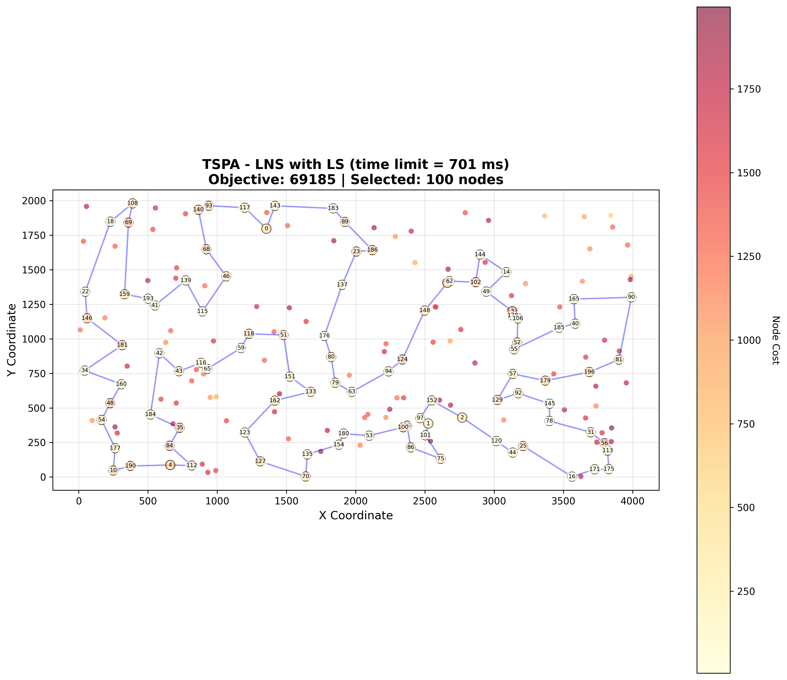
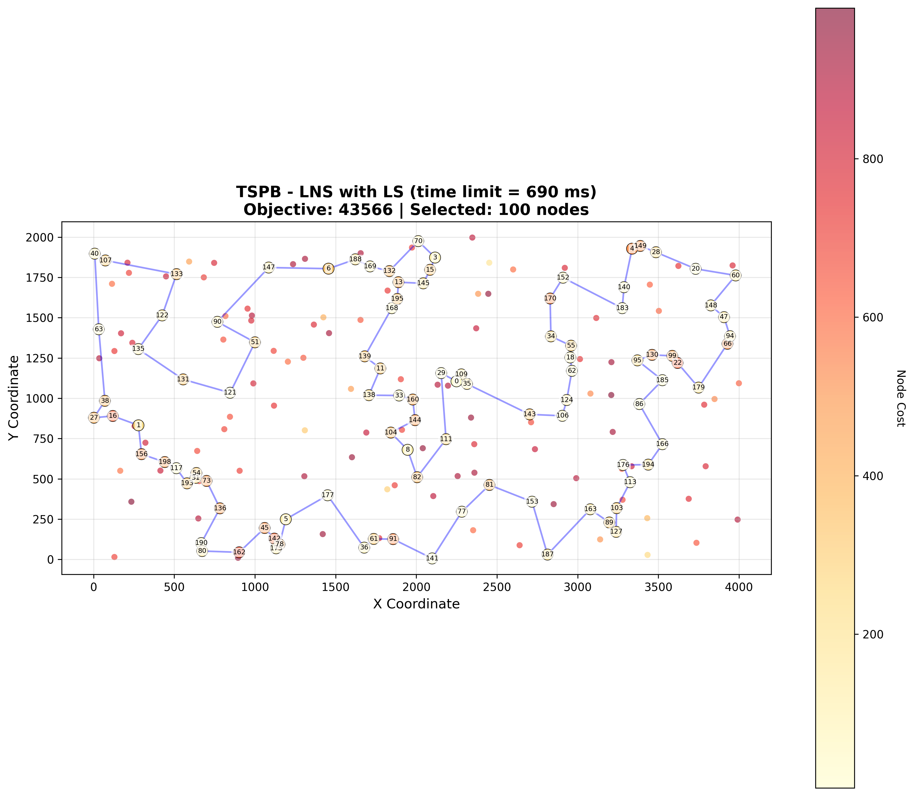
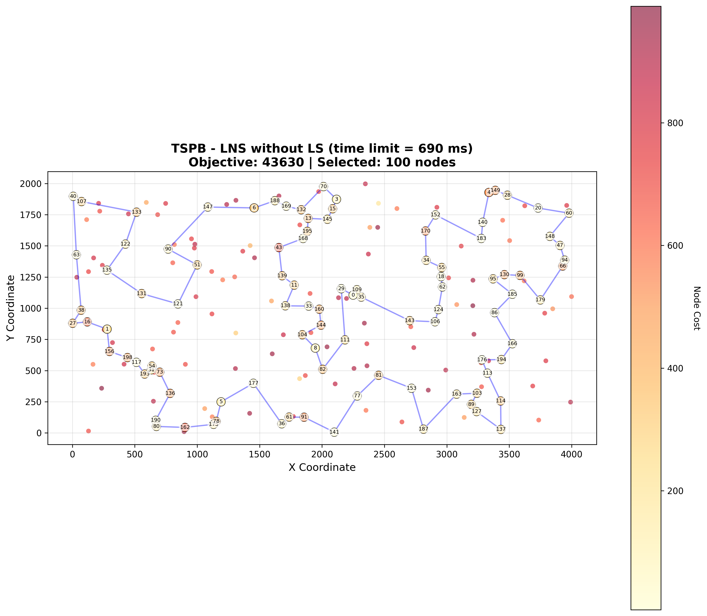

# Assignment 7 - Large Neighborhood Search for Selective TSP

## Authors
- Mateusz Idziejczak 155842
- Mateusz Stawicki 155900

## Github
> https://github.com/Luncenok/EvolutionaryComputing

## Problem Description

This is the same variant of the Traveling Salesman Problem as in previous assignments:
- Select exactly 50% of nodes (rounded up if odd)
- Form a Hamiltonian cycle through selected nodes
- Minimize: total path length + sum of selected node costs
- Distances are Euclidean distances rounded to integers

Instances:
- **TSPA, TSPB** with 200 nodes, selecting 100 nodes.

## Goal

Implement Large Neighborhood Search (LNS) in two versions:
1. **LNS with Local Search**: Apply local search after each destroy-repair iteration
2. **LNS without Local Search**: Only apply destroy-repair without subsequent local search

For both versions:
- Use a random starting solution with local search applied initially
- Run **20 times** per instance
- Use a **time limit equal to the average MSLS time** from Assignment 6
- Report the number of main loop iterations

## Algorithm Pseudocode

### Large Neighborhood Search (LNS)

LNS iteratively destroys and repairs a solution to explore larger neighborhoods.

```python
LNS(timeLimit, useLocalSearch=True):
    # Initialize with random solution
    current = generateRandomSolution()
    current = localSearch(current)  # Always apply to initial
    
    best = current
    bestObjective = objective(current)
    
    startTime = now()
    iterations = 0
    
    while (now() - startTime) < timeLimit:
        iterations += 1
        
        # Destroy: remove ~30% of nodes
        partial = destroy(current)
        
        # Repair: rebuild using greedy heuristic
        repaired = repair(partial)
        
        # Optional local search
        if useLocalSearch:
            candidate = localSearch(repaired)
        else:
            candidate = repaired
        
        obj = objective(candidate)
        
        # Update best
        if obj < bestObjective:
            bestObjective = obj
            best = candidate
        
        # Accept if better (greedy acceptance)
        if obj < objective(current):
            current = candidate
    
    return best, iterations
```

### Destroy Operator

The destroy operator removes approximately 30% of nodes from the current solution using weighted random selection. Nodes connected by longer edges have higher probability of removal:

```python
destroy(solution, destroyFraction=0.30):
    numToRemove = solSize * destroyFraction
    
    # Calculate weights based on adjacent edge costs
    weights = []
    for i in range(len(solution)):
        prev = (i - 1) % len(solution)
        next = (i + 1) % len(solution)
        edgeCost = distance[solution[prev]][solution[i]] + distance[solution[i]][solution[next]]
        weight = edgeCost + costs[solution[i]]
        weights.append(weight)
    
    # Weighted random selection of nodes to remove
    toRemove = weightedRandomSelect(numToRemove, weights)
    
    # Return remaining nodes (preserving tour order)
    return [node for i, node in enumerate(solution) if i not in toRemove]
```

**Destroy rationale:**
- Weighted selection targets "bad" edges (longer connections) and costly nodes
- 30% removal provides significant diversification while retaining solution structure
- Preserving tour order helps maintain good partial structures
- Randomization prevents deterministic cycling

### Repair Operator

The repair operator rebuilds the solution to full size using the weighted 2-regret heuristic (the best-performing greedy heuristic from previous assignments):

```python
repair(partial, selectCount):
    solution = partial
    
    while len(solution) < selectCount:
        bestNode = None
        bestPos = None
        bestScore = -infinity
        
        for each unselected node:
            # Find best and second-best insertion positions
            best1, best2 = findTwoBestInsertions(node, solution)
            
            regret = best2 - best1
            score = wRegret * regret - wBest * best1
            
            if score > bestScore:
                bestScore = score
                bestNode = node
                bestPos = bestInsertPosition
        
        solution.insert(bestPos, bestNode)
    
    return solution
```

**Repair rationale:**
- Weighted 2-regret achieves best results among greedy heuristics
- Balances urgency (regret) with quality (insertion cost)
- Efficiently rebuilds while maintaining good tour quality

## Experimental Setup

- **Instances**: TSPA, TSPB (200 nodes, 100 selected)
- **Objective**: Minimize path length + sum of selected node costs
- **Local search**: Steepest descent with edge exchange (from Assignment 3)
- **Destroy fraction**: 30% of nodes removed
- **Repair heuristic**: Weighted 2-regret (w_regret=1.0, w_best=1.0)
- **Evaluation**:
  - Run both LNS versions **20 times** per instance
  - Use **time limit = average MSLS time** (~1090 ms)
  - Report min, max, and average objective values and running times
  - Report average number of destroy-repair iterations

## Key Results

### Summary Comparison

| Instance | ILS Avg | LNS+LS Avg | LNS Avg | LNS+LS vs ILS | LNS vs ILS |
|----------|---------|------------|---------|---------------|------------|
| TSPA | 69340 | 69689 | 69817 | +0.50% | +0.69% |
| TSPB | 43674 | 44239 | 44294 | +1.29% | +1.42% |

### Iteration Count Table

| Instance | LNS with LS | LNS without LS | ILS (LS runs) |
|----------|-------------|----------------|---------------|
| TSPA | 1476.9 | 1683.4 | 3544.5 |
| TSPB | 1438.95 | 1620.15 | 3566.7 |

### Comparison with All Previous Methods

| Method | TSPA | TSPB |
|--------|------|------|
| Random | 264638 (238611 – 287962) | 213875 (190076 – 244960) |
| Nearest Neighbor (end only) | 85108 (83182 – 89433) | 54390 (52319 – 59030) |
| Nearest Neighbor (any position) | 73178 (71179 – 75450) | 45870 (44417 – 53438) |
| Greedy Cycle | 72646 (71488 – 74410) | 51400 (49001 – 57324) |
| Greedy 2-Regret | 115474 (105852 – 123428) | 72454 (66505 – 77072) |
| Greedy Weighted (2-Regret + BestDelta) | 72129 (71108 – 73395) | 50950 (47144 – 55700) |
| Nearest Neighbor Any 2-Regret | 116659 (106373 – 126570) | 73646 (67121 – 79013) |
| Nearest Neighbor Any Weighted | 72401 (70010 – 75452) | 47653 (44891 – 55247) |
| LS Random + Steepest + Nodes | 88011 (81817 – 97630) | 62848 (55928 – 70479) |
| LS Random + Greedy + Nodes | 93267 (86375 – 101454) | 65388 (57842 – 76707) |
| LS Random + Greedy + Edges | 81101 (76362 – 87763) | 54088 (50858 – 59045) |
| LS Greedy + Steepest + Nodes | 71614 (70626 – 72950) | 45414 (43826 – 50876) |
| LS Greedy + Steepest + Edges | 71460 (70510 – 72614) | 44979 (43921 – 50629) |
| LS Greedy + Greedy + Nodes | 71908 (71093 – 73048) | 45584 (43917 – 51165) |
| LS Greedy + Greedy + Edges | 71825 (70977 – 72706) | 45376 (43845 – 51170) |
| LS Random + Steepest + Edges | 73965 (71371 – 78984) | 48252 (45823 – 51965) |
| LM Random + Steepest + Edges | 74981 (72054 – 79520) | 49325 (45965 – 52805) |
| Candidates (k=5) | 84726 (78843 – 91459) | 49873 (47117 – 53865) |
| Candidates (k=10) | 77773 (72851 – 84000) | 48450 (45669 – 51178) |
| Candidates (k=15) | 75510 (72276 – 83040) | 48295 (45582 – 51938) |
| Candidates (k=20) | 74416 (71292 – 80264) | 48221 (45338 – 51285) |
| LM Candidates (k=10) | 75157 (72331 – 80832) | 49219 (46145 – 52021) |
| LM Candidates (k=20) | 74976 (72054 – 79520) | 49302 (45965 – 52805) |
| MSLS (200 iterations) | 71306 (70748 – 71959) | 45741 (45356 – 46168) |
| **ILS** | **69340 (69107 – 69861)** | **43674 (43473 – 44056)** |
| **LNS with LS** | 69689 (69185 – 70194) | 44239 (43566 – 45964) |
| **LNS without LS** | 69817 (69496 – 70217) | 44294 (43630 – 45602) |

## Visualizations

Best solutions found by LNS visualized on both instances:

<table>
  <tr>
    <th>LNS with LS - TSPA</th>
    <th>LNS with LS - TSPB</th>
  </tr>
  <tr>
    <td></td>
    <td></td>
  </tr>
  <tr>
    <th>LNS without LS - TSPA</th>
    <th>LNS without LS - TSPB</th>
  </tr>
  <tr>
    <td></td>
    <td></td>
  </tr>
</table>

## Analysis and Conclusions

### LNS vs ILS Comparison

**Key findings:**
- **ILS outperforms LNS** on both instances with the same time budget
- TSPA: ILS achieves 69340 avg vs LNS+LS's 69689 (+0.50% worse)
- TSPB: ILS achieves 43674 avg vs LNS+LS's 44239 (+1.29% worse)
- ILS performs ~2.4× more local search runs than LNS iterations (3545 vs 1477 for TSPA)

**LNS characteristics:**
- LNS's large neighborhood (30% destruction) provides more diversification
- Each LNS iteration is more expensive due to greedy repair (O(n²) per iteration)
- LNS may be better for escaping very deep local optima

### Effect of Local Search in LNS

| Metric | LNS with LS | LNS without LS | Difference |
|--------|-------------|----------------|------------|
| TSPA Avg Obj | 69689 | 69817 | +0.18% |
| TSPB Avg Obj | 44239 | 44294 | +0.12% |
| TSPA Iterations | 1477 | 1683 | +14.0% more |
| TSPB Iterations | 1439 | 1620 | +12.6% more |

**Observations:**
- **LNS with LS is slightly better** in solution quality
- LNS without LS completes ~12-14% more iterations
- The quality gain from local search outweighs the iteration count loss
- The greedy repair alone produces solutions close to local optima, but LS provides final refinement
