# Assignment 8 - Global Convexity Tests for Selective TSP

## Authors
- Mateusz Idziejczak 155842
- Mateusz Stawicki 155900

## Github
> https://github.com/Luncenok/EvolutionaryComputing

## Problem Description

This is the same variant of the Traveling Salesman Problem as in previous assignments:
- Select exactly 50% of nodes (rounded up if odd)
- Form a Hamiltonian cycle through selected nodes
- Minimize: total path length + sum of selected node costs
- Distances are Euclidean distances rounded to integers

Instances:
- **TSPA, TSPB** with 200 nodes, selecting 100 nodes.

## Goal

Analyze the **global convexity** (fitness-similarity relationships) of the solution space by:
1. Generating **1000 random local optima** for each instance
2. Calculating **similarity measures** between solutions (common edges, common nodes)
3. Analyzing how **similarity varies with solution quality** (min, max, avg similarity values)
4. Creating **12 visualization charts** (2 instances × 3 similarity versions × 2 similarity measures)

### Similarity Measures

Two types of similarity measures are used to compare solutions:

1. **Number of Common Edges**: Count of edges that appear in both solutions
2. **Number of Common Selected Nodes**: Count of nodes selected in both solutions

### Similarity Versions

For each similarity measure, three versions of analysis are performed:

1. **Average Similarity to All**: For each solution, calculate its average similarity to all other 999 local optima
2. **Similarity to Best of 1000**: Calculate similarity to the best local optimum found among the 1000 generated
3. **Similarity to Best Method (ILS)**: Calculate similarity to the best solution found by ILS (the best method from previous assignments)

**Note**: When calculating similarity to a single good solution, that solution itself is excluded to avoid an outlier with 100% similarity to itself.

## Algorithm Pseudocode

### Global Convexity Analysis

```python
analyzeGlobalConvexity(instanceName, n, selectCount, distance, costs, bestILSSolution):
    NUM_LOCAL_OPTIMA = 1000
    localOptima = []
    objectives = []
    
    # Generate 1000 random local optima
    for i in range(NUM_LOCAL_OPTIMA):
        initial = generateRandomSolution(n, selectCount)
        localOpt = localSearchGreedyEdges(initial, distance, costs)
        localOptima.append(localOpt)
        objectives.append(calculateObjective(localOpt, distance, costs))
    
    # Find best local optimum
    bestIdx = argmin(objectives)
    bestLocalOpt = localOptima[bestIdx]
    
    # Calculate statistics
    minObj = min(objectives)
    maxObj = max(objectives)
    avgObj = mean(objectives)
    
    # For each similarity measure (edges, nodes)
    for measureType in [EDGES, NODES]:
        
        # Version 1: Average similarity to all other local optima
        similarities_avg = []
        for i in range(NUM_LOCAL_OPTIMA):
            avgSim = 0
            for j in range(NUM_LOCAL_OPTIMA):
                if i != j:
                    avgSim += calculateSimilarity(localOptima[i], localOptima[j], measureType)
            avgSim /= (NUM_LOCAL_OPTIMA - 1)
            similarities_avg.append(avgSim)
        
        corr_avg = pearsonCorrelation(objectives, similarities_avg)
        exportToCSV(objectives, similarities_avg, corr_avg)
        
        # Version 2: Similarity to best of 1000 local optima
        similarities_best1000 = []
        for i in range(NUM_LOCAL_OPTIMA):
            if i == bestIdx:
                continue  # Skip the best solution itself
            sim = calculateSimilarity(localOptima[i], bestLocalOpt, measureType)
            similarities_best1000.append(sim)
        
        corr_best1000 = pearsonCorrelation(objectives[excluding bestIdx], similarities_best1000)
        exportToCSV(objectives[excluding bestIdx], similarities_best1000, corr_best1000)
        
        # Version 3: Similarity to best ILS solution
        similarities_ILS = []
        for i in range(NUM_LOCAL_OPTIMA):
            sim = calculateSimilarity(localOptima[i], bestILSSolution, measureType)
            similarities_ILS.append(sim)
        
        corr_ILS = pearsonCorrelation(objectives, similarities_ILS)
        exportToCSV(objectives, similarities_ILS, corr_ILS)
    
    return results
```

### Similarity Calculation Functions

```python
calculateCommonEdges(solution1, solution2):
    # Build edge set for solution1
    edges1 = set()
    for i in range(len(solution1)):
        u = solution1[i]
        v = solution1[(i + 1) % len(solution1)]
        edges1.add((min(u, v), max(u, v)))  # Normalize edge representation
    
    # Count common edges with solution2
    commonCount = 0
    for i in range(len(solution2)):
        u = solution2[i]
        v = solution2[(i + 1) % len(solution2)]
        edge = (min(u, v), max(u, v))
        if edge in edges1:
            commonCount += 1
    
    return commonCount

calculateCommonNodes(solution1, solution2):
    # Convert to sets and count intersection
    nodes1 = set(solution1)
    nodes2 = set(solution2)
    return len(nodes1 & nodes2)
```

### Pearson Correlation Coefficient

```python
pearsonCorrelation(x, y):
    # Calculate means
    meanX = mean(x)
    meanY = mean(y)
    
    # Calculate covariance and standard deviations
    cov = sum((x[i] - meanX) * (y[i] - meanY) for i in range(len(x)))
    stdX = sqrt(sum((x[i] - meanX)**2 for i in range(len(x))))
    stdY = sqrt(sum((y[i] - meanY)**2 for i in range(len(y))))
    
    # Return correlation coefficient
    if stdX == 0 or stdY == 0:
        return 0
    return cov / (stdX * stdY)
```

**Correlation interpretation:**
- **r close to -1**: Strong negative correlation - better solutions (lower objective) tend to have higher similarity to the reference
- **r close to 0**: No correlation - similarity is independent of solution quality
- **r close to +1**: Strong positive correlation - worse solutions tend to have higher similarity to the reference

For global convexity, we expect **negative correlations**, indicating that good solutions cluster together in the search space (funnel-shaped landscape).

## Experimental Setup

- **Instances**: TSPA, TSPB (200 nodes, 100 selected)
- **Objective**: Minimize path length + sum of selected node costs
- **Local search**: Greedy local search with edge exchange (from Assignment 3)
- **Number of local optima**: 1000 per instance
- **Initial solutions**: Random solutions with different starting nodes
- **Reference solutions**:
  - Best of 1000 local optima
  - Best ILS solution from Assignment 6
- **Output**: 12 CSV files (2 instances × 3 versions × 2 measures) containing objective values, similarity counts, and correlation coefficients
- **Visualizations**: 12 scatter plots with regression lines showing fitness-similarity relationships

## Key Results

### Objective Function Values - All Methods Comparison

#### TSPA Results

| Method | Min | Max | Avg |
|--------|-----|-----|-----|
| Random | 235453 | 288189 | 264501 |
| Nearest Neighbor (end) | 83182 | 89433 | 85108 |
| Nearest Neighbor (any) | 71179 | 75450 | 73178 |
| Greedy Cycle | 71488 | 74410 | 72646 |
| Greedy 2-Regret | 105852 | 123428 | 115474 |
| Greedy Weighted | 71108 | 73395 | 72129 |
| NN Any 2-Regret | 106373 | 126570 | 116659 |
| NN Any Weighted | 70010 | 75452 | 72401 |
| LS Random+Steepest+Nodes | 80903 | 97156 | 88323 |
| LS Random+Greedy+Nodes | 86293 | 102205 | 92779 |
| LS Random+Greedy+Edges | 75576 | 86423 | 81269 |
| LS Greedy+Steepest+Nodes | 70626 | 72950 | 71614 |
| LS Greedy+Steepest+Edges | 70510 | 72614 | 71460 |
| LS Greedy+Greedy+Nodes | 71093 | 73048 | 71913 |
| LS Greedy+Greedy+Edges | 70977 | 72844 | 71817 |
| LS Random+Steepest+Edges | 70937 | 78033 | 73945 |
| LM Random+Steepest+Edges | 71993 | 80945 | 74973 |
| Candidates k=5 | 78119 | 91398 | 84660 |
| Candidates k=10 | 73550 | 83200 | 77494 |
| Candidates k=15 | 71917 | 80679 | 75268 |
| Candidates k=20 | 71417 | 79637 | 74451 |
| LM Candidates k=10 | 72274 | 79625 | 74829 |
| LM Candidates k=20 | 71993 | 80945 | 74962 |
| MSLS (200 iterations) | 70813 | 71786 | 71344 |
| **ILS** | **69107** | **69776** | **69359** |
| LNS with LS | 69255 | 70147 | 69751 |
| LNS without LS | 69291 | 70389 | 69851 |
| **Global Convexity (1000 LO)** | **75733** | **88526** | **81055** |

#### TSPB Results

| Method | Min | Max | Avg |
|--------|-----|-----|-----|
| Random | 189071 | 238254 | 212513 |
| Nearest Neighbor (end) | 52319 | 59030 | 54390 |
| Nearest Neighbor (any) | 44417 | 53438 | 45870 |
| Greedy Cycle | 49001 | 57324 | 51400 |
| Greedy 2-Regret | 66505 | 77072 | 72454 |
| Greedy Weighted | 47144 | 55700 | 50950 |
| NN Any 2-Regret | 67121 | 79013 | 73646 |
| NN Any Weighted | 44891 | 55247 | 47653 |
| LS Random+Steepest+Nodes | 56207 | 70573 | 63219 |
| LS Random+Greedy+Nodes | 58888 | 73163 | 65643 |
| LS Random+Greedy+Edges | 50610 | 59193 | 54272 |
| LS Greedy+Steepest+Nodes | 43826 | 50876 | 45414 |
| LS Greedy+Steepest+Edges | 43921 | 50629 | 44979 |
| LS Greedy+Greedy+Nodes | 43917 | 51144 | 45561 |
| LS Greedy+Greedy+Edges | 43845 | 51072 | 45371 |
| LS Random+Steepest+Edges | 45799 | 51543 | 48313 |
| LM Random+Steepest+Edges | 46324 | 53526 | 49391 |
| Candidates k=5 | 46328 | 53421 | 49996 |
| Candidates k=10 | 45358 | 53439 | 48461 |
| Candidates k=15 | 45251 | 51868 | 48201 |
| Candidates k=20 | 45356 | 51272 | 48294 |
| LM Candidates k=10 | 46111 | 53213 | 49201 |
| LM Candidates k=20 | 46324 | 53526 | 49391 |
| MSLS (200 iterations) | 45040 | 46209 | 45758 |
| **ILS** | **43465** | **44209** | **43785** |
| LNS with LS | 43747 | 44651 | 44255 |
| LNS without LS | 43671 | 45669 | 44294 |
| **Global Convexity (1000 LO)** | **49379** | **61043** | **54207** |

### Running Time Comparison

#### TSPA Running Times (ms)

| Method | Min | Max | Avg |
|--------|-----|-----|-----|
| Random | 0.0001 | 0.0021 | 0.0002 |
| Nearest Neighbor (end) | 0.0344 | 0.0603 | 0.0387 |
| Nearest Neighbor (any) | 1.4212 | 1.5059 | 1.4470 |
| Greedy Cycle | 2.5191 | 2.6936 | 2.5977 |
| Greedy 2-Regret | 2.5644 | 5.3887 | 2.8215 |
| Greedy Weighted | 2.5992 | 2.6960 | 2.6242 |
| NN Any 2-Regret | 1.4172 | 1.6111 | 1.5038 |
| NN Any Weighted | 1.4408 | 1.9339 | 1.5728 |
| LS Random+Steepest+Nodes | 19.0661 | 31.4049 | 24.2276 |
| LS Random+Greedy+Nodes | 1.8853 | 6.7367 | 3.4547 |
| LS Random+Greedy+Edges | 1.5906 | 4.0691 | 2.5430 |
| LS Greedy+Steepest+Nodes | 2.8667 | 4.5868 | 3.5489 |
| LS Greedy+Steepest+Edges | 3.0082 | 4.3915 | 3.5445 |
| LS Greedy+Greedy+Nodes | 3.3134 | 5.0790 | 3.7871 |
| LS Greedy+Greedy+Edges | 3.3632 | 5.2897 | 3.8511 |
| LS Random+Steepest+Edges | 14.4390 | 21.8291 | 16.3947 |
| LM Random+Steepest+Edges | 4.1653 | 8.5713 | 5.5767 |
| Candidates k=5 | 3.7939 | 5.9315 | 4.5188 |
| Candidates k=10 | 5.3462 | 7.4807 | 6.1366 |
| Candidates k=15 | 7.2033 | 9.0747 | 8.0357 |
| Candidates k=20 | 8.8077 | 11.1121 | 9.8870 |
| LM Candidates k=10 | 6.2955 | 8.8053 | 7.5203 |
| LM Candidates k=20 | 19.0448 | 31.7943 | 21.6993 |
| MSLS (200 iterations) | 3206.98 | 3425.49 | 3259.67 |
| ILS | 3259.68 | 3260.58 | 3260.06 |
| LNS with LS | 3259.69 | 3260.96 | 3260.24 |
| LNS without LS | 3259.68 | 3260.74 | 3260.16 |
| **Global Convexity (1000 LO)** | **29391** | **29391** | **29391** |

#### TSPB Running Times (ms)

| Method | Min | Max | Avg |
|--------|-----|-----|-----|
| Random | 0.0000 | 0.0006 | 0.0001 |
| Nearest Neighbor (end) | 0.0354 | 0.0542 | 0.0398 |
| Nearest Neighbor (any) | 1.3943 | 1.5409 | 1.4215 |
| Greedy Cycle | 2.4907 | 2.6884 | 2.5575 |
| Greedy 2-Regret | 2.5337 | 2.7132 | 2.5969 |
| Greedy Weighted | 2.5349 | 2.6755 | 2.5782 |
| NN Any 2-Regret | 1.4031 | 1.5906 | 1.4758 |
| NN Any Weighted | 1.4143 | 1.6346 | 1.5160 |
| LS Random+Steepest+Nodes | 19.1283 | 31.8331 | 24.3617 |
| LS Random+Greedy+Nodes | 1.7297 | 5.2907 | 3.1663 |
| LS Random+Greedy+Edges | 1.7306 | 4.3680 | 2.5049 |
| LS Greedy+Steepest+Nodes | 1.8601 | 5.1730 | 2.3749 |
| LS Greedy+Steepest+Edges | 1.8860 | 5.0376 | 2.3720 |
| LS Greedy+Greedy+Nodes | 2.1049 | 4.3128 | 2.6515 |
| LS Greedy+Greedy+Edges | 2.1430 | 3.7055 | 2.5698 |
| LS Random+Steepest+Edges | 13.9633 | 40.8522 | 16.4927 |
| LM Random+Steepest+Edges | 4.3264 | 6.3337 | 5.2454 |
| Candidates k=5 | 4.0974 | 5.1938 | 4.5828 |
| Candidates k=10 | 5.6982 | 7.4067 | 6.5578 |
| Candidates k=15 | 7.6928 | 9.6709 | 8.6749 |
| Candidates k=20 | 9.3987 | 12.0207 | 10.5835 |
| LM Candidates k=10 | 5.9445 | 8.3050 | 7.2025 |
| LM Candidates k=20 | 19.5947 | 26.2397 | 22.4066 |
| MSLS (200 iterations) | 3182.64 | 3492.31 | 3263.80 |
| ILS | 3263.81 | 3265.93 | 3264.38 |
| LNS with LS | 3264.02 | 3265.15 | 3264.46 |
| LNS without LS | 3263.82 | 3265.21 | 3264.30 |
| **Global Convexity (1000 LO)** | **30079** | **30079** | **30079** |

---

### Global Convexity Analysis Results

#### TSPA - Similarity Analysis (1000 Random Local Optima)

**Local Optima Statistics:**
- **Objective**: Min=75733, Max=88526, Avg=81055
- **Time**: 29391 ms (~29.4 seconds)

**Raw Similarity Counts:**

| Measure | Similarity Version | Min | Max | Avg |
|---------|-------------------|-----|-----|-----|
| **Common Edges** (out of 100) | Avg to All | 17.3 | 29.1 | 22.7 |
| **Common Edges** (out of 100) | Best of 1000 | 16 | 44 | 29.1 |
| **Common Edges** (out of 100) | Best ILS | 22 | 52 | 34.2 |
| **Common Nodes** (out of 100) | Avg to All | 83.5 | 90.6 | 88.0 |
| **Common Nodes** (out of 100) | Best of 1000 | 85 | 96 | 90.0 |
| **Common Nodes** (out of 100) | Best ILS | 82 | 95 | 90.0 |

#### TSPB - Similarity Analysis (1000 Random Local Optima)

**Local Optima Statistics:**
- **Objective**: Min=49379, Max=61043, Avg=54207
- **Time**: 30079 ms (~30.1 seconds)

**Raw Similarity Counts:**

| Measure | Similarity Version | Min | Max | Avg |
|---------|-------------------|-----|-----|-----|
| **Common Edges** (out of 100) | Avg to All | 16.7 | 27.1 | 22.3 |
| **Common Edges** (out of 100) | Best of 1000 | 9 | 39 | 25.8 |
| **Common Edges** (out of 100) | Best ILS | 18 | 49 | 32.5 |
| **Common Nodes** (out of 100) | Avg to All | 77.7 | 86.0 | 82.7 |
| **Common Nodes** (out of 100) | Best of 1000 | 75 | 93 | 85.1 |
| **Common Nodes** (out of 100) | Best ILS | 74 | 93 | 85.1 |

### Summary - Raw Similarity Values

| Instance | Measure | Avg to All | Best of 1000 | Best ILS |
|----------|---------|------------|--------------|----------|
| TSPA | Common Edges | 22.7 | 29.1 | 34.2 |
| TSPA | Common Nodes | 88.0 | 90.0 | 90.0 |
| TSPB | Common Edges | 22.3 | 25.8 | 32.5 |
| TSPB | Common Nodes | 82.7 | 85.1 | 85.1 |

**Bonus: Correlation Coefficients (r)**

| Instance | Measure | Avg to All | Best of 1000 | Best ILS |
|----------|---------|------------|--------------|----------|
| TSPA | Common Edges | -0.861 | -0.512 | -0.643 |
| TSPA | Common Nodes | -0.256 | -0.196 | -0.304 |
| TSPB | Common Edges | -0.810 | -0.407 | -0.569 |
| TSPB | Common Nodes | -0.345 | -0.263 | -0.375 |

## Visualizations

### TSPA - Common Edges

<table>
  <tr>
    <th>Average Similarity to All</th>
    <th>Similarity to Best of 1000</th>
    <th>Similarity to Best ILS</th>
  </tr>
  <tr>
    <td>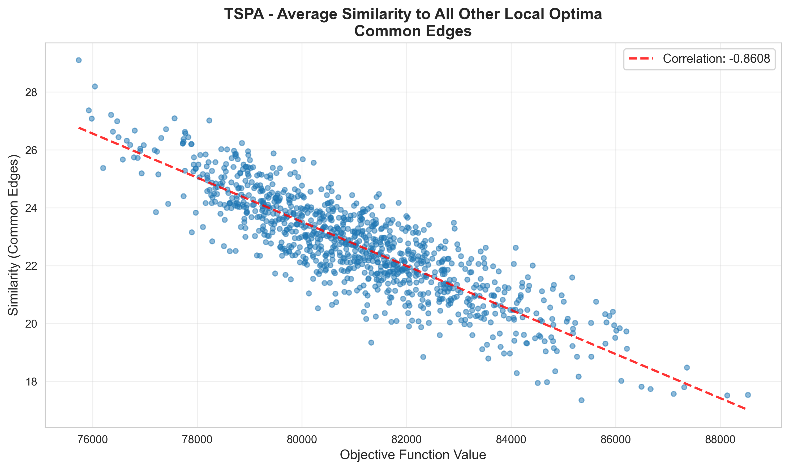</td>
    <td>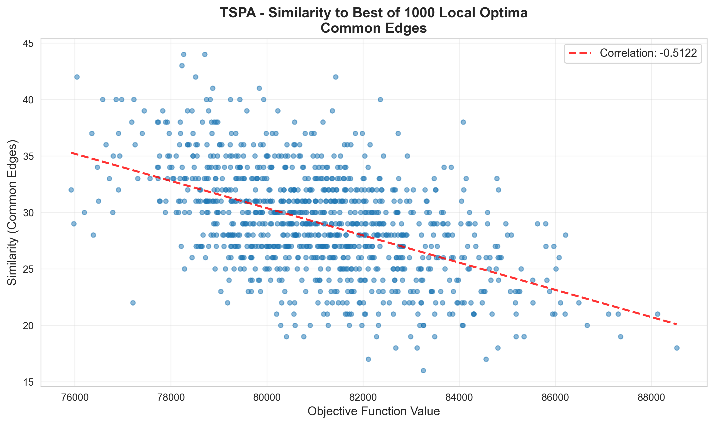</td>
    <td>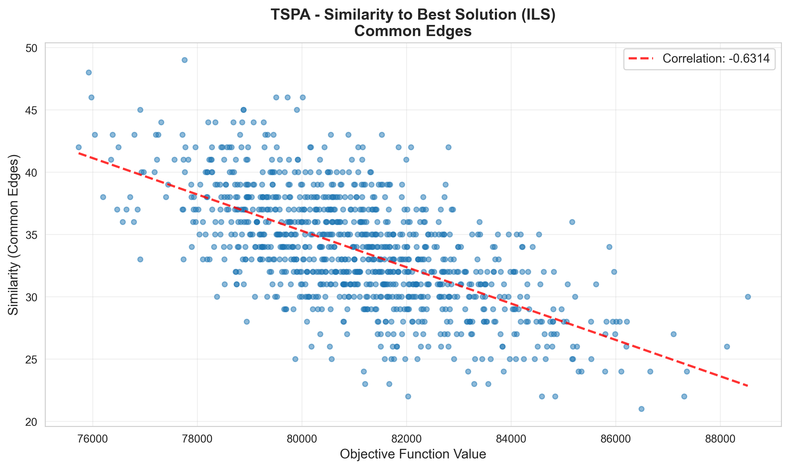</td>
  </tr>
</table>

### TSPA - Common Nodes

<table>
  <tr>
    <th>Average Similarity to All</th>
    <th>Similarity to Best of 1000</th>
    <th>Similarity to Best ILS</th>
  </tr>
  <tr>
    <td>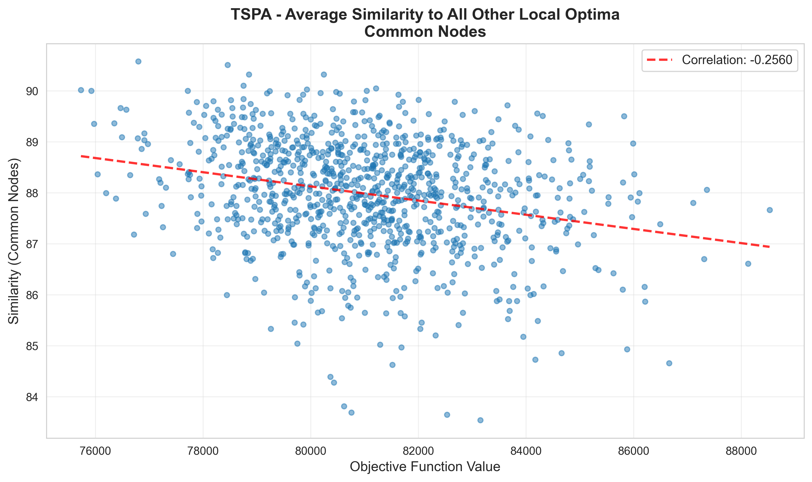</td>
    <td>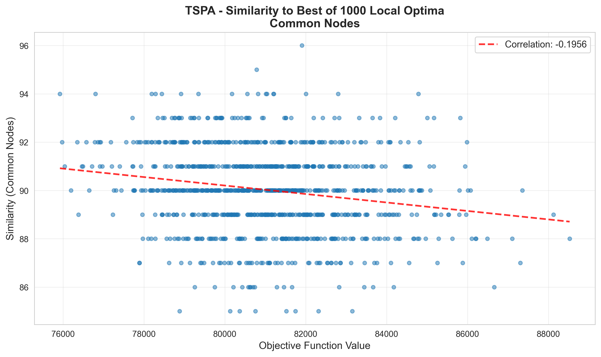</td>
    <td>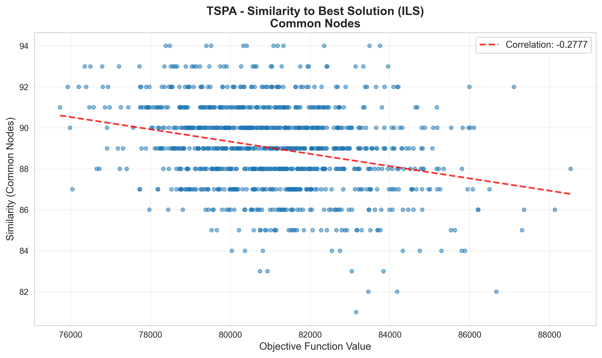</td>
  </tr>
</table>

### TSPB - Common Edges

<table>
  <tr>
    <th>Average Similarity to All</th>
    <th>Similarity to Best of 1000</th>
    <th>Similarity to Best ILS</th>
  </tr>
  <tr>
    <td>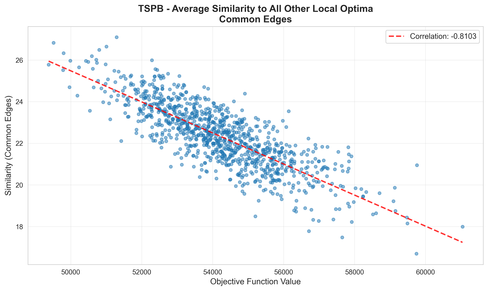</td>
    <td>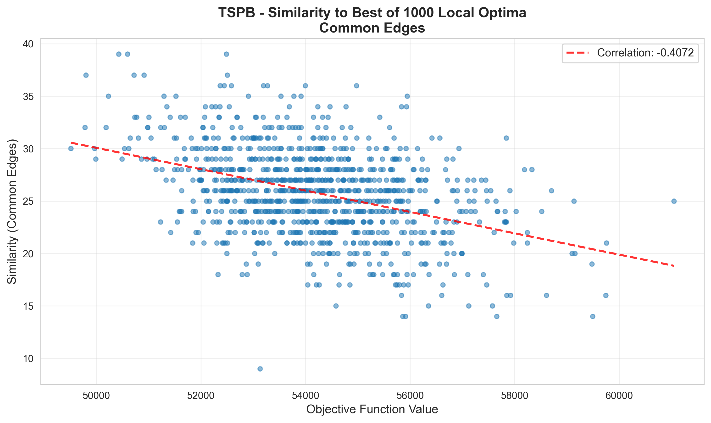</td>
    <td>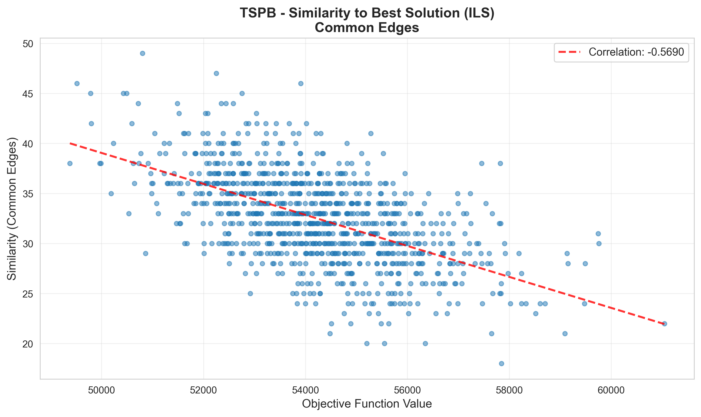</td>
  </tr>
</table>

### TSPB - Common Nodes

<table>
  <tr>
    <th>Average Similarity to All</th>
    <th>Similarity to Best of 1000</th>
    <th>Similarity to Best ILS</th>
  </tr>
  <tr>
    <td>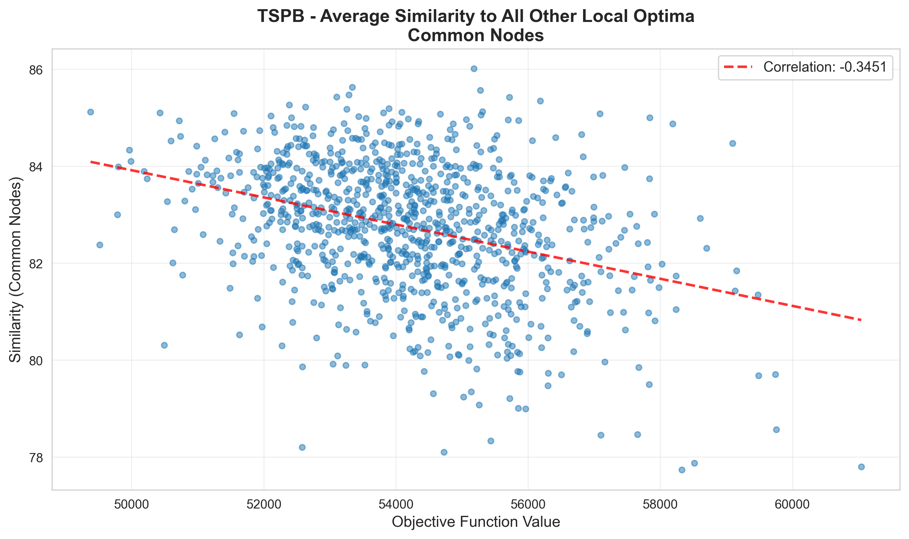</td>
    <td>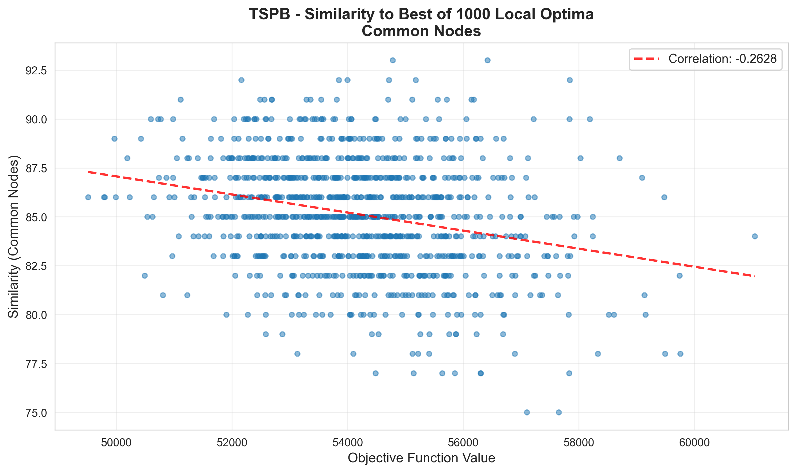</td>
    <td>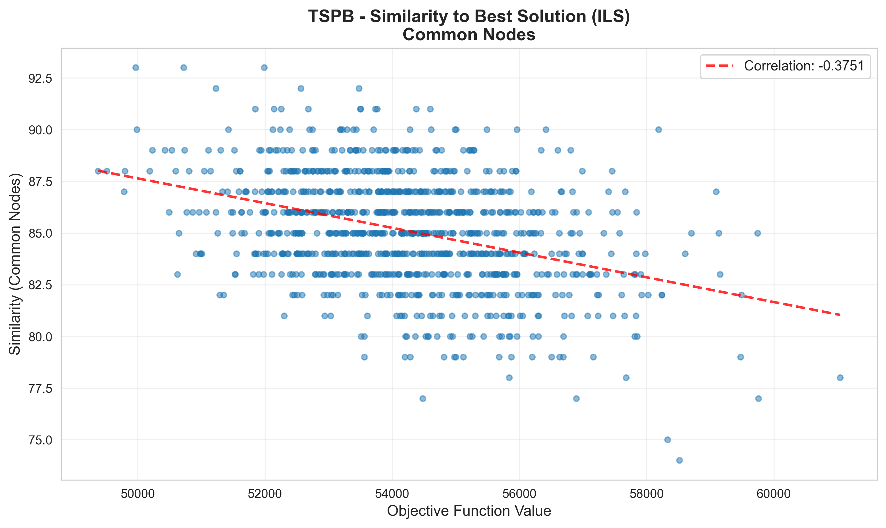</td>
  </tr>
</table>

## Analysis and Conclusions

### Raw Similarity Analysis

**Key findings from raw similarity counts:**

1. **Common edges show low absolute similarity** (~22-34 edges out of 100)
   - TSPA: Average 22.7 edges shared among random local optima (only 23% overlap)
   - TSPB: Average 22.3 edges shared among random local optima
   - This indicates **high diversity in edge structure** across local optima
   - Similarity to best ILS is higher: TSPA 34.2, TSPB 32.5 edges on average
   - Range is wide (TSPA: 16-44 edges to best of 1000; 22-52 edges to best ILS)

2. **Common nodes show high absolute similarity** (~83-90 nodes out of 100)
   - TSPA: Average 88.0 nodes shared among random local optima (88% overlap)
   - TSPB: Average 82.7 nodes shared among random local optima (83% overlap)
   - This indicates **node selection is relatively constrained** - most local optima select similar nodes
   - The problem structure forces similar node choices regardless of edge arrangement

3. **Similarity increases toward better solutions**
   - Avg to All → Best of 1000 → Best ILS shows increasing similarity
   - TSPA edges: 22.7 → 29.1 → 34.2 (52% increase from avg to ILS)
   - TSPB edges: 22.3 → 25.8 → 32.5 (46% increase from avg to ILS)
   - Better solutions share more structure with other solutions

### Comparison of Similarity Measures

| Measure | TSPA Avg | TSPB Avg | Interpretation |
|---------|----------|----------|----------------|
| **Common Edges** | 22.7 out of 100 | 22.3 out of 100 | Low overlap (~23%) - edges vary significantly |
| **Common Nodes** | 88.0 out of 100 | 82.7 out of 100 | High overlap (~85%) - nodes are constrained |

**Why edges show more variation:**
- 100 edges connect 100 nodes in a cycle - many valid arrangements exist
- Edge structure directly impacts path length (major component of objective)
- Different edge patterns can achieve similar node selections

**Why nodes show less variation:**
- Node costs constrain which nodes are "good" to select
- Only 100 out of 200 nodes selected - roughly half must be chosen
- Cost-effective nodes tend to appear in most good solutions

### Similarity Version Comparison

For **TSPA Common Edges**:
| Version | Min | Max | Avg |
|---------|-----|-----|-----|
| Avg to All | 17.3 | 29.1 | 22.7 |
| Best of 1000 | 16 | 44 | 29.1 |
| Best ILS | 22 | 52 | 34.2 |

**Interpretation:**
- **Avg to All** shows the baseline similarity structure (22.7 edges average)
- **Best of 1000** (objective 75733) shows moderate similarity increase to 29.1 edges
- **Best ILS** (objective 69107) shows highest similarity at 34.2 edges average
- The 52% increase from avg-to-all to best-ILS indicates good solutions cluster together

### Instance Comparison

| Metric | TSPA | TSPB |
|--------|------|------|
| Avg Common Edges | 22.7 | 22.3 |
| Avg Common Nodes | 88.0 | 82.7 |
| Edge similarity to ILS | 34.2 | 32.5 |
| Node similarity to ILS | 90.0 | 85.1 |
| Local Optima Range | 75733-88526 | 49379-61043 |
| Best ILS | 69107 | 43465 |
| Gap (Best LO vs ILS) | +9.6% | +13.6% |

Both instances show similar patterns:
- Low edge similarity (~22-23 edges) among random local optima
- High node similarity (~83-88 nodes) among random local optima
- Increasing similarity toward better solutions

### Implications for Search Algorithms

1. **Edge diversity suggests room for improvement**
   - Only 22-23 common edges on average means local optima differ significantly in structure
   - ILS achieves 34 common edges with local optima - it finds more "central" solutions
   - Edge-based perturbation (as in ILS) effectively explores this diverse space

2. **Node similarity suggests constrained selection**
   - 83-88% node overlap means most good solutions use similar nodes
   - Node-based moves alone may not provide enough diversity
   - The "good" nodes are relatively fixed by cost structure

3. **Better solutions are more similar to each other**
   - ILS solutions share 34 edges with local optima vs 22.7 average
   - This supports iterative improvement - moving toward similar good solutions
   - The landscape has a "funnel" structure where good solutions cluster

### Comparison with Previous Best Methods

| Method | TSPA Min | TSPA Avg | TSPB Min | TSPB Avg |
|--------|----------|----------|----------|----------|
| **ILS** | 69107 | 69359 | 43465 | 43785 |
| **LNS with LS** | 69255 | 69751 | 43747 | 44255 |
| **LNS without LS** | 69291 | 69851 | 43671 | 44294 |
| **MSLS** | 69839 | 70178 | 43530 | 43823 |
| **Best of 1000 LO** | 75733 | 81055 | 49379 | 54207 |

The 9-14% gap between best local optima and ILS demonstrates:
- Random starting points rarely lead to high-quality local optima
- ILS's perturbation strategy effectively navigates the solution space
- Sophisticated metaheuristics are essential for this problem

### Computational Performance

| Instance | Total Time (ms) | Time Breakdown |
|----------|-----------------|----------------|
| TSPA | 29,391 | 1000 local searches + ~500K similarity comparisons |
| TSPB | 30,079 | 1000 local searches + ~500K similarity comparisons |

**Note**: The majority of time is spent on pairwise similarity calculations for "avg to all" version (1000 × 999 / 2 ≈ 500,000 comparisons), not on generating local optima.

## Conclusions

1. **Low Edge Similarity Among Local Optima**: Only ~22-23 common edges out of 100 between typical local optima, indicating high structural diversity in the solution space.

2. **High Node Similarity Among Local Optima**: ~83-88 common nodes out of 100, showing that node selection is constrained by cost structure.

3. **Better Solutions Share More Structure**: Similarity to best ILS (34 edges) is 50% higher than average similarity (22.7 edges), confirming that good solutions cluster together.

4. **Edge Structure is Key**: The large variation in edges (vs constrained nodes) suggests that optimizing edge patterns is the primary challenge and opportunity.

5. **ILS Effectiveness Explained**: ILS finds solutions with higher similarity to other good solutions, navigating toward the "center" of the good solution cluster.

6. **Significant Optimization Gap**: The 9-14% gap between random local optima and ILS shows the value of sophisticated metaheuristics over simple multi-start approaches.
