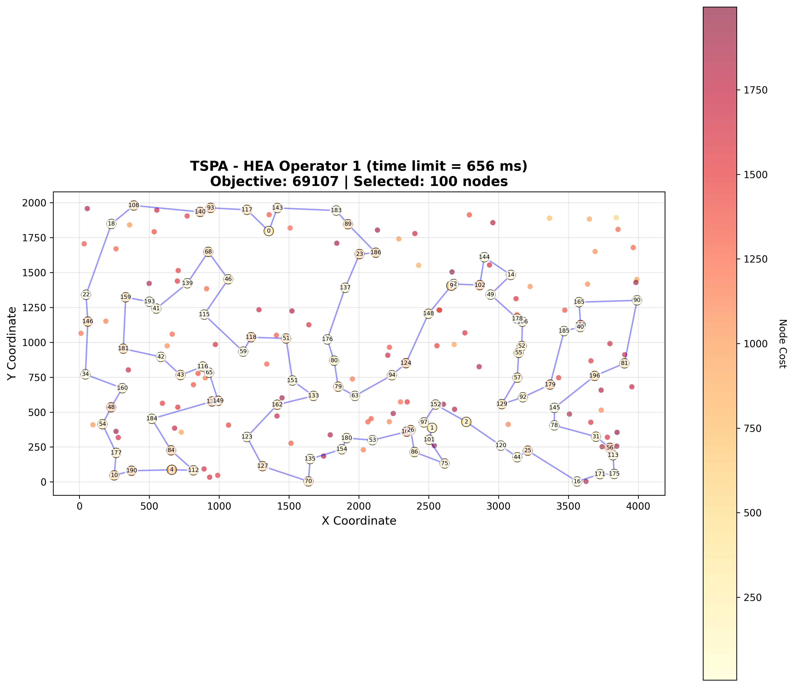
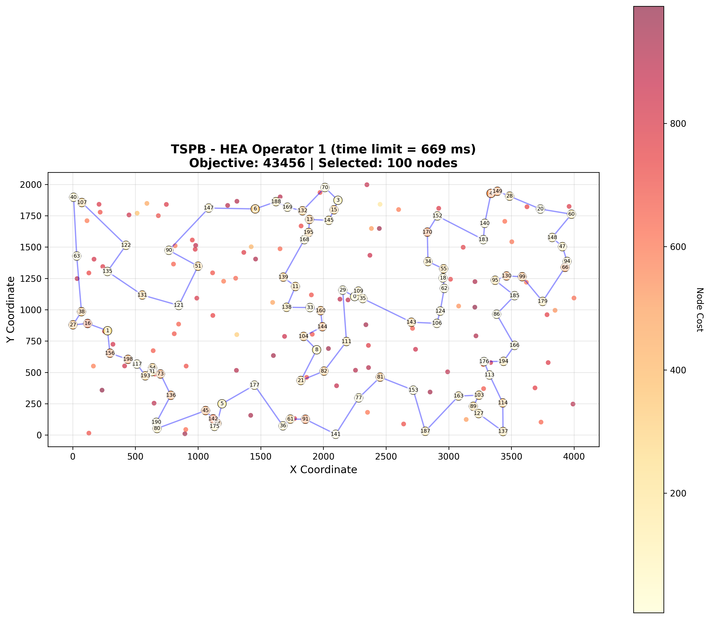
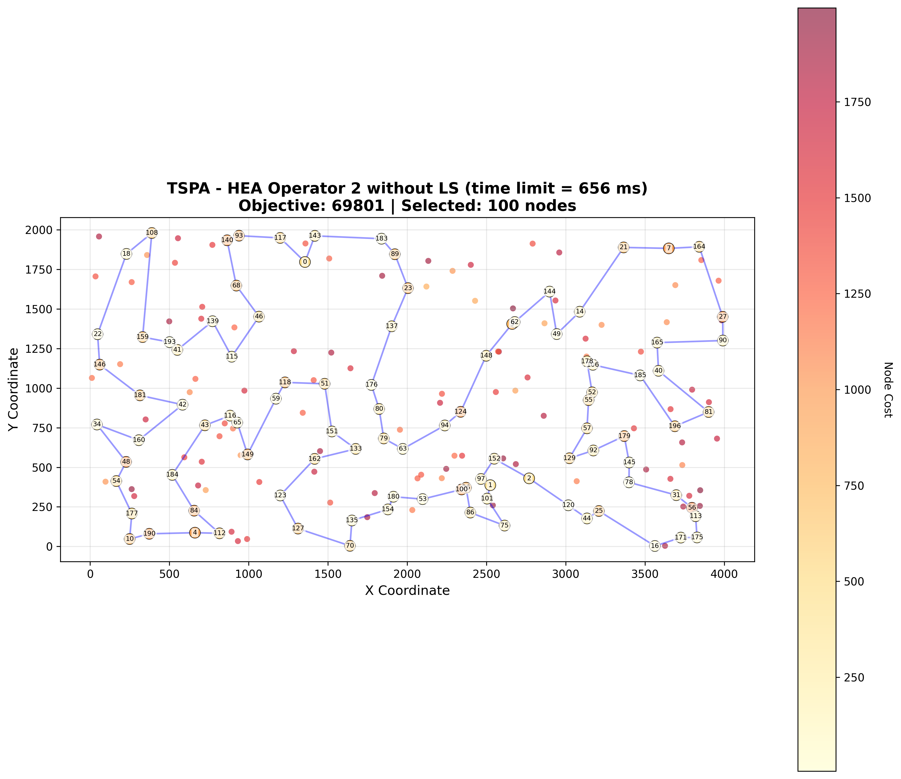
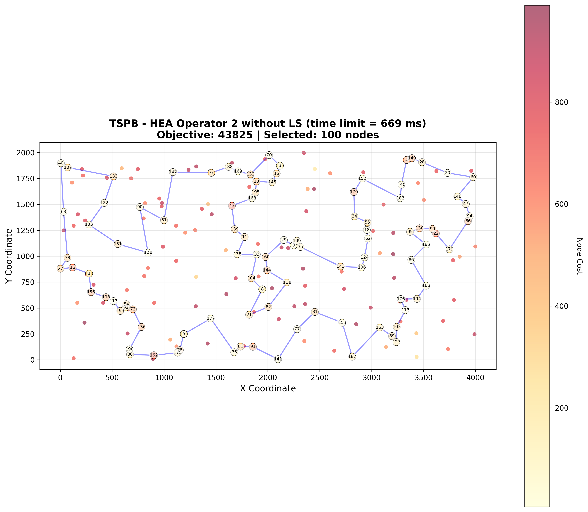
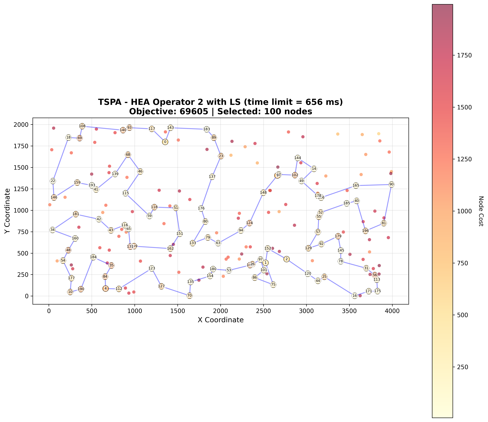
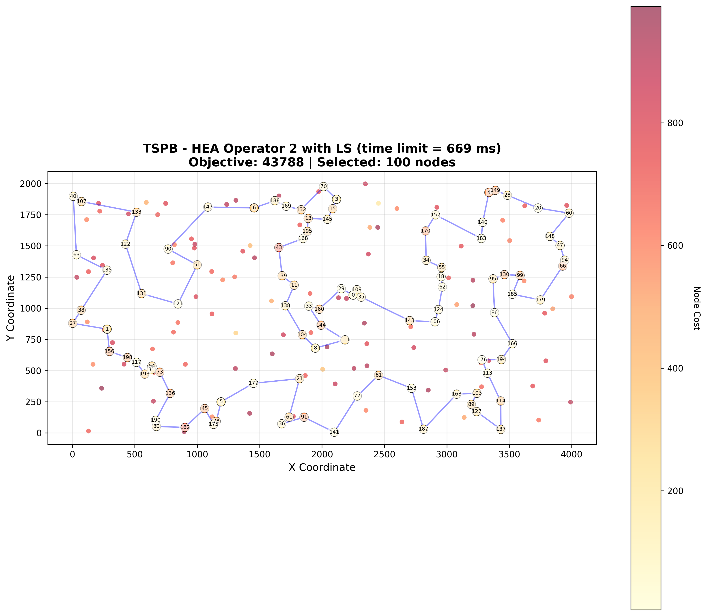

# Assignment 9 - Hybrid Evolutionary Algorithm for Selective TSP

## Authors
- Mateusz Idziejczak 155842
- Mateusz Stawicki 155900

## Github
> https://github.com/Luncenok/EvolutionaryComputing

## Problem Description

This is the same variant of the Traveling Salesman Problem as in previous assignments:
- Select exactly 50% of nodes (rounded up if odd)
- Form a Hamiltonian cycle through selected nodes
- Minimize: total path length + sum of selected node costs
- Distances are Euclidean distances rounded to integers

Instances:
- **TSPA, TSPB** with 200 nodes, selecting 100 nodes.

## Goal

Implement a Hybrid Evolutionary Algorithm (HEA) and compare it with MSLS, ILS, and LNS methods from previous assignments.

## Algorithm Parameters

- **Population size**: 20 (elite population)
- **Selection**: Steady-state with uniform random parent selection
- **Local search**: Applied to each offspring (except Operator 2 without LS variant)
- **Duplicate prevention**: No copies of the same solution in population (objective value comparison)

## Algorithm Pseudocode

### Hybrid Evolutionary Algorithm (HEA)

```python
HEA(timeLimit, operator, useLocalSearch=True):
    # Initialize population with random solutions + local search
    population = []
    while len(population) < 20:
        solution = generateRandomSolution()
        solution = localSearch(solution)
        if not isDuplicate(solution, population):
            population.append(solution)
    
    best = findBest(population)
    
    while elapsed_time < timeLimit:
        # Select two distinct parents uniformly at random
        parent1, parent2 = selectParents(population)
        
        # Recombination
        offspring = operator.recombine(parent1, parent2)
        
        # Local search (optional for Operator 2)
        if useLocalSearch:
            offspring = localSearch(offspring)
        
        # Duplicate check and replacement
        if not isDuplicate(offspring, population):
            worst_idx = findWorstIndex(population)
            if objective(offspring) < objective(population[worst_idx]):
                population[worst_idx] = offspring
        
        # Update best
        if objective(offspring) < objective(best):
            best = offspring
    
    return best
```

### Recombination Operator 1: Common Nodes and Edges

This operator preserves structural elements common to both parents:

```python
operator1_recombine(parent1, parent2):
    # Find common nodes (present in both parents)
    common_nodes = set(parent1) & set(parent2)
    
    # Find common edges (bidirectional match)
    edges1 = {(parent1[i], parent1[i+1]) for all edges}
    edges2 = {(parent2[i], parent2[i+1]) for all edges}
    common_edges = edges1 & edges2  # Bidirectional
    
    # Build subpaths from common edges
    subpaths = build_connected_subpaths(common_nodes, common_edges)
    
    # Add random nodes to reach selectCount (each as single-node subpath)
    while total_nodes < selectCount:
        node = random_unselected_node()
        subpaths.append([node])
    
    # Connect subpaths in random order with random direction
    shuffle(subpaths)
    offspring = []
    for path in subpaths:
        if random() < 0.5: reverse(path)
        offspring.extend(path)
    
    return offspring
```

### Recombination Operator 2: Parent-based with LNS Repair

This operator preserves more structure from one parent:

```python
operator2_recombine(parent1, parent2):
    # Keep only nodes from parent1 that are also in parent2
    partial = [node for node in parent1 if node in parent2]
    
    # Repair using weighted 2-regret heuristic (same as LNS)
    solution = repair_with_weighted_2regret(partial)
    
    return solution
```

## Experimental Setup

- **Instances**: TSPA, TSPB (200 nodes, 100 selected)
- **Objective**: Minimize path length + sum of selected node costs
- **Local search**: Steepest descent with edge exchange (from Assignment 3)
- **Population size**: 20
- **Evaluation**:
  - Run all HEA variants **20 times** per instance
  - Use **time limit = average MSLS time** (~657 ms for TSPA, ~669 ms for TSPB)
  - Report min, max, and average objective values and running times
  - Report average number of generations (offspring created)

## Key Results

### Summary Comparison

| Instance | ILS Avg | LNS+LS Avg | HEA Op1 Avg | HEA Op2+LS Avg | HEA Op2 Avg |
|----------|---------|------------|-------------|----------------|-------------|
| TSPA | 69338 | 69814 | **69224** | 70092 | 70336 |
| TSPB | 43752 | 44242 | **43604** | 44295 | 44456 |

### Generation/Iteration Count Table

| Instance | HEA Op1 | HEA Op2+LS | HEA Op2 | LNS+LS | LNS | ILS (LS runs) |
|----------|---------|------------|---------|--------|-----|---------------|
| TSPA | 1362 | 6524 | 9475 | 1476 | 1613 | 3481 |
| TSPB | 1303 | 5908 | 9515 | 1393 | 1590 | 3452 |

### Comparison with All Previous Methods

| Method | TSPA | TSPB |
|--------|------|------|
| Random | 264638 (238611 – 287962) | 213875 (190076 – 244960) |
| Nearest Neighbor (end only) | 85108 (83182 – 89433) | 54390 (52319 – 59030) |
| Nearest Neighbor (any position) | 73178 (71179 – 75450) | 45870 (44417 – 53438) |
| Greedy Cycle | 72646 (71488 – 74410) | 51400 (49001 – 57324) |
| Greedy 2-Regret | 115474 (105852 – 123428) | 72454 (66505 – 77072) |
| Greedy Weighted (2-Regret + BestDelta) | 72129 (71108 – 73395) | 50950 (47144 – 55700) |
| Nearest Neighbor Any 2-Regret | 116659 (106373 – 126570) | 73646 (67121 – 79013) |
| Nearest Neighbor Any Weighted | 72401 (70010 – 75452) | 47653 (44891 – 55247) |
| LS Random + Steepest + Nodes | 88011 (81817 – 97630) | 62848 (55928 – 70479) |
| LS Random + Greedy + Nodes | 93267 (86375 – 101454) | 65388 (57842 – 76707) |
| LS Random + Greedy + Edges | 81101 (76362 – 87763) | 54088 (50858 – 59045) |
| LS Greedy + Steepest + Nodes | 71614 (70626 – 72950) | 45414 (43826 – 50876) |
| LS Greedy + Steepest + Edges | 71460 (70510 – 72614) | 44979 (43921 – 50629) |
| LS Greedy + Greedy + Nodes | 71908 (71093 – 73048) | 45584 (43917 – 51165) |
| LS Greedy + Greedy + Edges | 71825 (70977 – 72706) | 45376 (43845 – 51170) |
| LS Random + Steepest + Edges | 73965 (71371 – 78984) | 48252 (45823 – 51965) |
| LM Random + Steepest + Edges | 74981 (72054 – 79520) | 49325 (45965 – 52805) |
| Candidates (k=5) | 84726 (78843 – 91459) | 49873 (47117 – 53865) |
| Candidates (k=10) | 77773 (72851 – 84000) | 48450 (45669 – 51178) |
| Candidates (k=15) | 75510 (72276 – 83040) | 48295 (45582 – 51938) |
| Candidates (k=20) | 74416 (71292 – 80264) | 48221 (45338 – 51285) |
| LM Candidates (k=10) | 75157 (72331 – 80832) | 49219 (46145 – 52021) |
| LM Candidates (k=20) | 74976 (72054 – 79520) | 49302 (45965 – 52805) |
| MSLS (200 iterations) | 71306 (70748 – 71959) | 45741 (45356 – 46168) |
| ILS | 69338 (69114 – 69841) | 43752 (43457 – 44199) |
| LNS with LS | 69814 (69255 – 70681) | 44242 (43686 – 45472) |
| LNS without LS | 69811 (69426 – 70452) | 44374 (43747 – 45495) |
| **HEA Operator 1** | **69224 (69107 – 69371)** | **43604 (43456 – 43990)** |
| **HEA Operator 2 with LS** | **70092 (69605 – 70628)** | **44295 (43788 – 44769)** |
| **HEA Operator 2 without LS** | **70336 (69801 – 70888)** | **44456 (43825 – 45096)** |

### Running Times (ms)

| Method | TSPA | TSPB |
|--------|------|------|
| Random | 0.0002 (0.00008 – 0.006) | 0.00003 (0.00 – 0.0001) |
| Nearest Neighbor (end only) | 0.050 (0.016 – 0.453) | 0.019 (0.015 – 0.022) |
| Nearest Neighbor (any position) | 0.759 (0.677 – 2.582) | 0.783 (0.678 – 9.838) |
| Greedy Cycle | 0.775 (0.647 – 9.298) | 0.749 (0.649 – 10.58) |
| Greedy 2-Regret | 0.959 (0.903 – 1.584) | 0.929 (0.906 – 1.045) |
| Greedy Weighted (2-Regret + BestDelta) | 1.195 (0.905 – 28.36) | 0.936 (0.910 – 1.203) |
| MSLS (200 iterations) | 656.92 (648.64 – 699.07) | 669.29 (661.72 – 678.11) |
| ILS | 656.99 (656.92 – 657.23) | 669.36 (669.29 – 669.53) |
| LNS with LS | 657.10 (656.94 – 657.32) | 670.81 (669.30 – 694.94) |
| LNS without LS | 657.13 (656.92 – 657.30) | 669.52 (669.32 – 669.69) |
| **HEA Operator 1** | **657.06 (656.94 – 657.42)** | **669.42 (669.30 – 669.61)** |
| **HEA Operator 2 with LS** | **656.97 (656.92 – 657.09)** | **669.35 (669.30 – 669.44)** |
| **HEA Operator 2 without LS** | **656.95 (656.92 – 656.99)** | **669.33 (669.29 – 669.42)** |

## Visualizations

Best solutions found by HEA Operator 1 visualized on both instances:

<table>
  <tr>
    <th>HEA Operator 1 - TSPA</th>
    <th>HEA Operator 1 - TSPB</th>§
  </tr>
  <tr>
    <td></td>
    <td></td>
  </tr>
  <tr>
    <th>HEA Operator 2 without LS - TSPA</th>
    <th>HEA Operator 2 without LS - TSPB</th>
  </tr>
  <tr>
    <td></td>
    <td></td>
  </tr>
  <tr>
    <th>HEA Operator 2 with LS - TSPA</th>
    <th>HEA Operator 2 with LS - TSPB</th>
  </tr>
  <tr>
    <td></td>
    <td></td>
  </tr>
</table>

## Analysis and Conclusions

### HEA vs ILS/LNS Comparison

**HEA Operator 1 is the best performer**, outperforming all previous methods:
- TSPA: 69224 avg vs ILS's 69338 (**-0.16%**)
- TSPB: 43604 avg vs ILS's 43752 (**-0.34%**)
- Best solution found: 69107 (TSPA), 43456 (TSPB)

### Operator Comparison

| Metric | HEA Op1 | HEA Op2+LS | HEA Op2 |
|--------|---------|------------|---------|
| TSPA Avg | **69224** | 70092 | 70336 |
| TSPB Avg | **43604** | 44295 | 44456 |
| TSPA Generations | 1362 | 6524 | 9475 |

**Operator 2 underperforms** despite 5-7× more generations—removing all nodes not present in other parent destroys too much solution structure.

**Key insight**: Preserving common subpaths while randomizing their connections (Op1) is more effective than preserving one parent's ordering (Op2).
